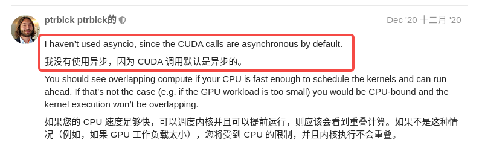

# 关于异步

## 普通异步函数

### 有些异步不是真正实现了异步，如下

https://stackoverflow.com/questions/71516140/fastapi-runs-api-calls-in-serial-instead-of-parallel-fashion/71517830#71517830


## fastapi并发请求，GPU如何异步处理请求？

注意，FastApi接口中，如果程序中有await，那么函数就用async def定义；反之就用def定义即可。

### 接口内部有异步就用async def定义，可以加速

如下代码耗时需要注意：（说明模型内部是异步执行的）

```python
from fastapi import FastAPI, Request
from fastapi import Body
import uvicorn, json, datetime
import torch
from sentence_transformers import SentenceTransformer

import os
os.environ['CUDA_VISIBLE_DEVICES'] = '0'

DEVICE = "cuda" if torch.cuda.is_available() else "cpu"
# DEVICE = 'cpu'

embeding_path = "model/bge-base-zh-v1.5"
embedding_model = SentenceTransformer(embeding_path, device=DEVICE)

app = FastAPI()

@app.get("/")
def func(content: str):
    vector = embedding_model.encode(content)
    vector = vector.flatten().tolist()
    return {'vector': vector}

if __name__ == '__main__':
    uvicorn.run(app="embedding:app", host='0.0.0.0', port=6000, workers=1, reload=True)

    # 并发效果：43个并发，95%耗时在1800ms以下，50%在1200ms以下。
```

注意async

```python
from fastapi import FastAPI, Request
from fastapi import Body
import uvicorn, json, datetime
import torch
from sentence_transformers import SentenceTransformer

import os
os.environ['CUDA_VISIBLE_DEVICES'] = '0'

DEVICE = "cuda" if torch.cuda.is_available() else "cpu"
# DEVICE = 'cpu'

embeding_path = "model/bge-base-zh-v1.5"
embedding_model = SentenceTransformer(embeding_path, device=DEVICE)

app = FastAPI()

@app.get("/")
async def func(content: str):
    vector = embedding_model.encode(content)
    vector = vector.flatten().tolist()
    return {'vector': vector}

if __name__ == '__main__':
    uvicorn.run(app="embedding:app", host='0.0.0.0', port=6000, workers=1, reload=True)

    # 并发效果：100个并发，95%耗时在27ms以下，50%在15ms以下。
```

**！！！后面我也测试了用CPU部署model，并对比了async def和def，发现前者并发效果更好！！！**


## 并发耗时多一定是发生了阻塞

https://cloud.tencent.com/developer/article/2216933

原文：

> ## 分析过程
>
> ### 定位“慢”原因
>
> >  这里暂时先忽略 CPU 占用率高的问题 
>
> **首先平均响应时间这么慢，肯定是有阻塞。先确定阻塞位置。重点检查几处：**
>
> - 锁 (同步锁、分布式锁、[数据库](https://cloud.tencent.com/solution/database?from_column=20065&from=20065)锁)
> - 耗时操作 (链接耗时、SQL耗时)


## GPU可以异步

### 1

https://d2l.ai/chapter_computational-performance/async-computation.html

看了这个例子，你可能对GPU的异步有更深的理解。

### 2

再加上我的实验：

```sh
向量耗时分析
	本地单独起一个向量编码异步接口，GPU部署
		并发效果：100个并发，95%耗时在22ms以下，50%在11ms以下。
	本地单独起一个向量编码异步接口，CPU部署
		并发效果：20个并发，95%耗时在54ms以下，50%在38ms以下。
```

代码如下：

```python
from fastapi import FastAPI, Request
from fastapi import Body
import uvicorn, json, datetime
import torch
from sentence_transformers import SentenceTransformer

import os
os.environ['CUDA_VISIBLE_DEVICES'] = '0'

DEVICE = "cuda" if torch.cuda.is_available() else "cpu"  # 并发效果：100个并发，95%耗时在22ms以下，50%在11ms以下。
#DEVICE = 'cpu'  # 并发效果：20个并发，95%耗时在54ms以下，50%在38ms以下。

embeding_path = "model/bge-base-zh-v1.5"
embedding_model = SentenceTransformer(embeding_path, device=DEVICE)

app = FastAPI()

@app.get("/")
async def func(content: str):
    vector = embedding_model.encode(content)
    vector = vector.flatten().tolist()
    return {'vector': vector}

if __name__ == '__main__':
    uvicorn.run(app="embedding:app", host='0.0.0.0', port=6000, workers=1, reload=True)

```

### 3



### 4

GPU是异步执行的

https://blog.csdn.net/u013548568/article/details/81368019

代码：

```python
import time
import torch
from sentence_transformers import SentenceTransformer

import os
os.environ['CUDA_VISIBLE_DEVICES'] = '0'

DEVICE = "cuda" if torch.cuda.is_available() else "cpu"
# DEVICE = 'cpu'

embeding_path = "model/bge-base-zh-v1.5"
embedding_model = SentenceTransformer(embeding_path, device=DEVICE)

embedding_model.encode("我我我我我我我")


# 1
start = time.time()
result = embedding_model.encode("梅子黄时日日晴")
end = time.time()

print(f"耗时: {(end - start) * 1000} ms")


# 2
torch.cuda.synchronize()
start = time.time()
result = embedding_model.encode("绿阴不减来时路")
torch.cuda.synchronize()
end = time.time()

print(f"耗时: {(end - start) * 1000} ms")


# 3

start = time.time()
result = embedding_model.encode("小溪泛尽却山林")
print(result)
end = time.time()

print(f"耗时: {(end - start) * 1000} ms")

```


## fastapi并发请求，CPU任务用多进程处理

1、多线程并不适合 CPU 密集型任务，对于这类任务，可以考虑使用多进程（multiprocessing）来实现并行计算。

2、在使用多线程时，确保你的代码是线程安全的，避免数据竞争等问题。

3、如果你需要更高级的并发处理能力，可以尝试使用`asyncio`库来实现异步任务。

https://juejin.cn/post/7273018561966522402


**多进程使用multiprocessing，变量共享**

```python
import multiprocessing

import numpy as np


def worker(name, q):
    obj = np.array([1,2,3,4,5])
    q.put(obj)


q = multiprocessing.Queue()
p = multiprocessing.Process(target=worker, args=('task', q))
p.start()
p.join()

print(q.get())

```

