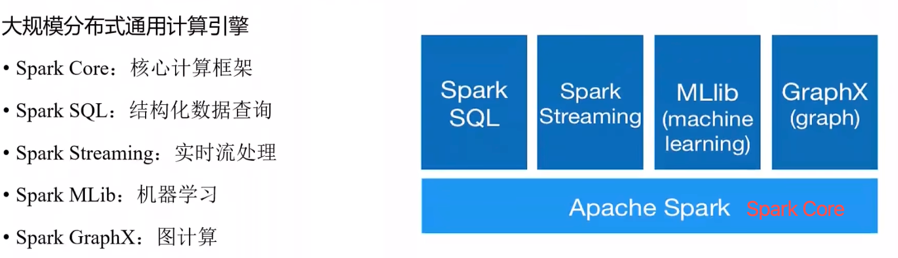
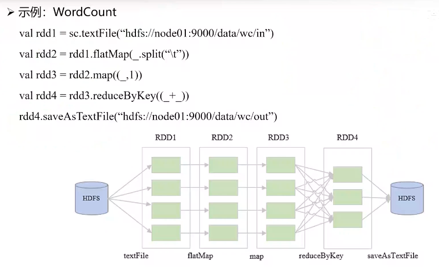
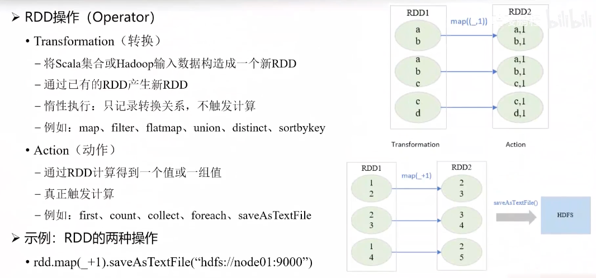
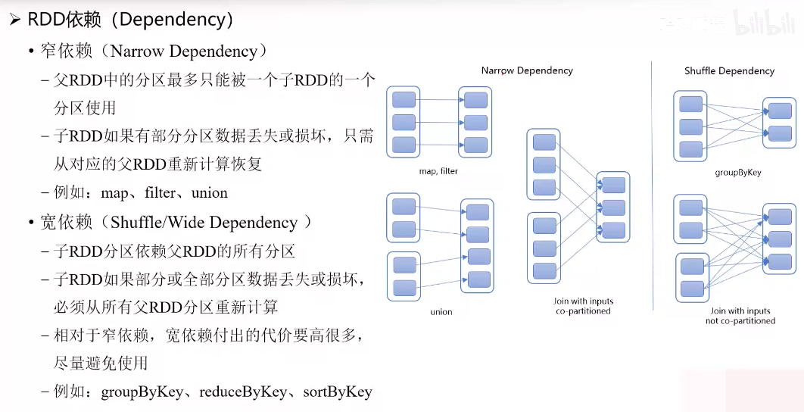
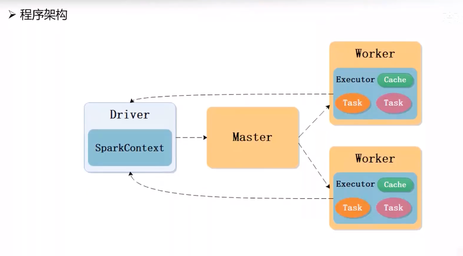
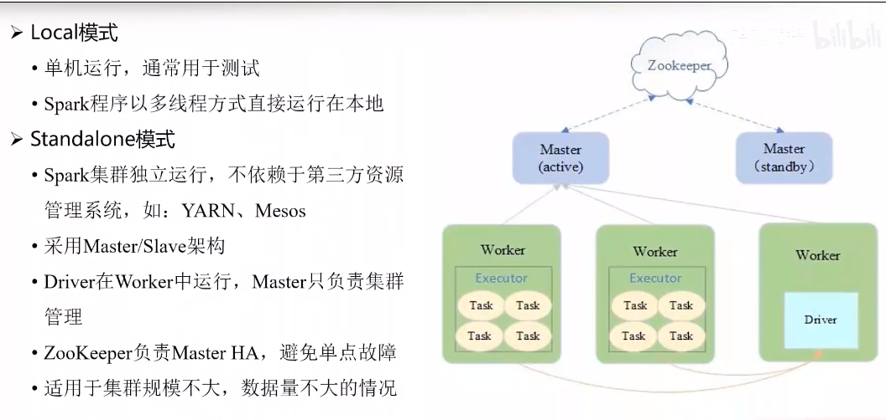
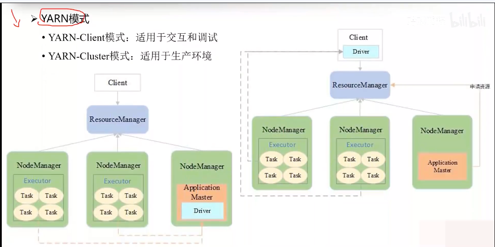

**介绍**

MapReduce把数据处理强行拆分为了两阶段：Map（分开处理）、Reduce（聚合）。
传统的MapReduce框架比如Hadoop在每个阶段都会把数据放到磁盘，下一阶段处理时再去把数据加载到内存。
特点：效率高，速度快，虽然吃内存，但是现在内存条便宜，哈哈。

Spark没有改变Map和Reduce的两阶段编程范式，它是将数据的操作和处理分为了Transform和Action操作，前者的所有操作都在内存中，而且没有真正执行，只有Action操作才是将数据真正执行。

**架构图**

SparkStreaming、SparkSQL、SparkMLib、SparkGraphX都是在SparkCore底层上开发的功能
像Spark streaming的话是做实时流处理的，它也是转换成底层的SparkCore去去运行了



SparkCore引擎的底层实际上就是用MapReduce编程范式开发的，上面的SparkSQL,SparkStreaming,SparkMLib,SparkGraphX都是基于SparkCore的接口（API）。


**Spark是兼容Hadoop的**

上面的一些特点看起来Spark是用来代替Hadoop的，但是Spark的运行模式支持多种，
1、可以安装一个单独Spark框架，Spark任务放到Spark框架执行
2、Spark任务提交到Spark集群执行
3、只有Hadoop集群，Spark任务通过OnYarn模式提交到Hadoop集群执行（YaRN调度计算资源）


**RDD**

Spark 是基于 RDD 进行运算的。那么什么是 RDD 呢？RDD 是弹性分布式数据集（Resilient Distributed Dataset）。其中，"R"代表弹性，"DD"代表分布式数据集。

所谓弹性分布式数据集，首先分布式数据集容易理解——我们的数据存储在集群的各个节点上。

具体来说，一个文件被拆分成多个数据块，分别存放在不同的节点上，每个节点上都存储了该文件的一部分数据。当需要对这些数据进行计算时，Spark 会将数据从各个节点加载到内存中进行处理。

各个节点上的数据组成了一个数据集，所以的话它叫分布式数据集。

**RDD特性**

首先，RDD 有一个重要特性——它是只读的（Read Only）。这意味着当你对 RDD 进行处理后，必须将处理结果保存为一个新的 RDD，而不能直接修改原有的 RDD。

同样地，对新 RDD 的处理结果也需要保存为另一个新的 RDD。因此，我们需要牢记 RDD 的这个只读特性，每次操作都会产生新的 RDD 对象。


**Spark Context上下文对象**

SC实际上是Spark的一个对象，叫Spark context。Context你可以理解成它是一个Spark的上下文对象。如果理解不了上下文这个概念的话，你就可以把它理解成是Spark框架的一个对象。

例子：

先使用flatMap把每一行数据拆分成单词，然后使用map将单词映射为(单词，1)，最后使用reduceByKey将相同的单词出现的次数相加，然后使用sortBy将结果排序

```python

from pyspark.sql import SparkSession

# 创建SparkSession
spark = SparkSession.builder \
    .appName("WordCount") \
    .getOrCreate()

# 方法一：使用RDD（传统方式）
def word_count_rdd(file_path):
    """使用RDD统计词频"""
    rdd = spark.sparkContext.textFile(file_path)
    
    word_counts = rdd \
        .flatMap(lambda line: line.split()) \
        .map(lambda word: (word.lower(), 1)) \
        .reduceByKey(lambda a, b: a + b) \
        .sortBy(lambda x: x[1], ascending=False)
    
    # 显示前10个词
    for word, count in word_counts.take(10):
        print(f"{word}: {count}")
    
    return word_counts

# 使用示例
if __name__ == "__main__":
    # 替换为你的文件路径
    file_path = "path/to/your/textfile.txt"
    
    word_count_rdd(file_path)
    
    spark.stop()
```



所以的话到这儿大家应该就理解了，为什么Spark是基于RDD进行运算的。他把数据读进来以后变成一个RDD之后的话，对这个RDD进行反复的操作。最后一个RDD基本上是最终结果，把这个结果做一个输出。

这是Spark的一个计算流程，所以的话它中间大量依赖RDD。这样的一个编程范式，实际上和单机编程差不多。（没感觉到需要对分布式进行针对性处理）


**DAG有向无环图**

RDD经过这样的一些运算的之后，我们发现这个运算逻辑可以绘制成一张dag图，也就是有向无环图。（上图）

**Partition**

上图中可以看到，从HDFS读取文件得到RDD1分为了四个block，其实可以理解为是一个partition，RDD1到RDD3都是一对一的partition关系，RDD3到RDD4是一对多的partition关系

RDD弹性意味着数据时内存中只读的，要改变数据，必须把前置依赖数据全都重新跑一遍。

**弹性**

比如说某个节点挂掉了，挂掉之后它要返回到前面的这四个节点里面，这四个节点重新再走一次Shuffle，然后才能把这个数据给恢复掉。所以的话这样的一个整体的一个过程相对来比较麻烦一些，但是已经比我要从头开始重新计算要好很多了。所以这叫弹性，也就是RDD最大的一个特点。为什么它是只读的？就是用来体现弹性。

**RDD的操作分为transformation还有action**

Transformation实际上是把RDD进行一个转换构造，他一直在做是把RDD进行一个转换，进行一个处理，从一个RDD转换成新的一个RDD。那action是啥呢？Action是触发计算，就是说它真正触发结果的一个生成，或者触发了结果的一个输出，这叫action。



**宽依赖和窄依赖**

Partition之间一对一的转换关系，那就是窄依赖，Partition之间是一对多的转换关系，那就是宽依赖。



为什么要区分宽窄依赖呢？因为大家发现宽依赖中间一定是走shuffle。那宽衣了中间一旦走shuffle，也就意味着说数据恢复起来会很麻烦。数据间挂掉之后要恢复要同时回到前面这个阶段，你就恢复到回到前面这几个节点里面重新跑一次计算任务，恢复起来会很慢，所以的话尽量避免这种宽依赖的形成。

那怎么样避免宽依赖的形成呢？就尽量避免使用这种宽依赖的算子。你比方说group by k reduced by salt by k只要什么什么by k它就是宽依赖的。你看group by可以按照K值去做分组，对吧？你要看按照K值进行分组，那肯定要把K相同的聚合到同一个节点，对吧？Reduce by k你要按照K值进行reduce，那肯定也要K进行一个分发。Sold by k, 你要按照K值进行一个排序，那肯定也要把K值的相同的分发到同一个节点，对吧？只要出现了这种，肯定是RDD之间形成宽依赖了。

**编程**

Spark是由Scala编写的，所以看源码必须要了解Scala，其次Python、Java都有对应的接口或SDK。


**Spark架构和执行流程**

Spark是一个分布式的计算框架，意味着数据是分布式数据集（存储在多个节点上，每个节点都有自己的数据或数据的一部分），计算时是在多个节点上进行的。计算架构如下：



来看一下Spark集群的话，主节点是master，从节点是worker，也是一个主从架构。

首先，客户端提交任务时，会向主节点（Master）发起一个任务请求。然后主节点会在所有 Worker 节点中为该任务分配运行资源。分配的第一项资源用来运行作业的管理进程。在 Spark 中，这个作业管理进程被称为 Driver。类似地，在其他系统中，作业的管理进程也叫 Application Master，但是在Spark这个叫driver。

Driver 开始解析任务，确定需要四个 Task 来执行。随后，Driver 向 Master 申请四个 Task 的资源。Master 接到申请后，会在各个 Worker 节点上分配资源，并将这些资源封装成 Executor 返回给 Driver。Driver 获得这些 Executor 资源后，将解析出的 Task 分发到各个 Executor 中执行。执行过程中，Task 会实时向 Driver 汇报执行进度。

当所有 Task 运行完成后，Driver 向 Master 申请资源释放，Master 随后将所有 Executor 资源释放。

通过这个流程，我们可以看出两个系统的原理十分相似。在 Yarn 中，作业的管理进程称为 Application Master，而在 Spark 中称为 Driver。同样，Yarn 申请的资源叫做 Container，Spark 申请的资源叫做 Executor。两者的主要区别在于：Yarn 的 Container 内通常只能运行一个 Task，而 Spark 的 Executor 内可以运行多个 Task。


**Spark作业提交模式**

代码执行分为几种模式：

Local模式：单机执行，一般用来调试和测试代码，没问题再用下面模式

Standalone模式：装了Spark集群的话用这种模式

Yarn模式：只装了Hadoop集群，没有Spark集群，用这种模式



Standalone 模式的运行机制与我们刚才讲的原理一致。它采用主从架构，主节点是 Master，从节点是 Worker。
当作业第一次提交时，会申请资源运行 Driver。Driver 启动后，会对作业进行解析，确定所需资源，然后向 Master 申请这些资源。Master 随即在各个 Worker 节点上分配 Executor。分配完成后，Driver 将解析好的 Task 分发到各个 Executor 中执行。执行过程中，Task 会实时向 Driver 汇报执行进度。当所有 Task 运行完成后，Driver 申请释放资源，整个作业流程结束。



上面是 Standalone 模式。如果没有单独的 Spark 集群，只有 Hadoop 集群，那么可以使用 Yarn 模式来运行 Spark。

首先，客户端向 Resource Manager 提交作业申请。Resource Manager 接到申请后，在各个 Node Manager（即 Worker 节点）上分配一个 Container。第一个 Container 用来运行 Application Master。
前面我们提到，Spark 的管理进程是 Driver，而 Yarn 的管理进程是 Application Master，那么这两者如何协调呢？其实很简单——只需要在 Driver 外层包装一个 Application Master 的壳子即可。这样，Application Master 和 Driver 就能协同工作了。

运行起来后，负责解析作业的仍然是 Driver。当 Driver 将 Spark 作业解析完成后，发现需要八个 Task 的资源。但是 Driver 无法直接申请 Hadoop 的资源，这时就发挥了 Application Master 的作用。Driver 通知 Application Master 说需要八个 Task 的资源，由 Application Master 向 Resource Manager 申请。Resource Manager 批准申请后，将相应的 Container 分配给 Application Master。Application Master 获得资源后，通知 Driver 资源已申请完毕。随后，Driver 将解析好的 Task 分发到这些 Container 中执行。

需要注意的是，在 Yarn 模式中，运行 Task 的资源叫做 Container，而在 Spark Standalone 模式中，对应的资源叫做 Executor。两者在不同系统中的命名不同，但职能相似。

以 Yarn 为主，Driver 将解析好的 Task 分发到各个 Container 中执行。执行过程中，Task 会实时向 Driver 汇报执行进度。当 Driver 发现所有 Task 运行完成后，会通知 Application Master 释放资源，Resource Manager 随即将所有资源释放。

**YaRN模式关于资源命名的注意事项**

这里有一个容易混淆的地方：Executor 是 Spark 的资源命名，在 Spark 框架中，申请出来的资源都叫 Executor。而在 Yarn 上申请出来的资源都叫 Container。两者在不同系统中的命名不同，需要特别注意这一点。

**Yarn 模式的两种部署方式**

Yarn 模式提供两种部署方式：Cluster 模式和 Client 模式。我们刚才讲的是 Cluster 模式，这种方式一般用于生产环境。

**Cluster 模式 vs Client 模式**

Client 模式一般用于交互和调试。两者的主要区别在于 Driver 的运行位置不同。

在 Cluster 模式中，Driver 运行在集群的某个 Worker 节点上。作业运行信息都由 Driver 收集，但客户端无法实时看到这些信息。这不利于调试。

在 Client 模式中，Driver 运行在客户端上。这样 Driver 会实时监控 Task 返回的信息，并直接在客户端的控制台上显示，便于观察作业运行情况，更适合调试和交互。

因此，我们通常在调试阶段使用 Client 模式，当确认作业没有问题后，再将其以 Cluster 模式部署到生产环境。


**作业解析**

**Spark执行流程是怎样的？**

Spark的执行流程中，Driver会解析用户编写的Spark代码，首先生成逻辑查询计划，然后生成物理查询计划，并将任务（task集合）调度至Executor中执行。Java会实时监控任务运行状态并进行相应调度。整体程序执行流程包括代码解析、逻辑查询计划生成、物理查询计划生成以及任务调度与执行。

**代码如何解析成task并展示链式编程的应用？**

在一个用scala编写的Spark代码示例中，展示了链式编程如何将词频统计功能浓缩在一行代码内。该代码通过SC（Spark context）读取文本文件，利用text file进行拆分生成单词，再按照K值进行reduce操作（即聚合并累加相同单词的出现次数），最后将结果输出至指定数据目录保存。

**Driver解析代码后生成了什么？**

Driver解析代码后生成了逻辑查询计划，逻辑查询计划关注RDD的状态变化，例如从string类型数据经过flat map操作拆分成单词，再到key value类型数据，并按照K值进行reduce操作，最后输出结果。

**物理查询计划是如何处理的？**

物理查询计划关注底层数据状态，根据逻辑查询计划中的RDD状态划分成DAG图，并针对其中的宽窄依赖进行状态切分。窄依赖可以放在同一个stage内，通过task处理，而宽依赖则会导致stage切割，形成新的stage。划分后的stage会打包成task，发送到Executor中执行，并实时向Driver汇报进度。

**DAG图如何切分以及为何要切分？**

DAG图切分依据是宽窄依赖关系，宽依赖会导致stage切割。例如，在一个复杂的DAG图中，根据RDD间的宽窄依赖关系将其划分为多个stage。stage数量与shuffle次数相关，stage越多shuffle越多，性能越差，因此调优过程中需关注减少stage数量以提升性能。

