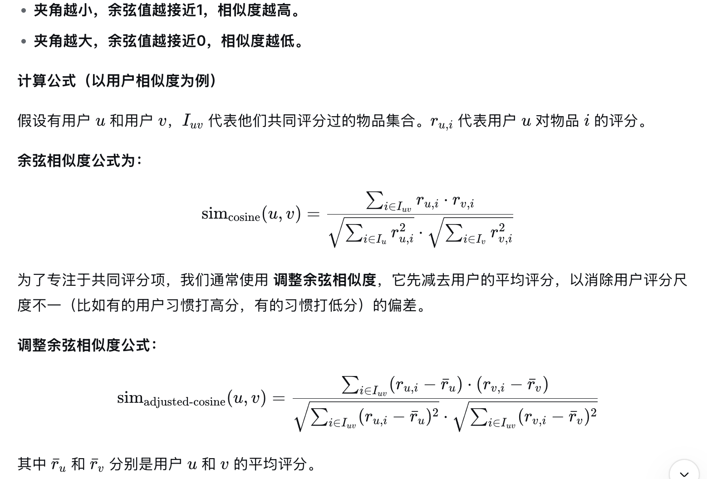
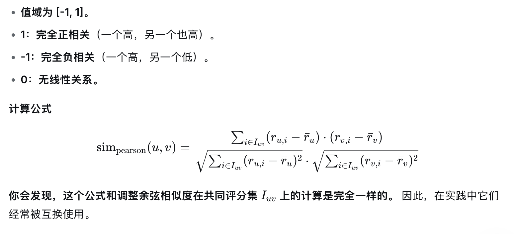
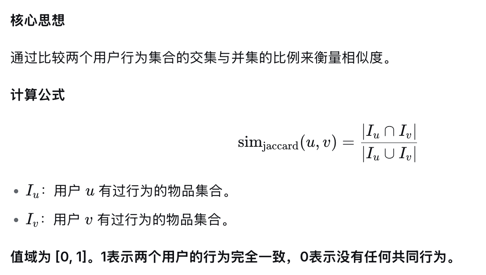
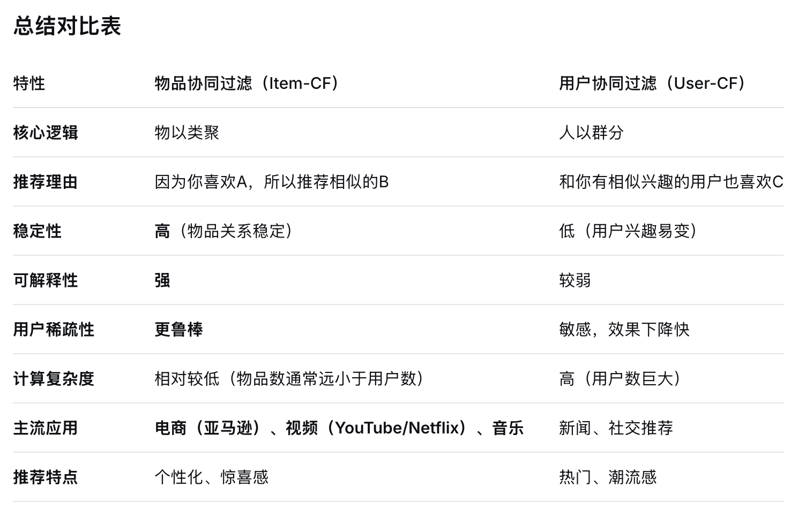
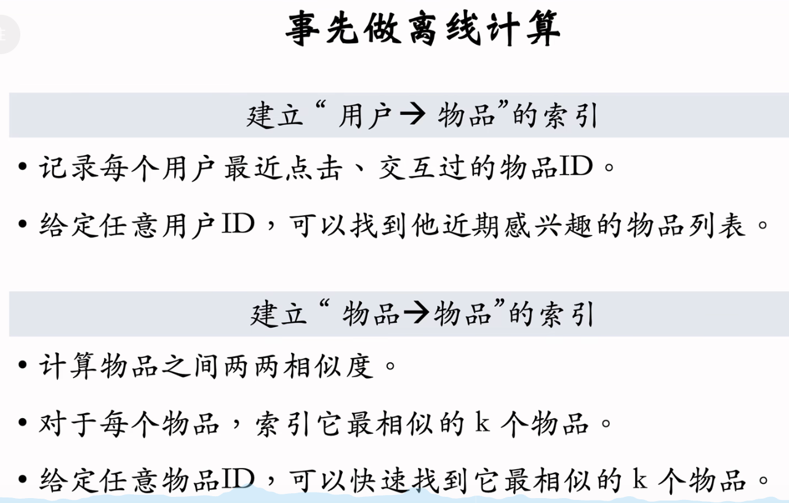
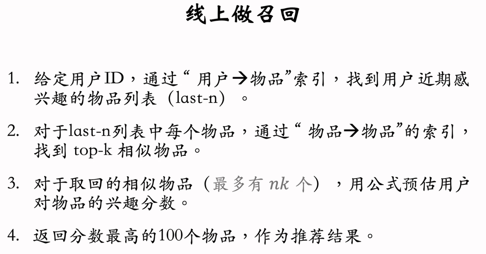

# 传统协同过滤算法

**原理**

不同于矩阵分解，协同过滤是直接使用原始评分矩阵来计算用户/物品的相似度。

也即，一个物品向量的每个元素是用户对物品的打分构成，一个用户向量的每个元素是该用户对不同物品的打分构成。

**相似度计算方法**

要注意：以下三种方法都可以用来计算用户间相似度和物品间相似度。

用户相似度是根据看过的共同物品来决定的，物品相似度是由看过该物品的用户来决定的。（注意，不是根据物品的内容来决定相似，而是由用户的行为决定）

余弦相似度

这和向量计算余弦相似度一样，但因为很多是零，所以直接用共同评分过的元素来计算，公式如下。

皮尔逊相似度

基本思想：看两个用户的评分模式是否一致。即，当用户A高于其平均分时，用户B是否也倾向于高于其平均分？

杰卡德系数

与前两种方法不同，杰卡德系数不关心具体的评分值，只关心 “是否有过行为” （如点击、购买、浏览）。它适用于隐式反馈数据（0/1数据）。

**原生的协同过滤算法使用上述三种相似度计算方法会导致几个问题，比如：**

对于大型平台来说（比如淘宝、抖音、小红书），用户和物品数量都是千万级别（甚至上亿），任何一个用户观看过、购买过的物品，只是这个巨大“用户-物品”矩阵的极小部分。可以说，99%的位置都是空的（0）。这就是一个稀疏矩阵。

**稀疏矩阵会导致问题：**

注意，特别是结合用户协同过滤推荐思路时问题非常大。

①计算出的相似度统计意义不显著。仅凭一两个物品的评分一致性，无法代表两个用户整体的兴趣偏好。比如A看了500部电影，B刚好只看了一部电影，恰好是A看过的。相似度也很高，但是推荐时难道认为A剩余499电影全部都是B喜欢的？这很扯淡。

②偶然性极大。用户A和B可能只是碰巧都看了《教父》并给了高分，但用户A可能喜欢黑帮片，用户B可能喜欢爱情片，他们本质上并不相似。

③系统却不得不依赖这个不可靠的相似度分数 来为用户A寻找邻居并生成推荐，从而导致推荐结果不准确。

**冷启动问题**

无法进行有效匹配：

一个新用户A，只评价过1部电影。现在要为他寻找相似用户。

用户B评价过500部电影，但恰巧其中包含了A评价的那一部。

系统会认为A和B是相似的，并把B喜欢的其他499部电影都推荐给A。这显然风险极高，因为A和B的相似度是建立在1/500这个极其薄弱的基础上的。

**用户的历史行为越少，系统就越难捕捉到他真实、稳定的兴趣偏好。**

**使用用户协同过滤推荐/UserCF**

核心思想：找到与目标用户兴趣相似的一群“邻居用户”，然后根据这些邻居的评价来预测目标用户对物品的喜好。

第一步就是上面讲到的计算用户间相似度，第二步就是为用户进行推荐（预测目标用户对未接触过的物品的评分），第三步就是根据分数从高到低排序推荐。

首先输入目标用户和用户-物品评分矩阵以及计算好的用户相似度矩阵

其次寻找最相似的K个用户，超参数K

邻居用户中目标用户没看过的物品构成候选列表，计算预测评分

遍历所有目标用户 U 未评分的物品，计算出每个物品的预测评分 P(U, I)。然后排序返回TopN推荐。

**使用物品协同过滤推荐/ItemCF**

核心思想：找到与目标用户曾经喜欢过的物品相似的一群“邻居物品”，然后根据用户对这些邻居物品的评分来预测对目标物品的评分。

首先输入目标用户和用户-物品评分矩阵以及已计算好的物品相似度矩阵

其次寻找目标用户的已评分物品

第三步就是为目标用户没有评分过的每个物品计算预测分数

最后就是：计算所有未评分物品的预测分 -> 排序 -> 取 Top-N 作为推荐列表。

**比较**

相比来讲，物品协同过滤推荐用的会更多一些。ItemCF的优点：

1、物品的稳定性远高于用户

物品：一个商品、一首歌、一部电影，其属性是相对稳定的。比如电影《肖申克的救赎》和《阿甘正传》之间的相似性，不会因为今天来了一个新用户就改变。因此，物品相似度矩阵可以离线计算好，并定期更新（比如一天一次），性能开销小。

用户：用户的兴趣是易变的。一个新用户可能今天喜欢看动漫，明天就开始研究烹饪。为了捕捉用户的最新兴趣，User-CF 需要频繁地、甚至实时地计算用户相似度，这在计算上是巨大的挑战，尤其当用户量达到千万甚至亿级时。

2、可解释性强

Item-CF 的推荐理由非常直观且令人信服：“因为你喜欢/购买了A，所以我们给你推荐类似的B”。这种逻辑用户很容易理解和接受。

User-CF 的推荐理由则可能是：“和你有相似兴趣的用户也喜欢C”。这个理由相对较弱，用户可能会疑惑：“那些用户是谁？我们的兴趣真的相似吗？”

3、适合处理用户行为稀疏场景

在任何一个平台，大多数用户的行为（评分、购买、点击）都是非常稀少的。这导致 User-CF 很难为这些用户找到足够数量的“相似邻居”，推荐质量大打折扣。

相比之下，热门物品总能获得大量用户行为。Item-CF 通过物品本身来连接用户，即使某个用户行为稀少，只要他有过一些行为，Item-CF 就能根据这些物品找到相似的物品进行推荐。

相比来讲，UserCF在用户兴趣变化快，社交性强或者追求潮流的场景中会更多一些。因为社交领域人与人的传播速度很快，所以基于用户来推荐更容易挖掘新、潮的物品。

**ItemCF实践**

索引的意义在于避免枚举所有的物品，比如记录每个用户最近感兴趣的n=200个物品，取回每个物品最相似的k=10个物品。给取回的nk=2000个物品打分。（用户对物品的兴趣爱好）

返回分数最高的100个物品作为推荐结果或者ItemCF召回通道的输出。

索引的好处：离线计算量大，但是线上计算量小。

步骤：

首先事先要做离线计算

其次，线上做召回

