https://www.bilibili.com/video/BV1b34y1e7En

基于向量表征的推荐算法思路整体上来讲就是，为用户和物品训练各自的向量，然后对目标用户计算时只需要计算该用户和物品向量的内积作为打分，然后排序获取TopN做推荐。

# 矩阵补充思想做推荐

**思想原理**

矩阵补充就是通过将用户-物品评分的稀疏矩阵（有零有非零，空白的是未曝光的）对空白未曝光的补全，也即为他们进行打分，然后打分后排序并做推荐。这是思想，真正训练算法有很多。

比如，下面的矩阵分解和神经网络协同过滤算法，都是用来做矩阵补充思想推荐的一种具体应用。

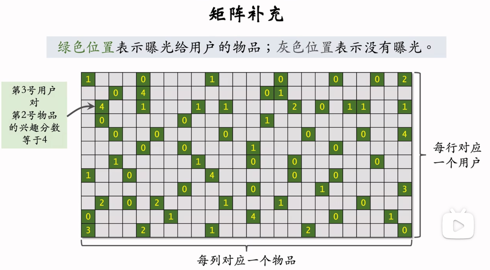

**缺点**

真正用矩阵补充来做推荐很少，因为它只用到了用户和物品的向量，没有用到交互信息，效果差。

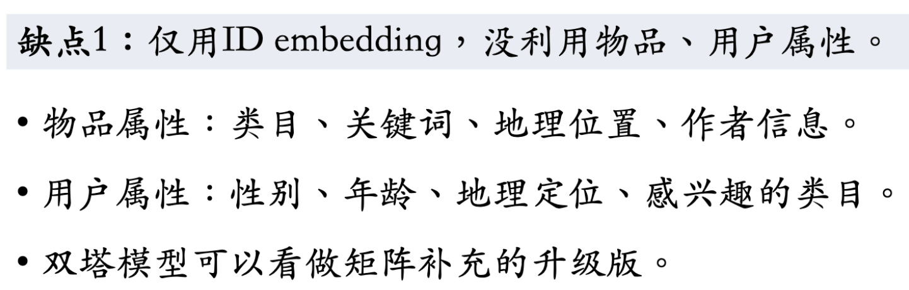

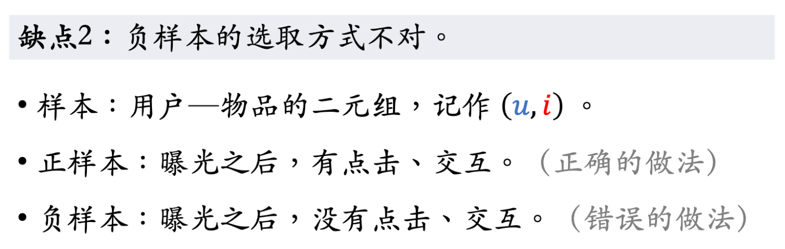

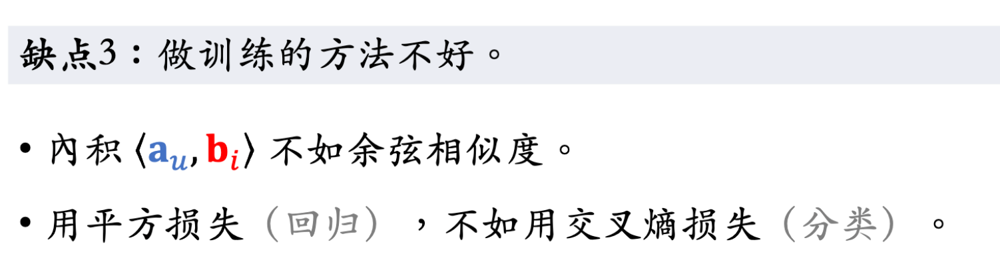

# 矩阵分解来实现矩阵补充

https://zhuanlan.zhihu.com/p/367690108

算法1：矩阵分解，训练策略：**交替最小二乘算法**

原理：**用U和V分别代表用户和物品隐因子矩阵**，UVT来近似代替R（真实用户的打分矩阵）。得到UV矩阵后，就类似于得到了用户向量和物品向量，然后矩阵补全时就是计算用户向量和未曝光物品向量的相似度来做排序和推荐。

训练：每次迭代固定U来最小化R的损失函数（均方误差），并迭代参数V；然后固定V来最小化R的损失函数（均方误差），并迭代参数U。知道均方误差收敛，最终得到隐因子矩阵U和V。

数据：如果使用全量数据推荐，由于时间跨度长，历史数据会很多，一般来讲会使用近几周或一个月的数据进行训练。

矩阵分解算法训练后就可以做矩阵补充，但是这样去做推荐效果并不好，因为没有利用物品和用户属性。

# NeuralCF算法/NeuCF

NeuCF其实就是矩阵分解的升级版，矩阵分解的缺点是只能处理向量的线性关系，而NeuCF可以处理非线性关系。实际上做推荐时，NeuCF也是得到用户向量和物品向量，然后矩阵补全时就是计算用户向量和未曝光物品向量的相似度来做排序和推荐。

**背景与动机：从传统协同过滤到 NeuralCF**

模型架构如下：

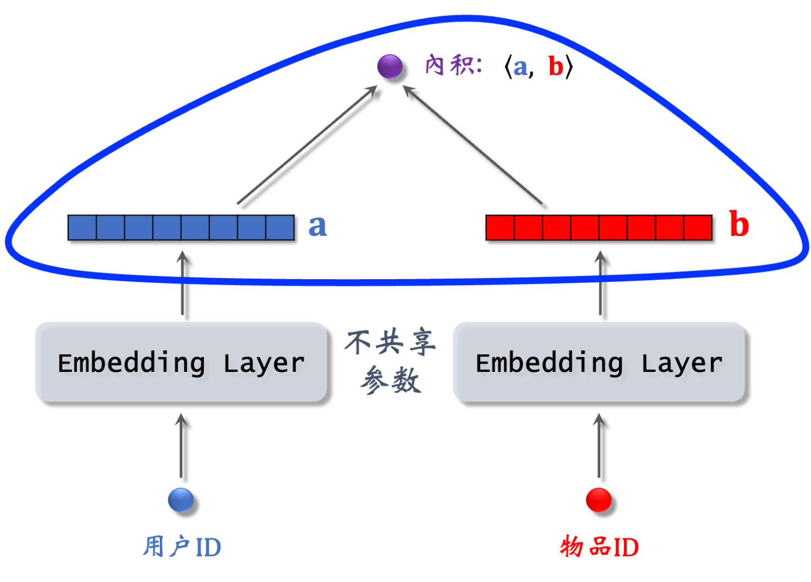

要理解 NeuralCF，我们首先要从它的前身说起。

**1. 传统协同过滤 (CF)**
核心思想是“物以类聚，人以群分”。
*   **用户基CF**：喜欢相同物品的用户，彼此也喜欢对方喜欢的物品。
*   **物品基CF**：喜欢某个物品的用户，也喜欢与之相似的物品。
早期的实现方式是直接计算用户或物品的相似度（如余弦相似度），但这种方法在大规模数据上效率低，且难以处理稀疏性问题。

**2. 矩阵分解 (MF)**
为了克服传统CF的缺点，矩阵分解成为了主流方法。它的核心思想是：
*   将巨大的“用户-物品”交互矩阵 R 分解为两个低维矩阵的乘积：用户隐向量矩阵 P 和物品隐向量矩阵 Q。
*   `R ≈ P * Q^T`
*   通过用户隐向量和物品隐向量的**内积 (Inner Product)** 来预测用户对物品的评分或偏好：`y_ui = p_u · q_i`

**MF的局限性：**
内积是一个非常简单的线性操作。它假设用户和物品的隐特征在潜在空间中的交互是线性的。**然而，用户和物品之间复杂的、非线性的交互关系，很难被简单的内积所充分捕捉。**

> **举个例子**：内积类似于说“如果用户喜欢‘科幻’和‘冒险’，而电影也具有‘科幻’和‘冒险’标签，那么用户可能会喜欢这部电影”。但现实情况更复杂，比如用户可能喜欢“科幻+喜剧”，但讨厌“科幻+爱情”。这种“与”和“或”的非线性关系，内积模型表达能力有限。

**NeuralCF 的核心思想**

NeuralCF 的提出，正是为了**解决矩阵分解中内积表达能力不足的问题**。

**它的核心创新点非常简单直接：**
**用神经网络（特别是多层感知机 MLP）来代替矩阵分解中的内积操作。**

通过引入神经网络，模型可以学习到用户和物品隐向量之间任意复杂的非线性交互函数，从而更精准地预测用户偏好。

**模型架构详解**

NeuralCF 的模型结构可以看作是矩阵分解的“神经化”升级，它主要包含以下几个部分：

**1. 输入层 (Input Layer)**
*   输入是两个 one-hot 编码的向量：
    *   **用户 one-hot 向量**：长度为用户总数，只有对应用户ID的位置为1，其余为0。
    *   **物品 one-hot 向量**：长度为物品总数，只有对应物品ID的位置为1，其余为0。

**2. 嵌入层 (Embedding Layer)**
*   这是处理稀疏 one-hot 向量的关键一步。
*   每个 one-hot 向量会通过一个嵌入层，被映射成一个低维的、稠密的向量（即隐向量/Embedding）。
    *   用户向量： `u_embedding = User_Embedding(user_id)`
    *   物品向量： `i_embedding = Item_Embedding(item_id)`
*   这一步和矩阵分解中学习用户/物品隐向量的过程是完全一致的。

**3. 神经协同过滤层 (Neural CF Layers)**
*   这是模型的核心创新部分。我们将上一步得到的用户隐向量和物品隐向量进行拼接（Concatenate），形成一个更长的联合向量。
    *   `concat_vector = [u_embedding, i_embedding]`
*   然后将这个拼接后的向量输入到一个多层感知机 (MLP) 中。MLP 由多个全连接层和激活函数（如 ReLU, Sigmoid）堆叠而成。
*   MLP 的作用就是**学习用户和物品特征之间复杂的非线性组合关系**。

**4. 输出层 (Output Layer)**
*   最后一层通常是一个神经元，使用 Sigmoid 或 Softmax 激活函数，将输出值映射到 0-1 之间，表示预测的用户对物品的偏好概率（如点击率 CTR）。

**优势与特点**

1.  **强大的非线性建模能力**：使用 MLP 代替内积，能够捕捉用户和物品之间复杂的、高阶的交互模式。
2.  **灵活性高**：模型结构易于扩展。可以很方便地将其他特征（如用户画像、物品属性、上下文信息等）作为额外输入加入到 MLP 中。
3.  **性能提升**：在公开数据集上的实验表明，NeuralCF 及其变体 NeuMF 在评分预测和Top-N推荐任务上，通常优于传统的矩阵分解方法。

**局限性与后续发展**

1.  **结构简单性**：NeuralCF 本质上仍然是“用户ID”和“物品ID”驱动的模型，是 CF 思想的深化。它没有充分利用丰富的边信息（Side Information）。
2.  **计算成本**：引入深度神经网络后，模型的参数量和计算复杂度都比 MF 要高。
3.  **启发了后续工作**：NeuralCF 的成功，正式开启了深度学习在推荐系统领域广泛应用的大门。它启发了大量更复杂的模型，例如：
    *   **Wide & Deep**： 明确地将“记忆”（线性模型）和“泛化”（深度模型）分开并组合。
    *   **DeepFM**： 使用FM代替Wide部分，自动学习低阶特征交互。
    *   **YouTube DNN**： 等一大批工业界成功的深度推荐模型，其核心思想都与 NeuralCF 一脉相承。

**总结**

NeuralCF 是推荐系统发展历程中的一个重要里程碑。它巧妙地将传统的协同过滤思想与深度学习的强大表达能力相结合，用神经网络取代了简单的内积操作，显著提升了对用户-物品复杂交互关系的建模能力，为后续深度推荐模型的设计提供了基础和灵感。

# 双塔模型/DSSM

双塔模型和神经网络协同过滤算法的不同在于，它考虑了用户和物品ID之外的其他特征，比如离散特征、连续特征等等作为双塔的输入。至于双塔，是指为用户和物品分别有独立参数的神经网络去计算和提取特征。模型如下：

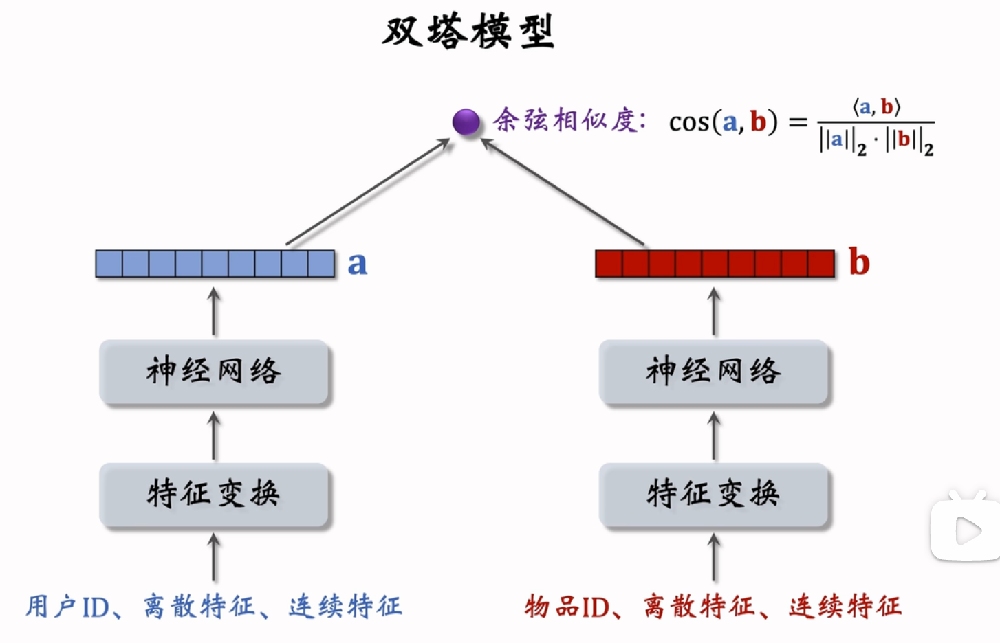

双塔模型的训练

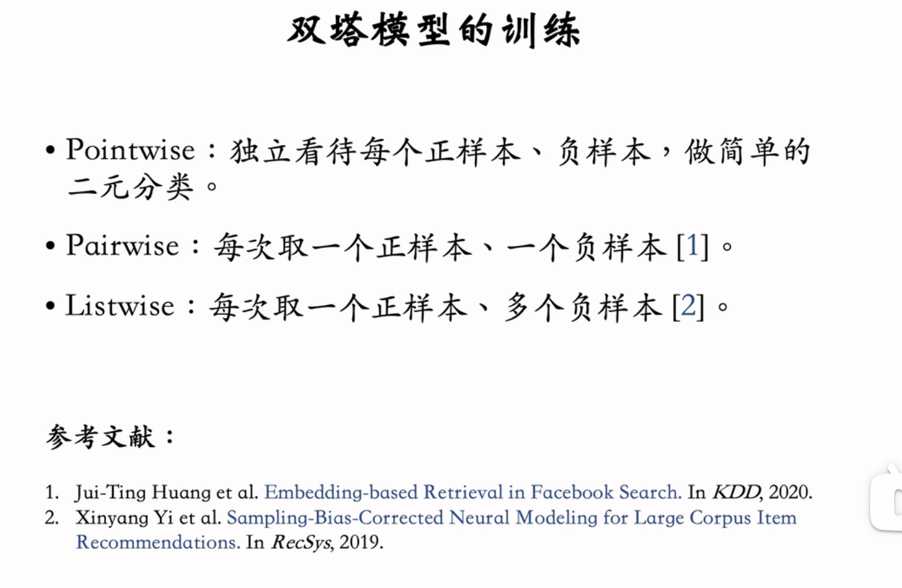

比如pointwise训练

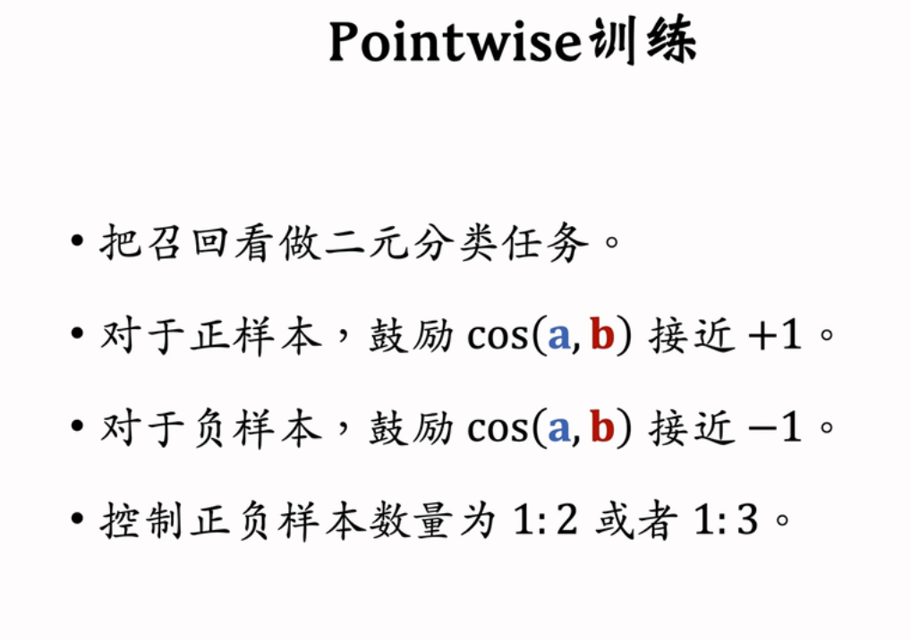

还有Pairwise训练

还有listwise训练

**负样本的选择**

**线上召回**

拿到物品塔模型，然后离线将所有物品计算成向量存储到Milvus或HNSW或Faiss等向量数据库（因为物品短期不会变化，所以可以离线存储向量），在线上做推荐时，将用户的（离散和连续）特征+id等输入用户塔得到用户向量（一般是32或64维），然后向量搜索，得到最相似的K个物品，然后推荐。

**模型更新**

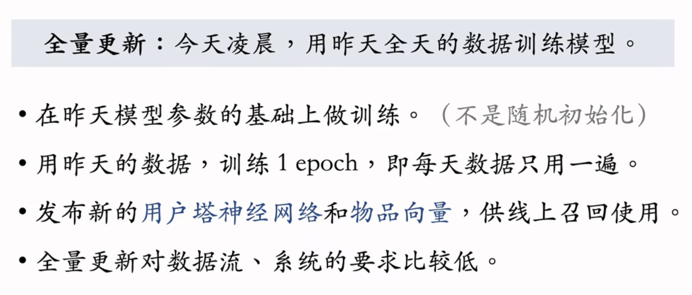

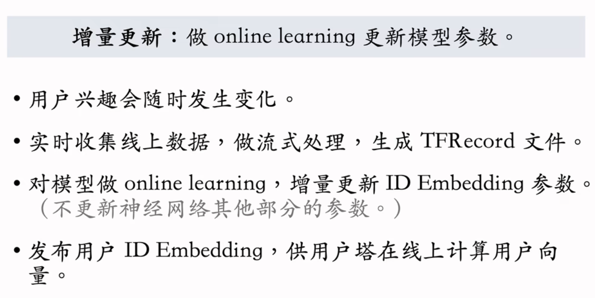

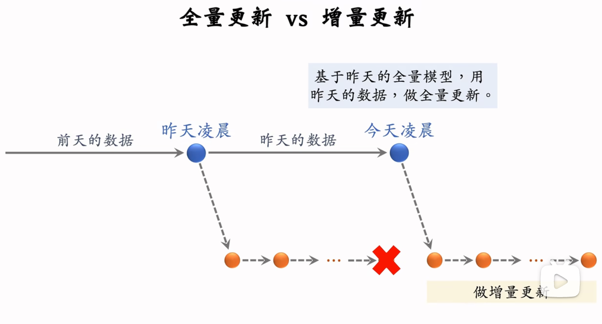

**推荐系统的特征**

https://github.com/wangshusen/RecommenderSystem/blob/main/Slides/03_Rank_05.pdf

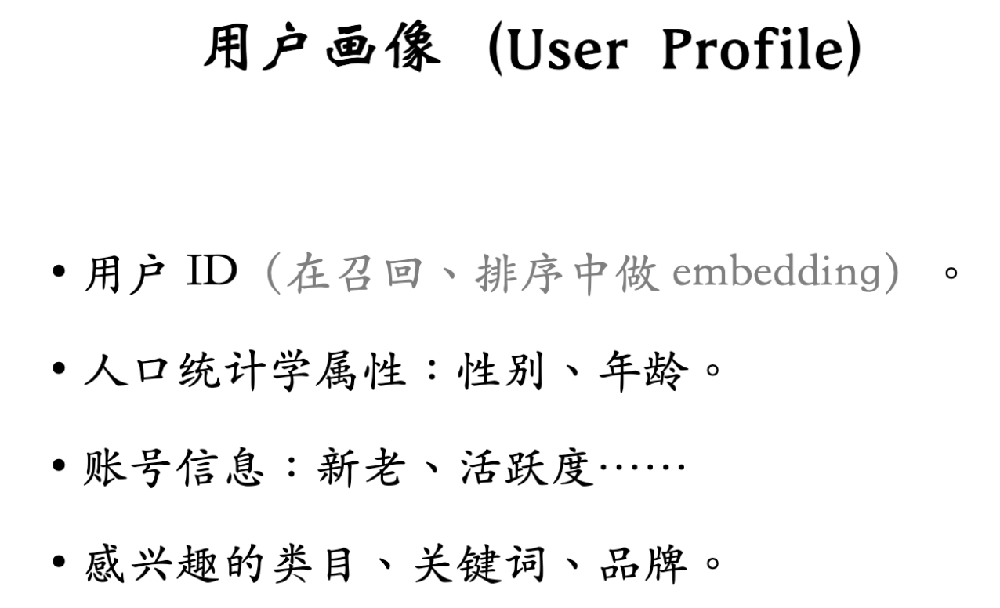

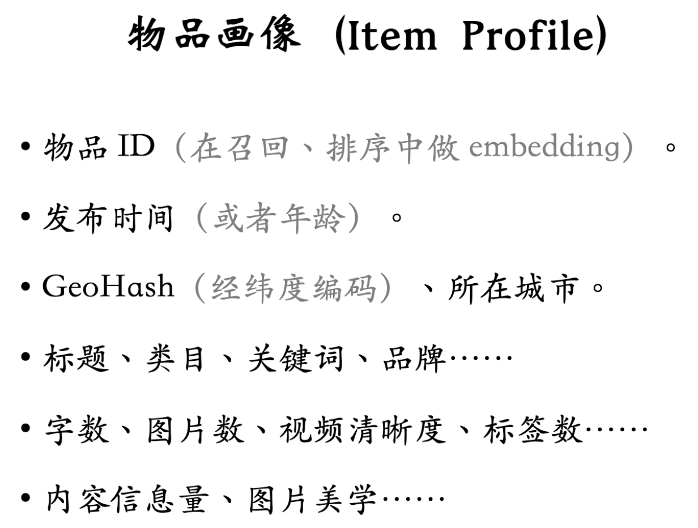

**特征处理**

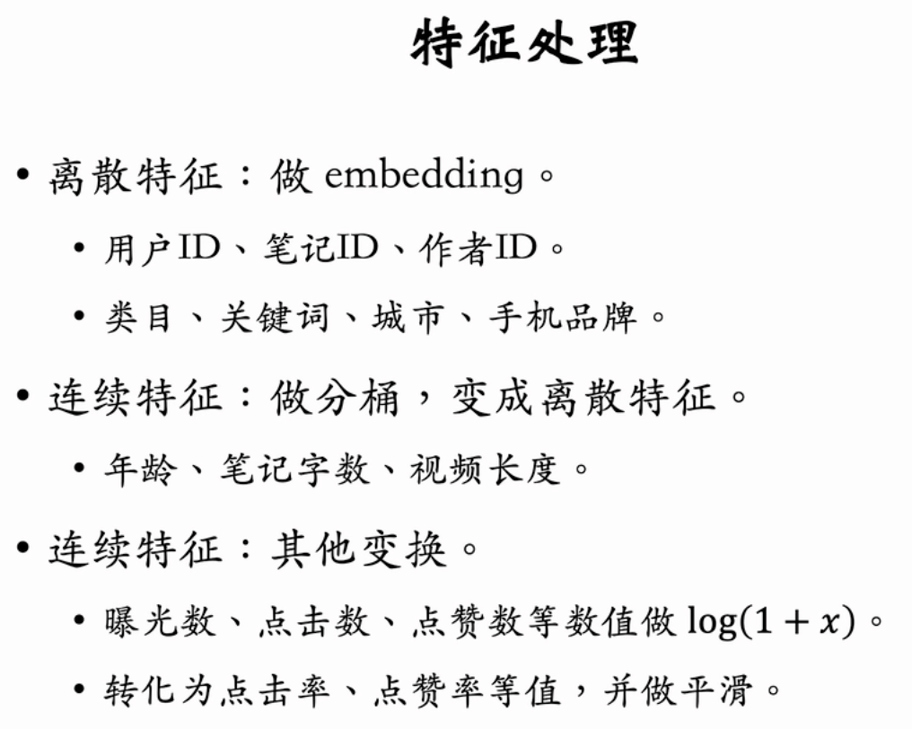

