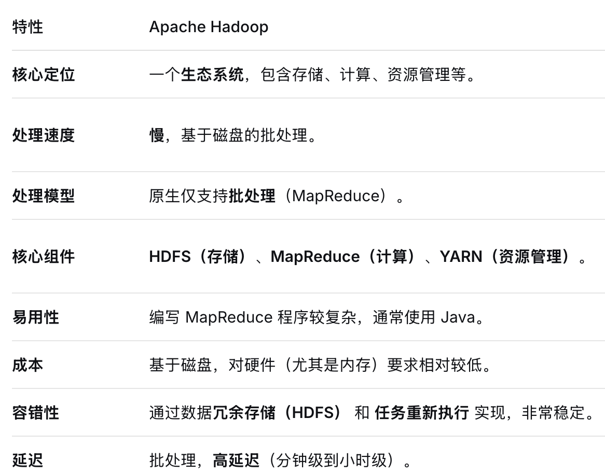
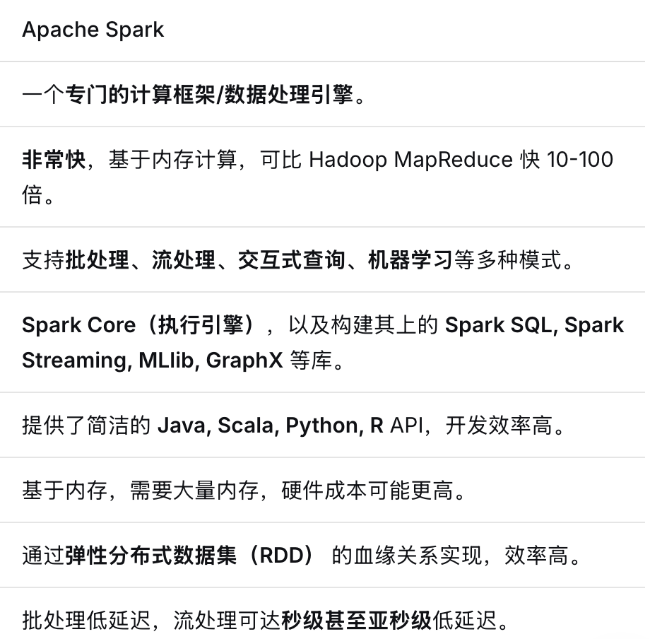

**Spark与Hadoop的区别**

https://chat.deepseek.com/a/chat/s/738ebc99-0904-41ff-96e4-0f698f837fb4

可以把 Hadoop 看作是大数据领域的“奠基者”，它定义了如何用普通电脑组成集群来存储和处理海量数据。而 Spark 则是“革新者”，它解决了 Hadoop 在处理速度上的核心瓶颈，变得更快、更好用。

