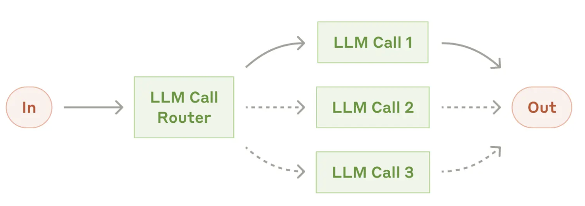
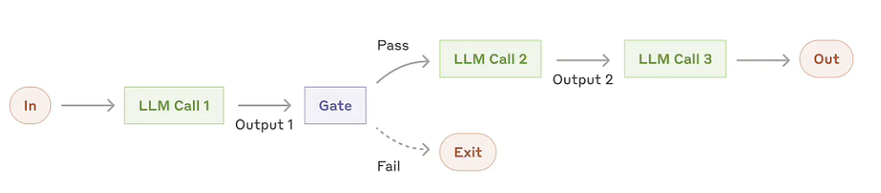
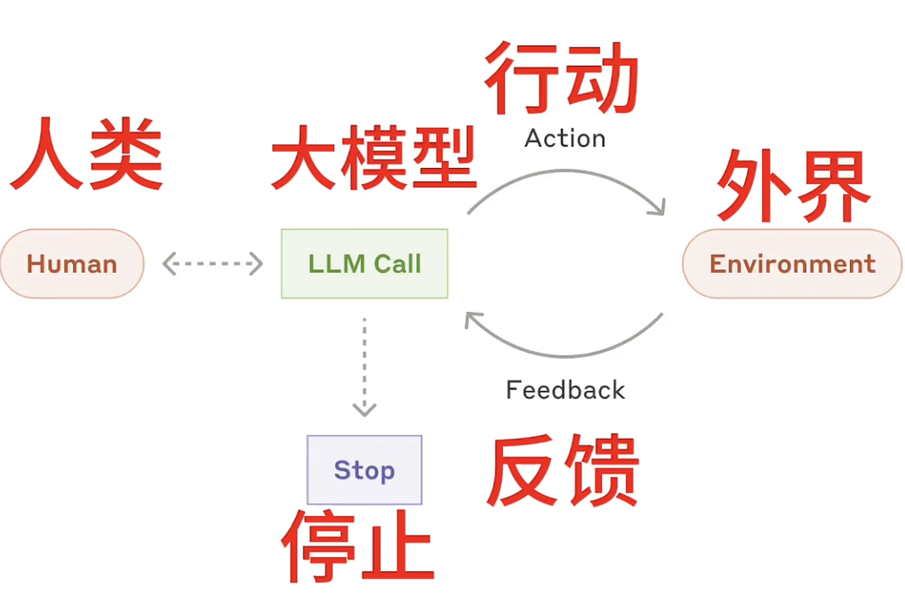
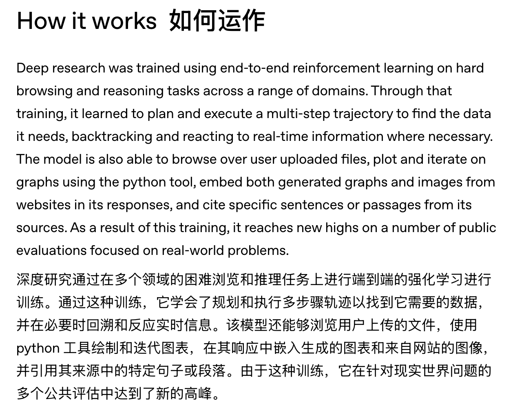
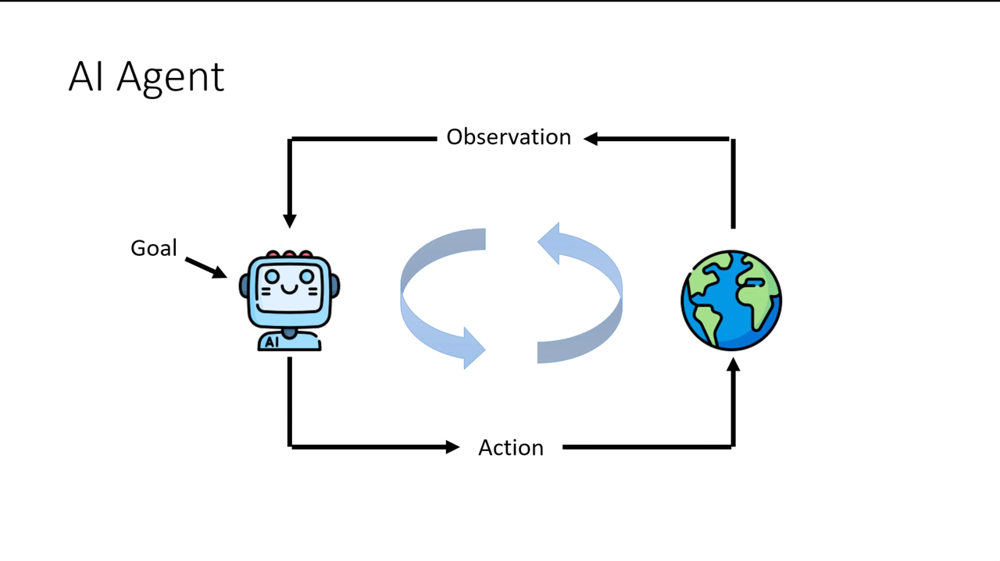
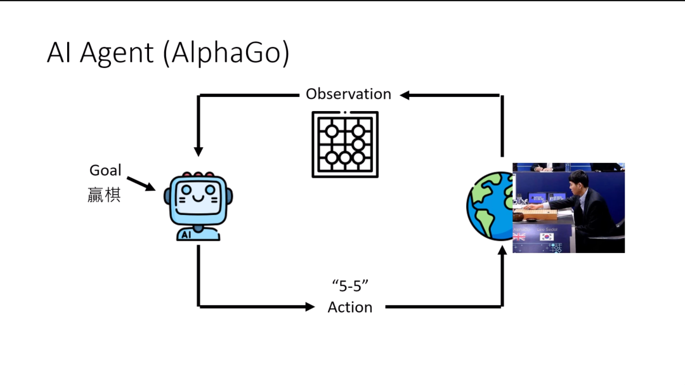
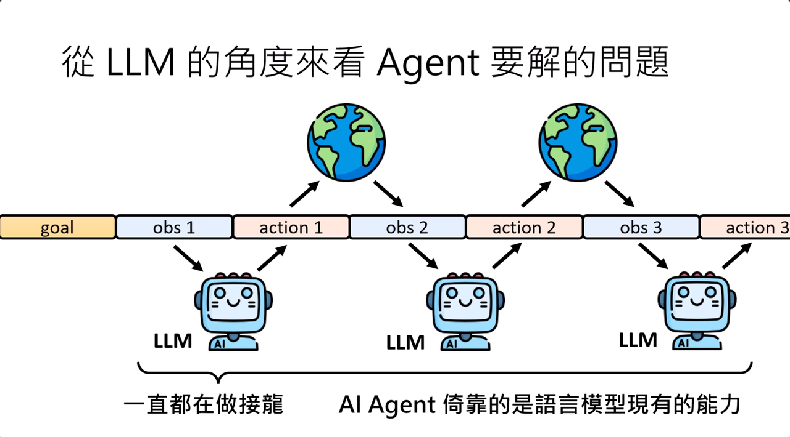
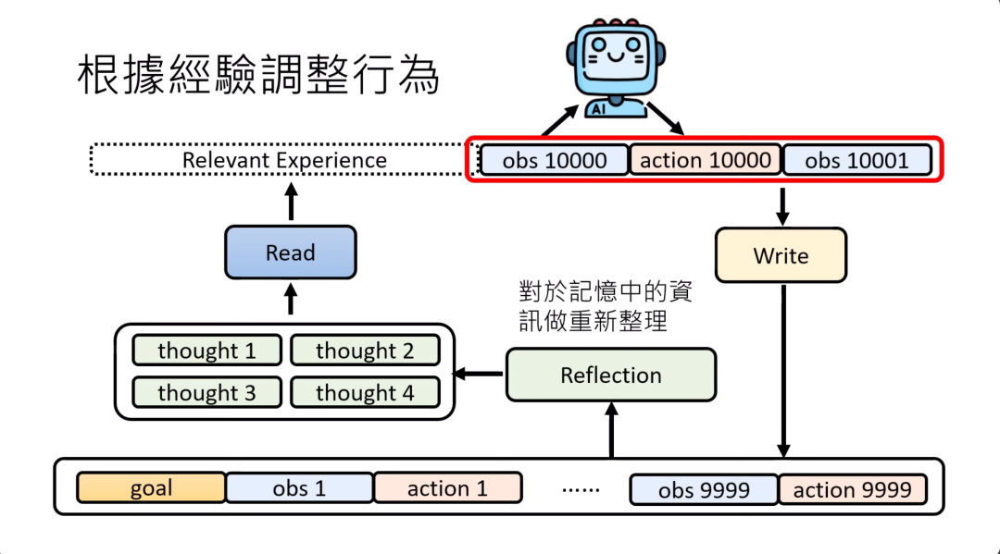

# 简介

一些有趣的Agent[链接](https://mp.weixin.qq.com/mp/appmsgalbum?__biz=MzIyMzA5NjEyMA==\&action=getalbum\&album_id=3885925693137584129\&subscene=90\&scenenote=https%3A%2F%2Fmp.weixin.qq.com%2Fs%3F__biz%3DMzIyMzA5NjEyMA%3D%3D%26mid%3D2647672885%26idx%3D1%26sn%3D33e0e31ddf8266d135ba91807b262e7e%26chksm%3Df1e76709e82f1114517b1d7fb1567dfb1a450f1484c0c2359f28a6d89ad633fca94666d5de16%26scene%3D90%26xtrack%3D1%26subscene%3D236%26clicktime%3D1751850337%26enterid%3D1751850337%26sessionid%3D1751850228118%26key%3Ddaf9bdc5abc4e8d0194125ba376734e49fccedaa95b8c5be03d92e84f3fec6ec996078c18c040cfe5a818ec496e220a8b651f0e3888ca2dcc3c8f464f04a47f024e9894fbef7bfe929f167cc65dc952882be085e3cb9076d17321c77d28dc54253db2bd3f3e57c2d1221d1189d7922b87ab4b2ef1edd345a2b8363d12c6b76a0%26ascene%3D1%26uin%3DMjEwNTkwMTM4Mw%253D%253D%26devicetype%3DUnifiedPCMac%26version%3Df2640611%26lang%3Dzh_CN%26countrycode%3DCN%26exportkey%3Dn_ChQIAhIQy%252FgSo%252FJYwRuJj3ysu1SXUBLkAQIE97dBBAEAAAAAAM%252FgJtWAJcsAAAAOpnltbLcz9gKNyK89dVj00y0Jl6Lucl%252FH4vwE4fgKM7CPT%252FC2CoADLqgBdVQ838C8YOPUhfOXll7T8BztSx2Pul82s7PNU5h7BoKvvsjt99z7kUgjCIwBnUg96U804JYJikyY6GVtaFtXdz2Dl8tfpGDHiUqucbFeMQQU%252FwXGVfqpWhW%252B0mKgL%252B1LL%252BFKrhE5DDRcZ1%252B9i1bTuEmUtitT1pujF3PLcB%252F5lbgsZPTr80XkpBvGwSGDv2ezvfTN5ujIzaoHGCfkaUmnPyvwKg%253D%253D%26acctmode%3D0%26pass_ticket%3DbKApy8PAwuCue1cgtyGokAhZH4NyFttuUrjmmzFM%252BS0B%252FGTJMynGTYEoO%252FuxhcGK%26wx_header%3D0%26fasttmpl_type%3D0%26fasttmpl_fullversion%3D7805415-zh_CN-html%26from_xworker%3D1\&nolastread=1\&sessionid=#wechat_redirect)

## **Agent、MCP、Function Calling和Tool use到底是什么关系？**

可以这么理解，Agent是自主规划并完成业务功能的系统，LLM是核心大脑，而MCP、Function Calling和Tool use都是扩展LLM能力的，

现在的Agent开发核心依赖LLM，业务功能通过开发各种工具实现，而工具与LLM之间的接入标准/协议目前最热门的就是MCP。Function Calling用的也非常多，只不过MCP的标准更通用且功能更强大。

写在2025年9月5日的今天，Qwen和Deepseek都发文，预告即将发布最新的Agent大模型，包括前几天美团首次发布LongCat Agent能力增强的大模型，前段时间的AutoGLM2.0（为手机而生的通用Agent），这些都是在Agent领域数据集上专门训练过的LLM。领域数据不懂可以看[这里](https://mp.weixin.qq.com/s/CdjSv1CGetZqn79TrL7lHA)

Function Calling是在本地为LLM提供工具功能，实现Agent业务，而MCP也可以提供工具，但由于其CS架构，它可以被更多人复用，减少重复造轮子。

## **完整的Agent架构通常包括**：

* **规划层**：任务分解和执行计划

* **记忆层**：短期和长期记忆管理

* **工具层**：各种外部工具和API

* **执行层**：具体操作的执行

* **反思层**：结果评估和自我改进

https://www.anthropic.com/engineering/building-effective-agents

**路由**

如果工具太多，比如数十个以上，都放在一个LLM中，效果会打折扣，但如果设置一个路由，每次先让路由来决定该使用哪一组路由，再去让LLM判断具体使用哪个工具，效果会好很多。

## Agent和工作流的区别

工作流是预先编排好的流程，而Agent是动态的，根据任务动态生成。

**Anthropic 眼中，代理/Agent的本质极其简单：模型在一个循环里使用工具。**

注意，大量市面上所说的”智能体“只能称为工作流，因为它不需要LLM来自主规划，都是一些工具的流程，实质上只是一个自动化的软件。但Agent不同，Agent是思考加自主规划，然后不断迭代。

工作流是预先定义的代码路径来协调大模型和工具的系统。

注意，Agent是增加了系统的复杂度，如无必要，无需增加。一般来讲工作流即可完成的，不要用智能体（绝大部分99%场景都不需要智能体），因为现在的场景中大多数都是有相对稳定和成熟的工作流程的，直接用自动化来实现即可。

**真正需要智能体的模式：（增加人类反馈，让人类来判断工具的执行结果进而指导或改变大模型的规划）**

**何时使用代理：** 代理可用于**解决开放式问题，这类问题难以甚至无法预测所需的步数，并且无法硬编码固定路径。LLM 可能会运行多轮，您必须对其决策有一定程度的信任。代理的自主性使其成为在可信环境中扩展任务的理想选择。**

# Agent入门

**Manus就是个Agent，还有DeepResearch**

**1、首先讲讲Manus**

虽然都是一个对话框，但是Manus的能力还不太一样，他不是那个你提出个问题，AI一会就会直接给你回答Chatbot。

而是当你提出问题之后，他会根据你的问题和要求，来拆解任务，进行极度复杂的任务规划和执行。并且会在云端自动运行，你可以直接退出出去，等运行完了，会通知你。

[让Manus随手做了一个千问开源的时间线。](https://mp.weixin.qq.com/s/l-79h5dnYOXQ17fDNasR7w)

**Agent产品几乎都是遵循：“计划 → 执行 → 结果合成”这一套。**&#x5373;使是OpenAI最牛逼的DeepResearch也是如此。

只不过DeepResearch是一个重新训练的模型，所有一切Agent操作都是由一个由o3重新训练的端到端模型完成的，而不是每一步用不同的模型来完成。

相比之下，Manus的做法则是工程化，用各种不同的模型和技术来做整合，这个就是Multi-Agent（多智能体架构）。

而最核心的三个能力，一般就是Agent的定义：1. 规划能力。2. 工具使用能力。3. 记忆能力。

**整个Agent产品其实最核心的就是这个底层模型的规划能力，所以这个东西是能提高Agent产品在后续任务中的成功度的。**

Manus的底模用的是Claude3.7，规划能力无法改变，但第二个工具使用能力，Manus整合了市面上所有的工具能力，有了Computer Use、Code Interpreter、Artifacts等等的能力，并且允许在虚拟机中进行异步调用，这是一个非常棒的交互和产品的创新。

说白了就是个究极缝合怪。（不是贬）

**2、其次讲讲[DeepResearch](https://openai.com/index/introducing-deep-research/)**

3、扣子/coze

4、dify

# Agent常见策略

https://claude.ai/chat/dd526217-968f-45ab-a133-d462adcc207b

**CoT**

很简单，就是让大模型一步步思考和推理，将任务拆解。

**ReAct**

先对复杂任务进行推理规划，然后执行所需工具，然后根据结果进行下一步推理。

**Reflexion**

引入自我反思机制，Agent在执行任务后会反思失败原因，将经验存储到记忆中，用于改进后续行动。

**Tree of Thoughts (ToT)**

将思考过程组织成树状结构，在每个节点探索多个可能的思考路径，可以进行回溯和剪枝，适合需要探索多种可能性的任务。

**Multi-Agent系统**

多个Agent协作，每个Agent负责不同角色或任务，通过通信和协调完成复杂任务。

# Agent详解

李宏毅课程链接

https://www.youtube.com/playlist?list=PLJV\_el3uVTsNZEFAdQsDeOdzAaHTca2Gi

https://mp.weixin.qq.com/s/rX4i5pi7mHLpm0iJHsMrSg

## Agent优秀例子

让Manus绘制Qwen系列模型推出的时间图：

https://mp.weixin.qq.com/s/l-79h5dnYOXQ17fDNasR7w

## AI Agent是什么

AI agent（智能体）的意思是说，人类不提供明确的行为或步骤的指示，人类只给AI目标，至于怎么达成目标，AI要自己想办法。比如，你给AI某一个研究的议题，那你期待一个AI agent就应该能够自己提出假设，设计实验，进行实验，分析结果。如果分析出来的结果跟假设不符合，要回头去修正假设。

以下围棋的AlphaGo为例：

这就是一个AI Agent，一个下围棋的智能体。AlphaGo的解决方案是训练一个奖励模型，使用强化学习RL来打造AI Agent.

### 用LLM实现AI Agent

除了强化学习，LLM也可以来做Agent的事情，只是LLM的本质上是文本接龙游戏，所以要做的事情/目标需要以文本接龙形式呈现。

## AI Agent关键能力

* 根据经验调整行为

  * 训练模型，更新模型参数（不是本课程内容）

  * 直接将action的结果放到observation，LLM续写就可能成功（今天已经有太多的证据说明，这些语言模型可以根据你给他的反馈改变他的行为，不需要调整参数。）

    * Agent的经验可以放到数据库，使用RAG模块来提升Agent能力

      

    * MemGPT,2023年

    * Agent Workflow Memory，2024年

    * Agent Memory Agent，2025年

* 如何使用工具

* AI Agent如何执行计划

## Agent容易出问题的点

一篇好文，why im betting against ai agents in 2025

agent容易出问题的点：
1、错误复合效应
每一步大模型正确率在95，复杂任务如果处理20步，最终正确率也只有36，也即三分之二的失败率
这个问题是把提示词写的再好也无法解决的，因为大模型一定有误差，而且执行步数是必须的

解决：大问题拆解成小问题，大模型的每个解法会让用户来确认执行。

2、成本高
当多轮对话后，前面token要带上，这增加了成本（作者这里没有考虑缓存，差评）

解决：尽量设计无状态对话，尽量少的使用上下文

3、智能体成功的关键在于工具tool而非大模型
比如Claude code的大模型claude换成ds，效果依然很好，因为工具非常多，完善

设计好的AI便于理解的工具，构建清晰的反馈机制，方案的回滚机制等很重要

计划能力

## 大模型中Function Call、Tools和MCP的区别及使用场景如下：

[区别](https://www.53ai.com/news/LargeLanguageModel/2025051482460.html)

* Function Call：是某些大模型（如OpenAI的GPT - 4）提供的特有接口特性。它以特定格式让LLM产出函数调用请求，由宿主执行操作并返回结果。消息格式通常为固定JSON，包含 function\_name 、 parameters 字段。

* Tools：是大模型可调用的外部资源，如数据库查询工具、文件读取工具等。在不同框架中，对工具的定义和使用方式有所不同，如LangChain基于Tool类抽象，支持任意函数签名，通过prompt动态生成参数。

* MCP：即模型上下文协议，是由Anthropic提出的标准化协议，定义了大模型与外部工具交互的标准消息格式和交互流程，采用类似JSON - RPC 2.0的格式，支持自定义二进制/文本格式，通过标准输入输出实现进程间通信，适用于模型与工具、服务的解耦集成。

## Agent框架

https://openai.github.io/openai-agents-python/

openai的agent builder：https://platform.openai.com/agent-builder/edit

# Agent项目分析

openmanus

https://zhuanlan.zhihu.com/p/30090038284

