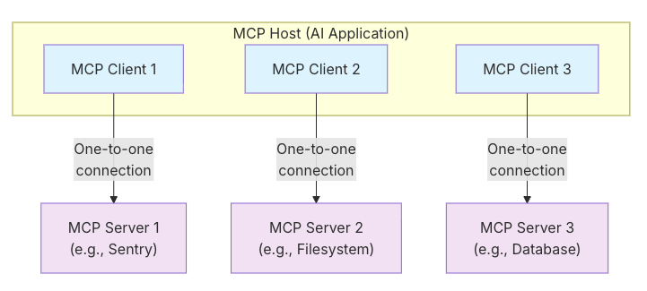

# MCP

MCP协议文档：

https://modelcontextprotocol.io/docs/getting-started/intro

Python FastMCP的文档：

https://gofastmcp.com/getting-started/welcome

## 分析

MCP Host ：协调和管理一个或多个 MCP 客户端的 AI 应用程序

MCP 客户端 ：维护与 MCP 服务器的连接并从 MCP 服务器获取上下文以供 MCP 主机使用的组件

MCP 服务器 ：为 MCP 客户端提供上下文的程序

HOST就是我们的服务本身，比如Claude Code或VsCode等，Host内可以建立多个Server-Client一对一连接




## 工作流程详解

**MCP采用的是C/S架构**，工具会集成客户端然后与远程的或本地的服务端建立连接，然后用户会话过程中会让大模型识别什么工具是需要执行的，然后等服务端执行完后再让大模型理解并返回给用户。


系列教程：https://www.bilibili.com/video/BV1cTTezwEom


## 开发框架

1、Anthropic的官方MCP SDK

https://github.com/modelcontextprotocol/python-sdk
这是mcp专门开发的Python SDK，当然langchain其实也可以做Tool use，但不是mcp


2、FastMCP（我觉得更好用一些） 是构建 MCP 服务器和客户端的标准框架。FastMCP 1.0 已被纳入官方 MCP Python SDK。

https://gofastmcp.com/getting-started/welcome


注意，现在MCP的通信只剩stdio(一般用于本地)和Streamable HTTP了，SSE被弃用了。主要原因在于SSE需要服务端和客户端保持长链接，对于输出任务过长+高并发的场景，对服务器要求很高，而Streamable HTTP能够解决这个问题。

流程：

MCP使用上述的框架开发完后使用方法是：cherry-studio、cursor、claude-code等包含MCP Client的工具通过uvx或npx来安装MCP Server。

典型使用场景：
```shell
# 运行文件系统MCP Server
npx @modelcontextprotocol/server-filesystem /path/to/directory

# 运行Git MCP Server  
uvx mcp-server-git --repository /path/to/repo
```

其中npx和uvx都会把包（和环境）安装到本地，然后运行。然后这些AI工具内置的MCP Client会自动和Server交互，从而为LLM提供工具使用入口。


# 运行Git MCP Server  
uvx mcp-server-git --repository /path/to/repo


# 插件

问与学：https://claude.ai/chat/fd21e402-2fc8-49fa-81c1-42f6528e913e

其实本质上就是大模型的Function Calling调用，也即定义好API（符合RESTful规范即可），和出入参数，将API的这些信息放入大模型的系统提示词，并约束大模型什么时候需要调用API和拒绝调用。

在问答的时候，LLM会对适当的问题调用API并构造入参，得到结果后再返回给LLM。

