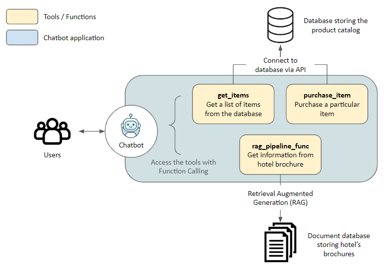

普通LLM支持Function Call，而推理模型不支持函数调用

# 定义

Function Calling到底是什么？其实就是将函数的定义描述放入LLM的系统提示词，在回答问题时让模型决定何时该调用Function或者不调用直接输出，如果调用Function，也一并输出Function名称和入参。

另外，如果系统集成得好的话，Function的执行结果（独立的程序运行）会被再次送到LLM作为参考来回答。

流程如下：

# 附录

Function Calling的讲解：

https://www.cnblogs.com/xiaoxi666/p/18594503

https://luxiangdong.com/2024/04/13/func-call/
