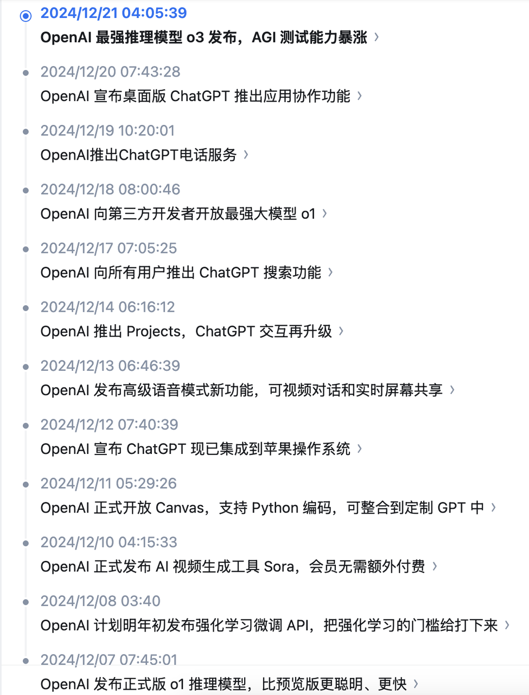

1.发展历程
大模型是个经验性的学科，现在的研究方式好处就是有效，在某些场景下实打实提升了性能，坏处就是不可控。

2022年，ChatGPT
GPT3.5基础上开发的聊天应用

2023年，百模大战
GPT4在2023年3月推出
各家都纷纷推出自己的大模型，特别是LLama的开源策略，使得各家企业具备训练私有领域大模型的必备条件。

2024年，追赶并超越GPT-4，并降本增效
优秀基模国产代表作，Qwen，deepseek
2024年本质上还是在基模上追赶国外的基模，

2025年，行业非常热衷提升大模型推理能力
2024年9月13日，o1（是个推理模型，而非基座模型）预览版推出。o1是经过强化学习训练来执行复杂推理任务的新型语言模型。特点就是，o1在回答之前会思考——在响应用户之前产生一个很长的内部思维链。通过训练，o1还学会完善自己的思维过程，尝试不同的策略，并认识到自己的错误。
随后deepseek-r1的推出，全行业都在研究推理能力

LoRa最清晰讲解
https://bilibili.com/video/BV1waZ2YDEcp

LLM-as-a-judge

StyleChat/StyleLLM
- 时间：2024-3
- 方法
  - 领域：文本风格迁移，综述
  - 基模使用GPT或其他开源LLM，利用StyleLLM对基模输出进行改写，达到一定程度的拟人效果。
  - 核心效果是StyleLLM，StyleLLM是一个基于大语言模型（llm）的文本风格迁移（text style transfer）项目。项目利用大语言模型来学习指定文学作品的写作风格（惯用词汇、句式结构、修辞手法、人物对话等），形成了一系列特定风格的模型。
- StyleLLM训练方法：
  - 基模+LoRA+RM等
[图片]
  - my own style model · Issue #2 · stylellm/stylellm_models
  - 总结：
    以下是本repo所发布模型的创建步骤，需要训练其他风格模型的人都可以以此为参考：
    1. 准备平行数据集
      - 准备希望学习风格的小说文本。
      - 将小说的全文分割成句子。
      - 使用LLM，如GPT来修改每个句子的风格。输入提示 "change the style of this sentence. \ninput: … \noutput:"，即可得到一个风格不同但含义相同的新句子。
      - 将新句子与原小说句子配对，构成一个平行数据集。
    2. SFT-有监督微调
      - 使用平行数据集训练 SFT 模型，输入是新句子，输出为原句子。
    3. RM-奖励模型
      - 使用不同的checkpoint和温度采样多个 SFT 模型输出。
      - 对输出进行排名，构成一个偏好数据集。
      - 使用偏好数据集训练 RM 模型。
    4. PPO
      - 使用 SFT 和 RM 模型训练最终的 PPO 模型。
- 附录
  - https://github.com/stylellm/stylellm_models
  - 数据集已发布：
    - 平行数据集(Parallel Dataset)：SFT
    - 偏好数据集(Preference Dataset)：RM

MemoryBank
- 一个基于艾宾浩斯记忆曲线来增强LLM记忆的机制
- 时间：2023-5-21
- https://arxiv.org/abs/2305.10250
- https://github.com/zhongwanjun/MemoryBank-SiliconFriend
Character-LLM，角色扮演的可训练的智能体
- 时间
  - 2023-10-16
- https://arxiv.org/abs/2310.10158
- https://github.com/choosewhatulike/trainable-agents
- 思考
  - 保护经验
    - 定义
      - 不允许角色回答他角色认知外的问题，也就是制造知识遗忘
    - https://kimi.moonshot.cn/chat/ctn0g40u8lder575j750
- 综述
  - 时间
    - 2024年10月
  - https://arxiv.org/abs/2404.18231
LLM规划能力综述
- 时间
- 2024-2-5
- https://arxiv.org/abs/2402.02716
CharacterBench，一个使用LLM来自定义角色的基准测试
- 时间
  - 2024-12-16
- 来源
  - 禹哥分享
- https://papers.cool/arxiv/2412.11912

杂文：
https://zhuanlan.zhihu.com/p/679177488

学习方法
- 博客
  - 快速补充自己的Agent知识短板
- 论文
  - 阅读前沿论文，解决工作中的棘手问题
  - 每日一篇经典论文
- 习惯
  - 每天用平板或Mac看论文，并做好笔记
分析总结

OpenAI
在2024年12月份的连续12天发布会：

ollama的教程
https://techdiylife.github.io/blog/blog.html?category1=c02&blogid=0037
酒馆教程
简介：PLists 和 Ali:Chat

模型合并
https://towardsdatascience.com/merge-large-language-models-with-mergekit-2118fb392b54/
https://developer.volcengine.com/articles/7390576746635984932

模型分词器和聊天模板
https://github.com/huggingface/blog/blob/main/zh/chat-templates.md

OpenRouter
一个融合绝大多数商用API的汇合路由，不过据说好像需要翻墙才能调用（我未自测）
