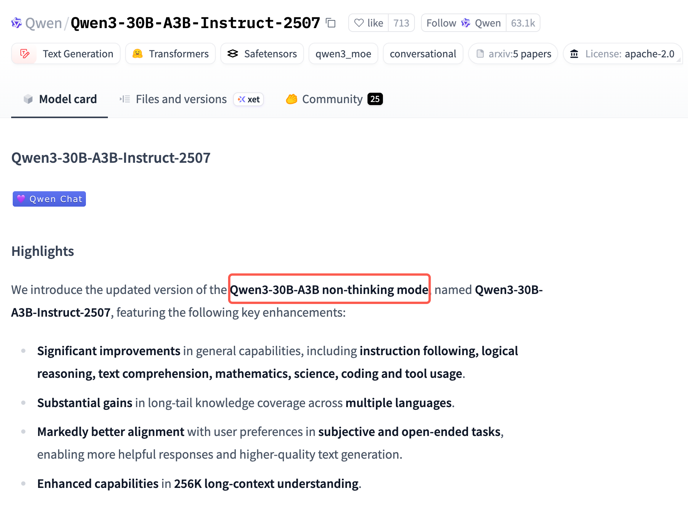

https://cloud.tencent.com/developer/article/2515102

NoThinking 方法本质上就是强制模型输出：「思考：好吧，我想我已经思考完了。」

# 不能简单地“用CoT数据训练，然后强制关闭思考模式”

这样做通常会导致模型效果严重下降，甚至不如原本的非思考模型。

这种做法违反了大语言模型（LLM）的**自回归生成机制**。以下是详细的原理分析以及正确的替代方案：

### 1. 为什么“训练CoT但推理时不让思考”行不通？

#### A. 概率依赖链条断裂 (Broken Probability Chain)
LLM是基于上文预测下一个token的。
*   **思考模式下**：模型生成答案（Answer）时，能够“看见”刚刚生成的推理过程（Reasoning）。
    *   公式：$P(\text{Answer} \mid \text{Question}, \text{Reasoning})$
    *   在这种情况下，推理过程就像是草稿纸，为最终答案提供了上下文和中间变量（存放在KV Cache中）。
*   **强制关闭思考**：如果你用CoT数据训练模型，模型学会了“必须先推导再回答”。如果你在推理时强制禁止它输出思考过程（例如通过System Prompt要求直接给答案，或强制截断思考标签），模型就失去了它依赖的“中间垫脚石”。
    *   公式变成了：$P(\text{Answer} \mid \text{Question})$
    *   **后果**：模型会因为缺乏必要的中间计算步骤，导致逻辑跳跃、胡言乱语或直接复读预训练时的错误直觉。

#### B. 模式不匹配 (Training-Inference Mismatch)
*   **训练时**：你教模型“遇到问题 $\to$ 写出长篇推理 $\to$ 得出结论”。
*   **推理时**：你强迫模型“遇到问题 $\to$ 立即得出结论”。
*   这种指令与训练习惯的冲突，会让模型处于一种“不知所措”的状态，导致其性能显著退化。

---

### 2. 正确的做法：将思考“内化”（Distillation / Internalization）

如果你希望拥有CoT的高质量结果，又希望推理时保持非思考模式的高速度，正确的路径是**知识蒸馏（Knowledge Distillation）**。

#### 操作步骤：
1.  **第一步：生成数据（用CoT模式）**
    使用 Qwen3（或其他强力模型）开启思考模式，让它对你的数据集进行推理，生成包含详细思考过程和最终答案的文本。
    *   数据样貌：`Question -> [Thinking Process] -> Final Answer`

2.  **第二步：清洗数据（去除非思考部分）**
    这是最关键的一步。编写脚本，**剔除**掉数据中的 `[Thinking Process]` 部分，只保留 `Question` 和 `Final Answer`。
    *   清洗后数据：`Question -> Final Answer`
    *   *注：你需要确保Final Answer是正确的。因为经过了思考，这个Answer的质量通常比模型凭直觉直接生成的要高。*

3.  **第三步：用清洗后的数据微调 Qwen3**
    使用这组`(Question, Answer)`数据对 Qwen3 进行微调（SFT）。

#### 效果分析：
*   **原理**：这相当于让模型“死记硬背”复杂逻辑的正确结果，或者将显式的推理逻辑“内化”为模型参数中的隐式直觉。
*   **结果**：
    *   在**非思考模式**下，这种微调出来的模型效果会**显著优于**直接用原始数据训练的模型。
    *   它吸收了CoT带来的“高质量答案”，但推理时不需要输出思考过程，实现了**高准确率与低延迟的平衡**。

### 3. 总结建议

| 你的操作方案 | 预期结果 | 评价 |
| :--- | :--- | :--- |
| **用CoT数据训练 $\to$ 推理时开启思考** | 效果最好，速度慢 | 标准用法，适合复杂任务。 |
| **用CoT数据训练 $\to$ 推理时强制关闭思考** | **效果最差**，逻辑崩塌 | **严重不推荐**。模型会“不知所措”。 |
| **用CoT生成的答案（去掉思考过程）训练 $\to$ 推理时关闭思考** | **效果较好，速度快** | **推荐方案**。这叫“能力蒸馏”，能让非思考模式变聪明。 |

**一句话建议：**
如果你在推理时主要使用非思考模式，请不要直接把带有长篇大论思考过程的CoT数据喂给模型训练，而是应该**把思考过程作为生成高质量数据的手段，只把最终的高质量问答对（Q-A pairs）喂给模型进行训练。**

# Qwen3系列模型

