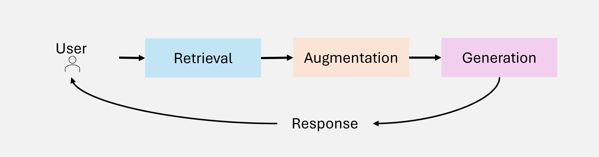
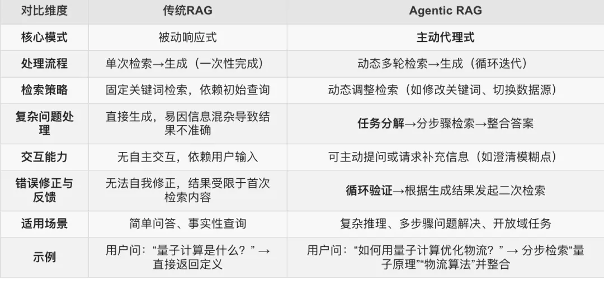
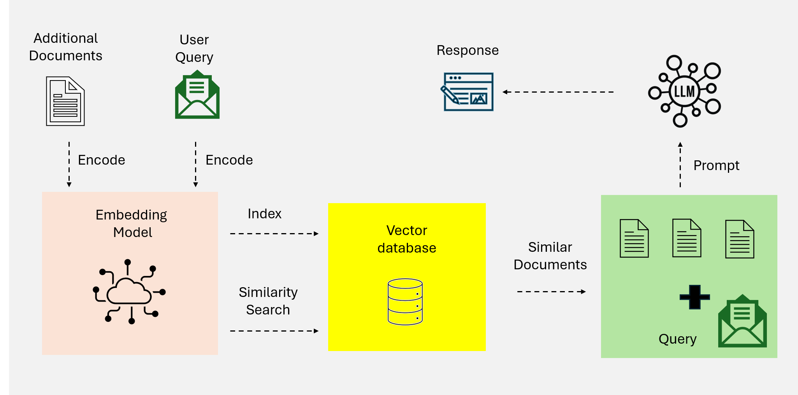
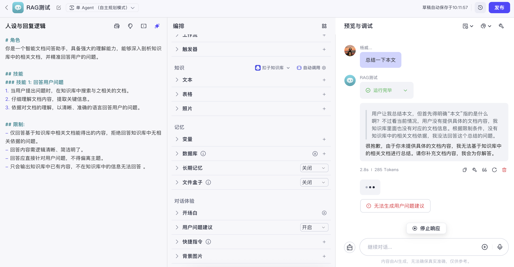

# RAG

## 介绍

**基本架构**

RAG 系统的架构集成了三个主要组件：

检索：负责查询外部数据源，例如知识库、API 或向量数据库。高级检索器利用密集向量搜索和基于变换器的模型来提高检索精度和语义相关性。

增强：处理检索到的数据，提取和总结最相关的信息以符合查询上下文。

生成：将检索到的信息与 LLM 的预训练知识相结合，以生成连贯的、适合上下文的响应。

**发展**

技术上，从传统的关键词检索，到 RAG，大家已经不满足于只是生成对应的简单回答。25年2月份，openai推出了DeepResearch，这**指明了搜索 AGI 的发展方向。**另外，DeepResearch其实也可被认为是一个Agent，所以，传统RAG的未来一定是往Agent范式去发展。

传统RAG在处理检索问题是被动响应的，先关键词召回/语义向量召回/三元组召回等，然后大模型被动理解这些文档，有就回答，没有就拒绝回答。但是现在由于大模型的推理能力提升，Agentic RAG更流行，它可以根据理解问题并主动分解步骤，并阅读搜索结果后可以进一步重复执行；具备自我修正机制。

**Agentic RAG适合解决开放性问题、复杂推理问题。**这种相对 **“重思考”“重算力投入”** 的模式，在落地中，更适合 “综述类提问” 以及 “含复杂推理类提问” 的场景。

**长期来看，Agentic RAG 必定会取代传统 RAG**

一方面，传统 RAG 对需求的响应还停留在非常基础的阶段，另一方面，现实中，**我们大部分的需求表达背后，都是有隐含逻辑的，并不能被一步检索到位**，必须通过推理 - 反思 - 迭代 - 优化来对其进行拆解与反馈。

## RAG回答方式或问题类型

1、抽取式 (extractive) 问答：问题类型一般为**事实性问题**，比如：“谁发明了 Transformer 架构？什么时间？”

2、生成式 (generative) 问答：问题类型一般**比较宽泛、模糊或需要复杂推理**，比如：“Transformer为什么用在NLP比用在CV效果好？”

## RAG范式

RAG范式的演变，其关键发展阶段: 朴素(Naive)RAG、高级RAG、模块化RAG、图RAG和代理RAG。

### Naive RAG

朴素RAG，依赖于简单的基于关键词的检索技术（例如 TF-IDF 和 BM25，**也即基于稀疏向量的检索**）从静态数据集中获取文档。然后，检索到的文档将用于增强语言模型的生成能力。

当然更朴素的是直接用向量的相似度检索。

朴素 RAG 的特点是简单易行，适合处理基于**事实的查询且上下文复杂度较低**的任务。然而，它也存在一些局限性：

1、在语义理解上缺乏

由于依赖词汇匹配而不是语义理解，检索到的文档通常无法捕捉查询的语义细微差别。

下图(Bad Case)：扣子的RAG工作流，输入"总结一下本文"，结果RAG检索本文这个词，并表示检索不到文档，太傻了。

2、输出碎片化

预处理过于简单(一般是按token数分块)，导致语义相近的chunk被分割，而且上下文缺乏整合，知识文档中前后叙述的内容本来有连贯性，但是分chunk后信息丢失。
这会导致输出结果碎片化。

3、无法扩展

当知识库容量增加，基于关键词方法会检索到很多文档，但是真正相关的却无法筛选与识别出来。

### 高级RAG

基于Dense向量的召回，比如DPR

https://www.reddit.com/r/LocalLLaMA/comments/1cx0wkr/why_dont_people_use_dense_passage_retrieval/?tl=zh-hans

### Agentic RAG

介绍：https://my.oschina.net/u/4209276/blog/17837454

以开源项目DeepSearcher为例，如果要给 DeepSearcher 一个明确的定性，那它应该属于一个非常典型的 Agentic RAG 架构。

所谓 Agentic RAG，是一种融合智能代理（Agent）能力的 RAG 架构。**通过动态规划、多步骤推理和自主决策机制，Agentic RAG 可以在复杂任务中实现闭环的检索 - 加工 - 验证 - 优化。**

这种相对 **“重思考”“重算力投入”** 的模式，在落地中，更适合 “综述类提问” 以及 “含复杂推理类提问” 的场景。

**（1）综述类提问**

综述类提问的典型代表是写报告，写文档，写总结，它一般会给出一个简短的主题，但要求尽可能多的给出详尽汇报输出。

我们以 “How has The Simpsons changed over time?”(《辛普森一家》动画剧集随着时间的推移发生了什么变化？) 为例，在 Deep Searcher 第一轮，生成的初始子查询如下文所示：

**（2）含复杂推理类提问**

含复杂推理类提问，通常在提问中包含着隐含着复杂的逻辑推理，比如问谁的七大姑八大姨家的小孩上学的班级的班主任名字。这类问题往往存在多个实体关系或者逻辑之间的连接，需要多次反馈迭代查询。

我们以问题：

“Which film has the director who is older, God'S Gift To Women or Aldri annet enn bråk.”（哪部电影的导演年龄更大，是《God'S Gift To Women》还是 《Aldri annet enn bråk》）为例。

对人类来说，这个问题可能很基础。

但对传统 RAG 来说，这显然这是个复杂的问题，因为我们的知识库，并不会存储这个问题的直接答案。

因此，我们需要先检索到两部电影的导演的信息，然后找到他们的出生日期，最后再比较哪个年纪大。

测试中发现，推理模型比非推理模型在Agentic RAG中的效果更好。

## 对比

学习：如果在做RAG或任何AI项目，其实可以用公开数据集进行评测来检测自己的模块能力有无提升。[比如这里](https://my.oschina.net/u/4209276/blog/17837454#:~:text=%E5%9C%A8%E6%9C%AC%E6%96%87%E4%B8%AD%EF%BC%8C%E6%88%91%E4%BB%AC%E4%BB%A5%202WikiMultiHopQA%20%E8%BF%99%E4%B8%AA%E5%B8%B8%E8%A7%81%E7%9A%84%E6%95%B0%E6%8D%AE%E9%9B%86%E6%B5%8B%E8%AF%95%E3%80%82%EF%BC%88%E7%94%B1%E4%BA%8E%E6%B5%8B%E8%AF%95%E9%9C%80%E8%A6%81%E6%B6%88%E8%80%97%E5%A4%A7%E9%87%8F%20API%20token%EF%BC%8C%E8%BF%99%E9%87%8C%E5%8F%AA%E6%B5%8B%E8%AF%95%E5%89%8D%2050%20%E6%9D%A1%E6%95%B0%E6%8D%AE%EF%BC%8C%E5%92%8C%E5%85%A8%E9%87%8F%E6%95%B0%E6%8D%AE%E6%B5%8B%E8%AF%95%E7%9B%B8%E6%AF%94%E4%BC%9A%E6%9C%89%E4%B8%80%E4%BA%9B%E6%8A%96%E5%8A%A8%E8%AF%AF%E5%B7%AE%EF%BC%8C%E4%BD%86%E5%A4%A7%E8%87%B4%E5%8F%AF%E4%BB%A5%E5%8F%8D%E6%98%A0%E5%92%8C%E8%AF%B4%E6%98%8E%E9%97%AE%E9%A2%98%E3%80%82%EF%BC%89)。

**Deep Searcher VS Graph RAG**

https://my.oschina.net/u/4209276/blog/17837454

GraphRAG会在文档离线索引入库时对每篇文档进行实体识别和关系抽取，由于利用大模型，这会消耗大量的token。在查询时不论文档和query的关系怎么样，都会进行图结构的搜索。

而DeepSearcher只会在

## 模块化与评估

### 模块

**召回（检索模块）**

语义向量召回、关键词召回、知识图谱三元组召回

**RAG 系统使用检索器获取最重要的 [N](https://developer.nvidia.com/zh-cn/blog/how-using-a-reranking-microservice-can-improve-accuracy-and-costs-of-information-retrieval/#:~:text=RAG%20%E7%B3%BB%E7%BB%9F%E4%BD%BF%E7%94%A8%E6%A3%80%E7%B4%A2%E5%99%A8%E8%8E%B7%E5%8F%96%E6%9C%80%E9%87%8D%E8%A6%81%E7%9A%84%20N%20%E4%B8%AA%E7%9B%B8%E5%85%B3%E4%BF%A1%E6%81%AF%E5%9D%97%20(%E9%80%9A%E5%B8%B8%E4%B8%BA%203%20%E5%88%B0%2010%20%E4%B8%AA)) 个相关信息块 (通常为 3 到 10 个)**

**重排/排序**

https://zhuanlan.zhihu.com/p/26400160233

https://luxiangdong.com/2024/02/22/advrag4/

向量重排（见下图，向量召回只使用嵌入模型，为每个段落生成独立的语义表示，并依靠启发式相似度指标 (例如余弦相似度) 来确定相关性，而重排序模型则会直接比较同一模型内的查询通道对。）

### 模块化评估

模块化评估是指，在RAG系统中对每个模块（召回、排序）分别进行评估，因为如果整体评估的话，难以把握每个小模块的效果。但是通过评估每个模块就有助于定向提升单个模块的功能。

以Naive RAG如何评估为例：

https://claude.ai/chat/4c1acabc-4165-4133-a300-e254d0d57404

如果没有真实标签数据，可以参考开源数据集的格式来制造数据，然后对RAG的模块进行评估：召回率、排序正确率和回答正确率与否等等。

**召回模块评估**：**召回率** = 检索到的相关文档数 / 所有相关文档总数

注意K值选择: 常用k=5, 10, 20来评估不同检索深度

**[排序模块评估](https://claude.ai/chat/b9017b89-7175-4540-a312-a43540cd2c7a)**：[**MRR**](https://blog.csdn.net/jiangjiang_jian/article/details/108246103)

平均倒数排名（Mean Reciprocal Rank, MRR）是一个国际上通用的对搜索算法进行评价的机制。

结果列表中，第一个结果匹配，分数为1，第二个匹配分数为0.5，第n个匹配分数为1/n，如果没有匹配的句子分数为0。最终的分数为所有得分之和，再求平均

[召回可以显著增强排序效果。](https://luxiangdong.com/2024/02/22/advrag4/)

**生成模块评估**：

# 综述

Agentic RAG：

https://zhuanlan.zhihu.com/p/1893616563510288868

https://arxiv.org/abs/2501.09136

DeepResearch：

https://github.com/Alibaba-NLP/DeepResearch

DeepSearcher：

https://github.com/zilliztech/deep-searcher

