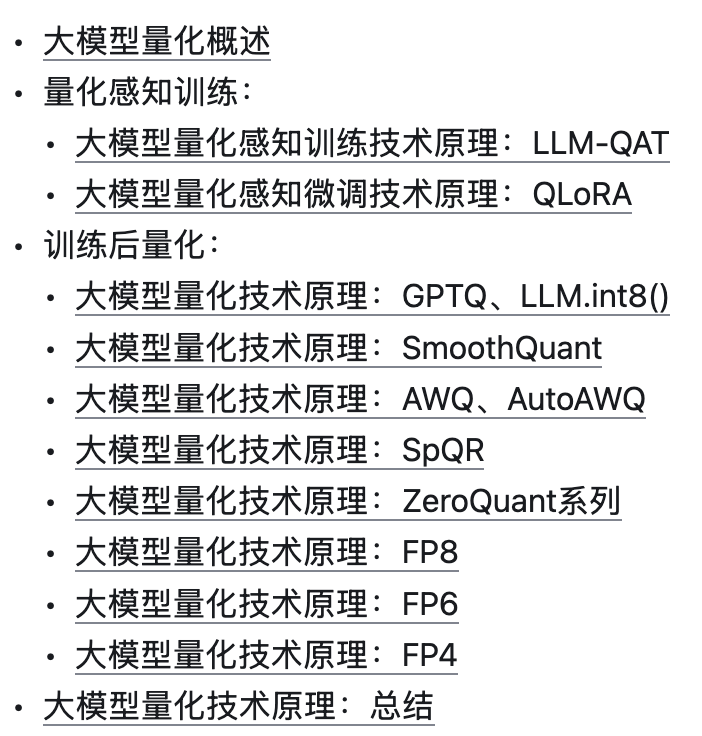
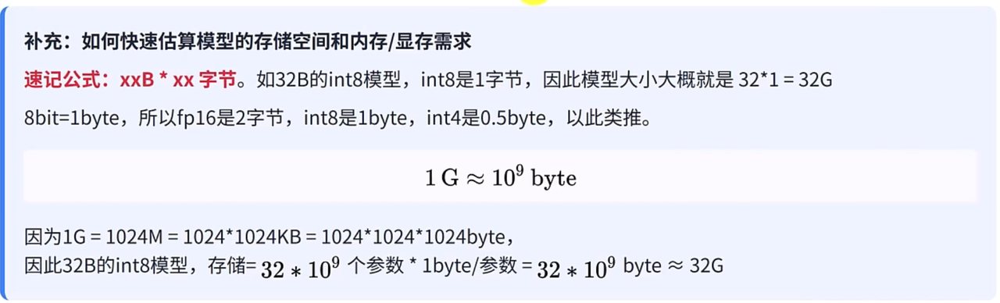

https://blog.csdn.net/weixin\_42426841/article/details/142706753

目前还没有 INT4 的 CUDA 内核，而且并非所有 Nvidia GPU 都支持 INT4 计算。

# 模型量化

现在大模型大多都是以FP16的半精度训练的模型，模型大小估计：

## 精度介绍

FP32量化到INT8，不是将参数从小数点后32位四舍五入到小数点后8位，根本不是这样。

原理：FP32是32位二进制表示的十进制小数，没有任何误差，而INT8量化就是将十进制小数映射为-127到128之间（也即8为二进制数据能表示的极限区间，或0-256，进一步说就是用2^8=256个整数来近似代替所有的十进制小数），再然后将-127到128之间的数或0-256之间的数转换为十进制小数，这就是INT8量化，转换有误差，所以这就产生了不同的量化方法。

具体：

https://chat.deepseek.com/a/chat/s/322d6d01-b0b6-4a46-983f-cb3210b12099

量化介绍：

https://www.bilibili.com/video/BV1CVLAzNEzh

### 量化的原因：

1、参数存储所需存储减少，因为所需二进制少了

2、计算加速。整数运算（比如INT8）比浮点数运算（比如FP32）要快

3、低精度分布式宽带传输更快

### 量化内容：

1、凡是参与计算的都可以量化，大头是权重和激活值

## 方法

### **bitsandbytes库**

量化任何模型的最简单方法之一，与GGUF均属于零样本量化，不需要量化校准数据及校准过程（而AWQ和GPTQ等量化方啊均需要少量样本进行校准） 。任何模型只要含有 `torch.nn.Linear` 模块，就可以对其进行开箱即用的量化。

### GPTQ

GPTQ是一种**训练后量化方法**（General Post-Training Quantization），也就是说先训练模型，模型训练完后再去做一个量化。

工具：auto-gptq

### GGUF/GGML

早期就是把各种格式兼容，pickle、safetensor等文件转为GGUF格式，作者通过C++实现了模型的量化和CPU部署支持，使得大模型能够在消费级电脑上部署。

**量化程度：**

支持INT2到INT8量化级别，

**量化方式：**

q4\_k\_m, Q6\_k, Q4\_k等量化方式（对不同的权重层进行量化）

**部署框架：**

llama.cpp、lmstudio、ollama

**流程：**

GGUF的操作流程：首先获取原始的开源模型，先将其转换为GGUF格式，然后再将 GGUF格式文件量化为较低精度。

### **AWQ（Activation-aware Weight Quantization）**

[**官方推荐**](https://qwen.readthedocs.io/zh-cn/latest/quantization/awq.html)

AWQ也是一种PTQ（后训练方法）

激活感知权重量化，使用AWQ量化的模型不会量化所有权重；而是量化对模型不重要的权重，以保持模型的有效性

原理：

* 将样本数据传递给预训练的 LLM，以确定权重和激活值的分布。

* 找出重要的激活值及相应的权重。

* 在量化其余权重为较低精度的同时，放大这些关键实体。

* AWQ量化导致的准确性损失最小。

AWQ由于准确性损失最小，所以最好

**量化程度：**&#x53EA;能INT4

**[量化方法](https://qwen.readthedocs.io/zh-cn/latest/quantization/awq.html#quantize-your-own-model-with-autoawq)（注意需要用数据来进行校准，是训练数据还是测试集还不太懂）**

## 注意

Ollama上下载的模型，都是默认量化的模型
