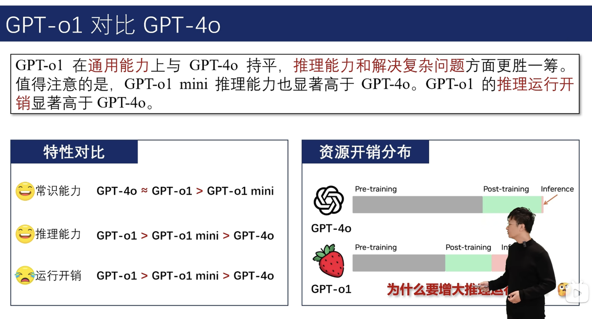

# 研究

https://mp.weixin.qq.com/s/uzih-VTaIweXIMwzhIRBjw

# 相关文章：

https://zhuanlan.zhihu.com/p/715923780

https://zhuanlan.zhihu.com/p/715923780

# 思考=思维链，思考提升推理效果

**1、关于推理模型的本质**

推理模型的本质实际上就是用更多的token/提示词来得到更精准的输出，比如：

https://chatgpt.com/c/67d13091-b8fc-8012-a253-fe5451cc0d90

直接问，回答错误，但是用另一条message让它仔细思考，答案就对了

理论上，如果用多个message来分析改写结果，基本上可以达到私有任务中SOTA的效果

2、现在的推理模型（R1 o1）其实并没有本质上从神经网络上解决模型的推理能力，本质上还是用奇淫技巧实现了推理效果。基模的优化、推理能力的提升才是实打实的真技术。

但是现在transformer架构下，token预测的限制，推理能力不能从根本上提高。这个是行业共性问题。

# GPT-o1：强化学习提升推理能力

# DeepSeek R1：没想到吧，我也做出来了

* 时间：2025-1-20

* 特点

  * R1 Zero 只专注探索推理思维了，并没有给它喂足够的高质量知识，所以它虽然思维能力很好，但话却说不出来。

  * DeepSeek-R1 在强化学习之前，先加入了冷启动数据进行微调（SFT），让模型从**一开始就具备基础的语言和推理能力**，之后再用强化学习优化推理能力。

  * DeepSeek-R1-Zero 是首个完全基于强化学习训练的推理大模型

    * 在强化学习的过程中，DeepSeek-R1-Zero 自己学会了一些意想不到的能力，比如 DeepSeek-R1-Zero 出现了研究人员称之为“aha 时刻（Aha Moment）”的现象

* 强化学习如何训练

  * 1、策略更新：这一过程让 AI 自己生成多个答案，并计算每个答案的得分（比如正确率），通过奖励机制（Reward Function），告诉 AI 哪种推理方式更有效。

  * 2、奖励建模

    * 准确性奖励（Accuracy Reward）：如果 AI 生成的答案正确，就给它更高的分数。比如在数学推理任务中，可以直接用答案对错作为奖励标准。

    * 格式奖励（Format Reward）：如果 AI 以正确的逻辑方式表达推理过程，也会得到奖励。例如 DeepSeek-R1-Zero 需要在 \<think> 标签中写推理过程，在 \<answer> 标签中写最终答案，这样可以确保 AI 形成清晰的推理逻辑。

  * 3、自我进化

    * 自我验证、反思能力、生成更长的推理链

* 表现

  * DeepSeek R1在数学、代码、自然语言推理等任务上，性能比肩 OpenAI o1 正式版。

  * 32B 和 70B 模型在多项能力上实现了对标 OpenAI o1-mini 的效果。

* 注意

  * 发现个有趣的[小问题](https://finance.sina.com.cn/tech/csj/2025-02-15/doc-inekpsyh6413762.shtml)：Deepseek-R1是不支持system prompt设置的，非assistant消息都被处理为user消息。

* 附录

  * https://zhuanlan.zhihu.com/p/21591128394

  * https://www.cnblogs.com/li-jian-Lee/p/18703414

# RLHF不是真正的强化学习

1、RLHF是单步的策略调整，而非动态大量调整

RLHF（基于人类反馈的强化学习）和其他类似的方法并没有为大型语言模型（LLM）带来真正的强化学习（RL），因为它们缺乏 RL 的核心特征：持续的环境交互和长期目标的追求。

RLHF 主要通过单步或几步优化来调整模型输出，使其符合人类偏好，而不是在一个动态环境中进行多步骤的策略调整。此外，RLHF 通常是离线或半离线进行的，缺乏实时的环境反馈和策略更新。因此，尽管 RLHF 可以改善模型的对齐性和输出质量，但它并不能赋予 LLM 真正的目标或意图，让它们「想要」赢得游戏。LLM 仍然主要是一个基于上下文预测下一个 token 的统计系统。

https://zhuanlan.zhihu.com/p/17293502660

2、很难得到奖励模型，因为人类偏好很难精确建模、或很难定量分析

之前RLHF相信做过的同学都知道这是一件非常麻烦的事情，因为Human Preference并无法精准的建模，训的Reward Model又很容易reward hacking，lilian weng都专门写了个blog来讲这件事：

https://lilianweng.github.io/posts/2024-11-28-reward-hacking/

RL的performance完全取决于reward。

# Logic-RL

https://papers.cool/arxiv/2502.14768

# SCoRe

# 字节Seed：Seed-Thinking-v1.5

* 时间：2025-04-11

* 思路：CoT数据+RL强化学习

* 结论

  1. CoT数据通过展示逐步推理过程，显著增强了模型的推理泛化能力。研究表明，CoT训练能够将推理能力从分布内（ID）场景扩展到分布外（OOD）场景，并加速收敛速度。此外，CoT数据还能帮助模型学习推理模式，即使训练数据中包含少量错误推理步骤，也能实现系统性泛化。

     1. **推理模型主要依赖思维链（CoT）数据，这种数据展示逐步推理过程。该团队的初步研究表明，过多非思维链数据会削弱模型探索能力。**

  2. 模型在强化学习训练中针对可验证和不可验证问题使用了不同的奖励建模方法。这种差异化处理提升了模型在复杂场景下的适应性。

  3. 除了CoT数据，Seed-Thinking-v1.5还整合了STEM问题、代码任务、逻辑推理和非推理数据。这种多样化的数据组合进一步提升了模型的泛化能力。

# 测试时大规模搜索采样

