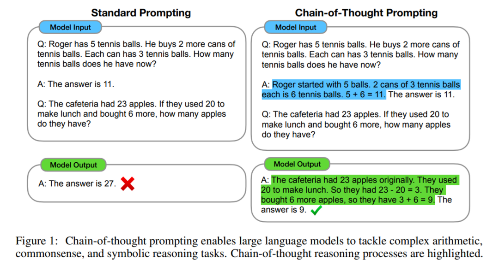
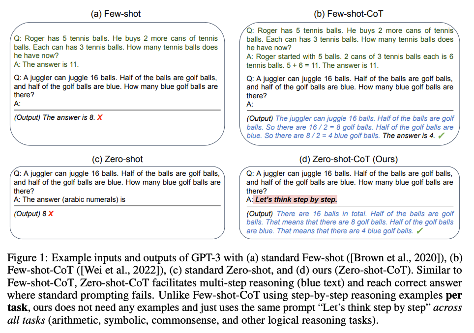

参考：https://github.com/ZJU-LLMs/Foundations-of-LLMs/tree/main/%E5%A4%A7%E6%A8%A1%E5%9E%8B%E7%BB%8F%E5%85%B8%E8%AE%BA%E6%96%87%E5%88%97%E8%A1%A8#%E6%80%9D%E7%BB%B4%E9%93%BE

按照prompting方法的演进顺序：IO --> CoT --> CoT-SC --> ToT

Input-Output prompting(简称IO)

# 1.CoT：Chain-of-Thought Prompting Elicits Reasoning in Large Language Models

* 时间：2022-1-28

* 目的：思维链提示词可以增强LLM对复杂问题（需要推理）的正确率

  * **具体，常规LLM回复时马上给出答案，没有过程。但是通过In-Context Learning中构造few-shot的推理思路案例，这样模型在回复新问题的时候也会开始推理并回复，最终提高正确率**

  * 图示如下：

  

* 附录：https://arxiv.org/abs/2201.11903

# 2.Zero-shot CoT：Large language models are zero-shot reasoners

* 思想

  * 在上面CoT👆🏻的基础上，谷歌发现发现：大模型，尤其是足够大的模型，可能不需要你费劲吧啦地写一堆CoT来作为prompt了，它自己可能就会推理了，秘诀就是加上一句咒语：“Let's think step by step.”

* 步骤

  * 具体则是需要LLM**两次**生成：

  * 1、先使用 “Let's think step by step.” 让模型自己给出推理过程

  * 2、把原始问题以及给出的推理过程再合在一起，让模型抽取出最终答案。其实第二步是不一定需要的，这里只是为了直接给出答案，所以加了第二步。

  * 思想如下：

  

* 附录：

* **评价：总体上，Few-shot CoT（又可以称之为Manual-CoT）的效果还是比Zero-shot CoT更好的，毕竟你手动认真地写了很多示范，努力不会白费**

https://blog.csdn.net/qq\_27590277/article/details/131546280

# 4.CoT-SC

CoT-SC(即Self-Consistency with CoT)就是使用多个不同的CoT来分别生成不同的token或决策，然后以少数服从多数的原则选出一个。

# 5.ToT

[Tree of Thoughts](https://zhida.zhihu.com/search?content_id=241301575\&content_type=Article\&match_order=1\&q=Tree+of+Thoughts\&zhida_source=entity)方法(简称ToT)属于在[CoT](https://zhida.zhihu.com/search?content_id=241301575\&content_type=Article\&match_order=1\&q=CoT\&zhida_source=entity)方法(Chain of Thoughts)的基础上的进一步扩展。通常利用大模型([LLM](https://zhida.zhihu.com/search?content_id=241301575\&content_type=Article\&match_order=1\&q=LLM\&zhida_source=entity))做文本生成的过程都是从左往右的(auto-regressively)，而ToT方法可以做lookahead和backtrack，即可以让LLM考虑更多的推理路径(reasoning path)并做自我评估(self-evaluating)之后再正式做出下一步的选择。用ToT方法构建起来一个tree之后，就可以利用经典的[BFS](https://zhida.zhihu.com/search?content_id=241301575\&content_type=Article\&match_order=1\&q=BFS\&zhida_source=entity)或[DFS](https://zhida.zhihu.com/search?content_id=241301575\&content_type=Article\&match_order=1\&q=DFS\&zhida_source=entity)等方法来搜索这个树，分别对应了ToT-BFS和ToT-DFS两种算法，最终得到一条最好的路径(即最后选定的可以解决问题的chain of thoughts)。

[Hulbert (2023)(opens in a new tab)](https://github.com/dave1010/tree-of-thought-prompting) 提出了思维树（ToT）提示法，将 ToT 框架的主要概念概括成了一段简短的提示词，指导 LLM 在一次提示中对中间思维做出评估。ToT 提示词的例子如下：

https://www.promptingguide.ai/zh/techniques/tot

ToT提示词：

https://github.com/princeton-nlp/tree-of-thought-llm/blob/master/src/tot/prompts/text.py

# 6.提示词教程

https://www.lijigang.com/

[ 李继刚等的prompt最佳实践](https://waytoagi.feishu.cn/wiki/JTjPweIUWiXjppkKGBwcu6QsnGd)

https://github.com/lijigang/write-prompt/tree/main

https://github.com/lijigang/prompts

[ 李继刚 | 提示词的道和术](https://langgptai.feishu.cn/wiki/AYMWwBPaSih46WkAo9jcfKkfntg)

https://github.com/langgptai/LangGPT?tab=readme-ov-file

李继刚：
https://www.cnblogs.com/fanzhidongyzby/p/18552793/prompt

https://www.cnblogs.com/fanzhidongyzby/p/18555401/prompt-compress

https://blog.csdn.net/m0\_59235699/article/details/142643673

## 案例

### 文本风格提取

* 时间：

* 感悟

  * 用伪代码写属性词的方式可以节省token的同时还能使文本精简，大模型处理效率更高。

  * JSON结构化输出后可以复用

* 附录

  * [ 小七姐：MetaPrompt-文章风格提取](https://waytoagi.feishu.cn/wiki/Ya1ZwKp3vivZc9k5rsCc9PklnLc)

# 思维链-提示词系列教程

https://www.cnblogs.com/gogoSandy/collections/2721

# 上下文工程

**上下文工程是构造多Agent、复杂任务必须要考虑的工作，通过上下文工程，提示词中可以在不同任务或任务的不同阶段构造不同的系统提示词。**

https://mp.weixin.qq.com/s/EcPPM8JoaYnabd4PgB3AjA

Karpathy 总结上下文设计要包含：

* 任务说明（task instructions）

* 示例（few-shot examples）

* 检索补充内容（RAG）

* 多模态信息

* 外部工具/函数

* 当前状态与历史上下文

* 上下文压缩与优化（compacting）

考虑太少，模型不理解任务；放太多或不相关，成本升高、性能下降。这是一门**科学的技术活**。
