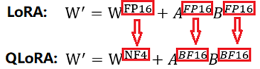
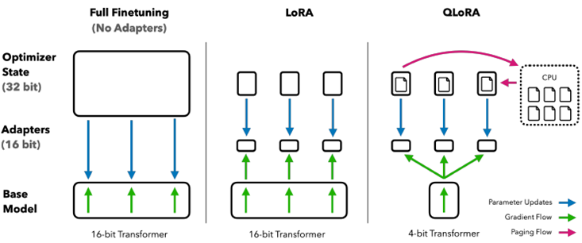

预训练模型是在大量文本上做next token prediction任务，主要理解语义特征和规律。

微调是后训练，主要是将预训练模型的能力对齐到特定任务上。

当然，训练范式包括：

1、微调（喂答案使模型完成任务，就像高考要考高分，就需要把**所有的**数据类型全部都整理好，让llm理解并泛化）

2、强化学习训练（通过建立**奖惩机制**的优化过程来提高模型完成任务的能力，适用于**有明确奖惩机制的场景**）

3、模型蒸馏（能力强的产生数据，来喂给小模型学习）

框架：

LLama-Factory，无需代码，命令行，小白使用

ms-swift，python sdk，适合**算法工程师**

unsloth，只支持英伟达卡

# 种类

freeze冻结微调

Prefix-tuning-> Optimizing continuous prompts for generation

P-tuning-> GPT Understands, Too

Prompt-tuning-> The Power of Scale for Parameter-Efficient Prompt Tuning

## 分类

全量微调 vs 参数高效微调（Parameter Efficient Fine-Tuning, PEFT）

PEFT也可以分类：

1、选择性微调：只微调部分层或某些参数

2、加性方法：只微调新增参数或层，包括Prompt tuning/prefix tuning/p-tuning

3、重参数化方法：通过对参数更新那部分参数进行低秩矩阵分解，减少需要更新的参数数量，如LoRA

## Prompt tuning

在句子前面加上特定提示词（比如：这是一个情感分类任务，句子是xxx，情感标签是xx），然后送入网络进行训练和学习。

## LoRA

* 简介

  * LoRA是一种参数高效微调的方法，它冻结了预训练的模型权重，并将可训练的**秩分解矩阵**注入到 Transformer 架构的每一层中，大大减少了下游任务的可训练参数的数量。

* 代码

  * https://blog.csdn.net/weixin\_42426841/article/details/142440572

* 附录

  * https://zhuanlan.zhihu.com/p/650197598

  * https://arxiv.org/abs/2106.09685

## QLoRA

https://www.cnblogs.com/tgltt/p/18518597

LoRA的原理是，模型参数为W，更新后的模型参数为W'，可以表示为W'=W+deltaW，其中deltaW=A\*B表示。AB可以由两个低秩矩阵表示（均为FP16）。

而QLoRA的原理是，W'=W(NF4)+deltaW，其中deltaW=A(BF16)\*B(BF16)

## **LoRA和QLoRA的区别点**

1）W现在变为4位量化的W，参数量减少为1/4

2）AB参数FP16转换为BF16（空间大小不变）

3）发现QLoRA相较LoRA，**多了一个与CPU内存进行页交换的功能(所谓Paged Optimizers)**，从而能支持更大参数量的模型微调

**两轮量化**

### **要点**

NF4量化、两轮量化、反量化等

### **流程**

1. 在微调之前，将预训练模型量化为 4 位（NF4 数据类型）。

2. 冻结量化后的模型参数。

3. 添加 LoRA 适配器。

4. 在量化的模型上训练 LoRA 适配器，梯度通过量化的模型反向传播。

5. 使用量化的模型和适配器进行推理。

### **思考**

QLoRA中量化和LoRA是同时进行的，在训练过程中是先量化再更新参数

### **问题**

https://zhuanlan.zhihu.com/p/9740276356

### ①QLoRA的结果是什么？全参数还是LoRA矩阵参数？

### ②QLoRA是否可以被视为一种量化感知训练（Quantization-Aware Training，QAT）方法？

某种角度看，确实可以。其实QLoRA 方法既具有 PTQ 的特征（在微调之前对模型进行量化），又具备 QAT 的特征（训练过程中感知量化影响）。因此，它可以被视为一种融合了 PTQ 和 QAT 特点的混合方法。

### ③为什么传统的微调技术不能直接应用于量化后的模型？

**通常而言，传统的微调技术直接对量化后的模型进行全参数微调，通常会导致显著的性能下降：**

* 量化导致的梯度传播问题

  * 梯度计算困难：在传统的反向传播中，需要计算损失函数对模型权重的梯度。然而，**量化操作通常是非线性且不可微的，这会导致梯度无法正确计算或梯度消失。**

  * 量化误差的累积：如果直接对低精度、量化后的参数进行更新，**量化误差会在梯度更新中累积**，导致模型性能的大幅下降。

* 损失函数对量化参数的不敏感

  * 更新效果有限：低位数的量化参数只能**表示有限的离散值**。损失函数对这些参数的变化可能不敏感，导致参数更新不能有效减少损失。

  * 优化困难：由于参数空间是**离散且有限的**，传统的优化算法（如梯度下降）在这样的空间中难以收敛到最优解。

### **④为什么QLoRA 可以在量化后的模型上进行微调，而不损失性能？**

* 避免更新量化参数：通过冻结量化后的模型参数，避免了量化误差在更新过程中累积的问题。

* 高效的参数更新：仅更新少量的 LoRA 适配器参数，大幅减少了计算和内存需求。

* 适应量化误差：LoRA 适配器在训练中适应了量化误差，弥补了量化带来的性能损失。

* 创新的量化方法：引入 NF4 数据类型和双重量化技术，提高了量化精度，减少了内存占用。

# 框架

## Peft

特点：

原生transformers代码来微调

## LLama-Factory

特点：

框架对各种代码进行了集成，无需手动写代码

https://www.lixueduan.com/posts/ai/05-finetune-llamafactory/

https://blog.csdn.net/weixin\_40677588/article/details/137139471

## Deepspeed

Deepspeed是一个分布式训练的深度学习库，它可以对模型训练进行提升性能。包括两大组件：

* **ZeRO优化器**：ZeRO（Zero Redundancy Optimizer）是DeepSpeed中的关键组件之一，它通过优化模型状态的存储和通信来大幅减少所需的内存占用，使得可以在有限的资源下训练更大的模型。

* **分片参数**：ZeRO通过对参数、梯度和优化器状态进行分片，将它们平均分配到所有的GPU中，这样每个GPU只存储一部分数据，从而减少了单个设备的内存需求。

ZeRO分为三个优化级别：ZeRO-1、ZeRO-2和ZeRO-3，每个级别都在前一个级别的基础上进一步减少内存占用。

# 数据格式

## Alpaca

* 简介

  * https://www.cnblogs.com/ag-chen/p/18430783

  * https://www.zhihu.com/question/611965526

  * https://blog.csdn.net/qq\_42755230/article/details/142880678

* 数据格式举例

  * [LLaMA-Factory/data/README\_zh.md at main · hiyouga/LLaMA-Factory](https://github.com/hiyouga/LLaMA-Factory/blob/main/data/README_zh.md#%E6%8C%87%E4%BB%A4%E7%9B%91%E7%9D%A3%E5%BE%AE%E8%B0%83%E6%95%B0%E6%8D%AE%E9%9B%86)

## ShareGPT

* 数据格式举例

  * [LLaMA-Factory/data/README\_zh.md at main · hiyouga/LLaMA-Factory](https://github.com/hiyouga/LLaMA-Factory/blob/main/data/README_zh.md#%E6%8C%87%E4%BB%A4%E7%9B%91%E7%9D%A3%E5%BE%AE%E8%B0%83%E6%95%B0%E6%8D%AE%E9%9B%86)

# 分布式训练

数据并行（Data Parallel）

模型并行（Model Parallel）

相关术语：

DDP、DeepSpeed、FSDP、accelerate

https://www.bilibili.com/video/BV1mm42137X8

https://llamafactory.readthedocs.io/zh-cn/latest/advanced/distributed.html

### 通信技术

GPU之间需要相互传输数据，所以就需要用到通信技术，如下：

PIX

PCIE

NVLINK

