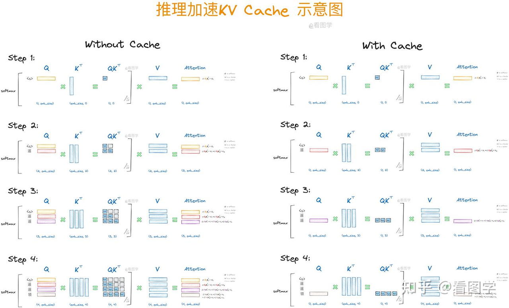

# 1、推理

## KV缓存

历史K矩阵和V矩阵在每一时刻attention的计算中都会用到，因此将其进行缓存，可节省大量重复计算。这就是KV Cache的核心原理所在。

KV缓存可以显著提高模型的运行效率，但它也带来了内存占用的问题。**KV缓存的大小随着序列长度的增加而线性增长，有时甚至可以达到模型大小的数倍。**

KV Cache的主要作用是节省计算时间，就是空间换时间（显存存储会增加）。

https://zhuanlan.zhihu.com/p/662498827



## 位置编码

https://www.bilibili.com/video/BV1ErPkeSEHn

### 1、RoPE

RoPE（旋转位置编码）是一种利用向量、矩阵计算技巧来解决Transformer中位置编码不能外推的问题，即训练时512长度，预测时不能超过512长度。

现在很多大模型如LLaMa，都用了RoPE，RoPE（旋转位置编码）在[训练时和预测时](https://www.kimi.com/chat/d0t9ks3ua3d00eititp0)都会被使用。

### 2、YaRN

YARN 的全称是 Yet Another RoPE Extention，顾名思义，YARN 是对 RoPE 的一种扩展，应用 YARN 后只需在少量的[长文本](https://so.csdn.net/so/search?q=%E9%95%BF%E6%96%87%E6%9C%AC\&spm=1001.2101.3001.7020)数据上微调即可实现模型上下文长度的扩展。

[YaRN](https://modelscope.cn/models/Qwen/Qwen3-32B#processing-long-texts:~:text=%E9%BB%98%E8%AE%A4%E7%9A%84%20config.json%20%E4%B8%AD%E7%9A%84%20max_position_embeddings%20%E8%AE%BE%E7%BD%AE%E4%B8%BA%2040%2C960%E3%80%82%E6%AD%A4%E5%88%86%E9%85%8D%E5%8C%85%E6%8B%AC%E4%B8%BA%E8%BE%93%E5%87%BA%E9%A2%84%E7%95%99%2032%2C768%20%E4%B8%AA%20token%20%E5%92%8C%E4%B8%BA%E5%85%B8%E5%9E%8B%E7%9A%84%E6%8F%90%E7%A4%BA%E9%A2%84%E7%95%99%208%2C192%20%E4%B8%AA%20token%EF%BC%8C%E8%BF%99%E5%AF%B9%E4%BA%8E%E5%A4%A7%E5%A4%9A%E6%95%B0%E6%B6%89%E5%8F%8A%E7%9F%AD%E6%96%87%E6%9C%AC%E5%A4%84%E7%90%86%E7%9A%84%E5%9C%BA%E6%99%AF%E6%9D%A5%E8%AF%B4%E6%98%AF%E8%B6%B3%E5%A4%9F%E7%9A%84%E3%80%82%E5%A6%82%E6%9E%9C%E5%B9%B3%E5%9D%87%E4%B8%8A%E4%B8%8B%E6%96%87%E9%95%BF%E5%BA%A6%E4%B8%8D%E8%B6%85%E8%BF%87%2032%2C768%20%E4%B8%AA%20token%EF%BC%8C%E6%88%91%E4%BB%AC%E4%B8%8D%E5%BB%BA%E8%AE%AE%E5%9C%A8%E8%BF%99%E7%A7%8D%E6%83%85%E5%86%B5%E4%B8%8B%E5%90%AF%E7%94%A8%20YaRN%EF%BC%8C%E5%9B%A0%E4%B8%BA%E5%AE%83%E5%8F%AF%E8%83%BD%E4%BC%9A%E6%BD%9C%E5%9C%A8%E5%9C%B0%E9%99%8D%E4%BD%8E%E6%A8%A1%E5%9E%8B%E6%80%A7%E8%83%BD%E3%80%82)可以让模型处理更长上下文，但是会损失性能。YaRN（另一种RoPE扩展方法），这是一种计算高效的方法，可以扩展此类模型的上下文窗口，所需token减少10倍，训练步骤减少2.5倍。

Qwen的说明：

所有知名的开源框架都实现了静态 YaRN，这意味着无论输入长度如何，扩展因子保持不变，可能会影响较短文本的性能。 **我们建议仅在需要处理长上下文时才添加 `rope_scaling` 配置。** 还建议根据需要调整 `factor`。例如，如果您的应用程序的典型上下文长度为 65,536 个 tokens，则最好将 `factor` 设置为 2.0。

```shell
SGLANG_USE_MODELSCOPE=true python -m sglang.launch_server ... --json-model-override-args '{"rope_scaling":{"rope_type":"yarn","factor":4.0,"original_max_position_embeddings":32768}}'
```


# 2、训练

参数量、优化器、
