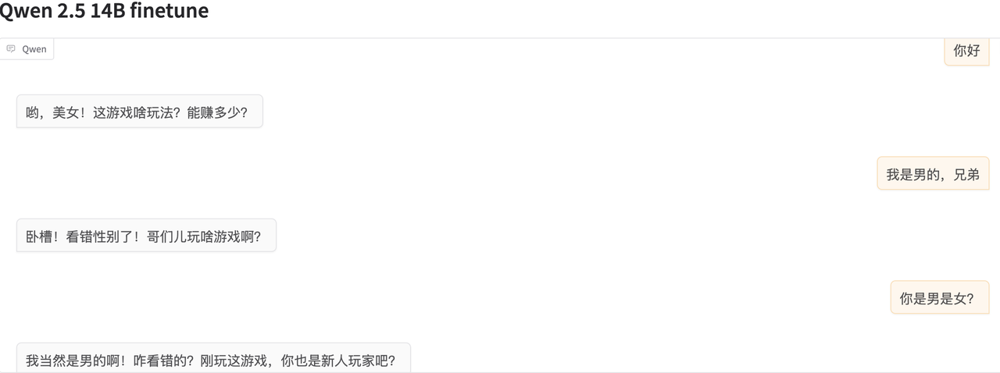
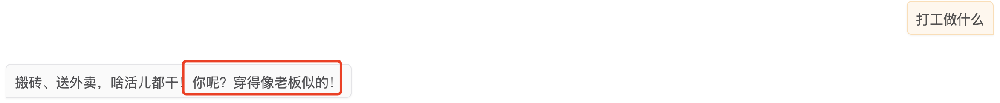
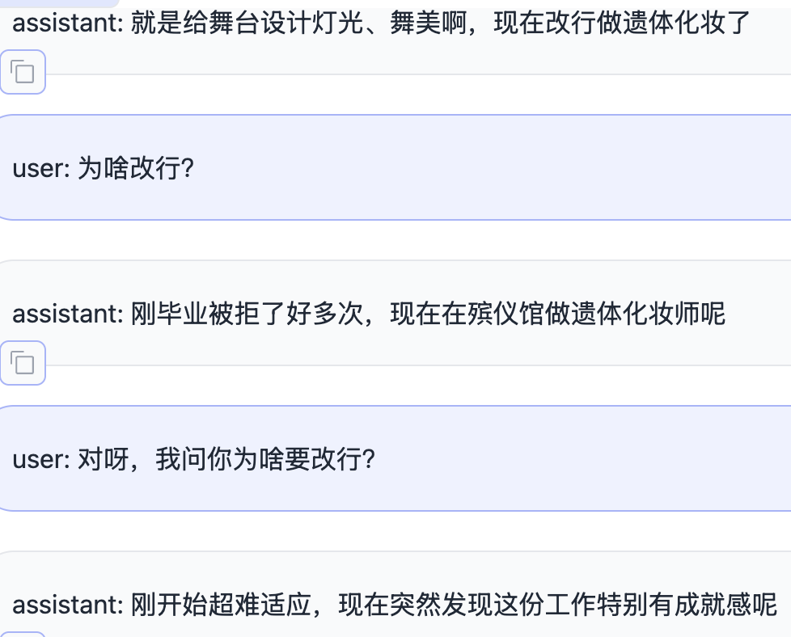
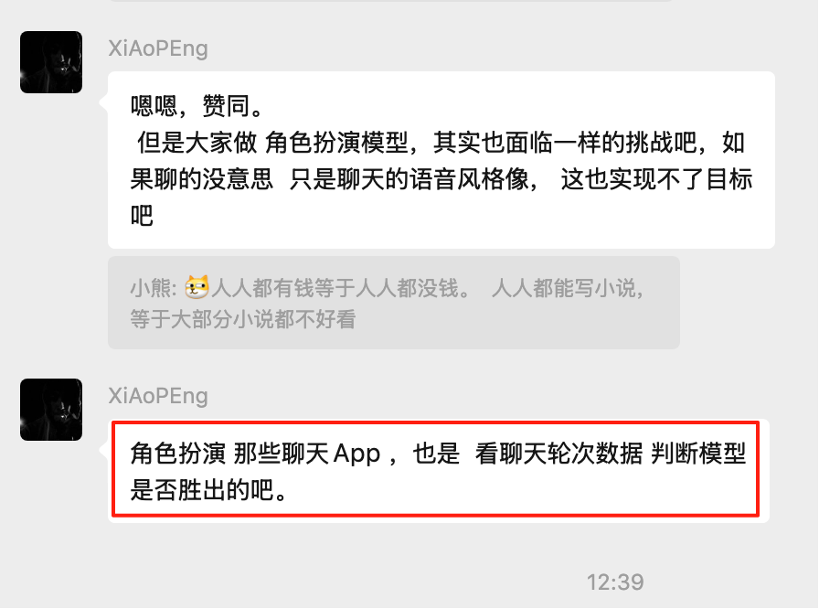

现在行业的问题是根本没有一个非常好的评价指标来评价一个模型到底好不好，那些benchmark本质上是可以用应试教育的方式去刷榜的，现在缺乏一个从数学严谨的角度上去评测某个模型好不好的指标，现在主要是主观评测。

**LLM结果需要可担责：**

1、比如生成的数据张冠李戴（问这个回答那个），因为没有做到一一对应关系，那可能就是数据清洗不够

2、如果很多特征没有学到，该学的特征没有学到，那就是交互数量不够，数据量需要增加，数据多样性不够

**思想：**

1、训练出来的模型需要评估，知道模型的好坏才敢上线。

2、微调效果不好的责任追究？到底是数据质量不高？数据数量不够？数据分布不契合？

# 模型评估指标

BLEU、ROUGE

# 模型效果评估

* 思想：

https://kimi.moonshot.cn/chat/cvfo1vbdjm8p1uvbi9h0

制造/扮演大量的用户，用户和我们训练的模型对话来生成测试数据，然后我们来设计一些**业务评估指标**，

如：角色一致性、聊天趣味性、连贯性、多样性等等

然后运用不同的模型来对测试数据进行评分（1-10），取平均分，最终评测该版本模型是否优于上一版本。

* 方法

  * 1、禹哥在2025年1月17有个完整的评价体系设计[ 虚拟人对话范围和评价方法](https://es3eflgtuw.feishu.cn/wiki/AR5twOf8aiwvirkCHLJcY9LIned)

  * 2、角色扮演模型两两互相PK评价的代码库https://github.com/boson-ai/RPBench-Auto

# 数据追本溯源

模型效果好不好，是否有提升，到底是数据的什么方面影响了结果？到底是数据质量不高？数据数量不够？数据分布不契合？

如何根据模型的效果来推导到底是数据的什么方面有问题，这就是数据的追本溯源。目前没有什么思路（这个问题更像是一个经验性学科，也即做过才知道）。

# Bad Case-定性分析：

**1、虚拟人经常对用户的身份、状态认知错误：eg, 默认用户性别女，在玩游戏，默认看见了用户穿着**

共性问题

> **训练数据中存在角色未知的用户信息**
>
> 目前构造数据时都在模拟**该角色**和很多随机角色或可能认识的人之间的对话，
>
> 由于训练时没有告诉虚拟人在和谁聊天，**但是数据中有这种信息**，这样训练出来的模型会猜测user的身份，或者默认user的身份和信息，这根本上是由数据中角色不知道user身份而数据中有身份数据导致。

**2、虚拟人聊天没有目的、场景、剧本，体验无趣**

> ①训练数据是和其他非常多角色的对话，但是真实使用场景只是一种：**角色在和陌生网友聊天**
>
> 我认为，构造训练数据的正确方法是：
>
> 用户统一定位为陌生网友（即所有数据都是：角色知道自己在和陌生网友聊天），按认识阶段来区分不同网友的对话数据
>
> ②训练单条数据**缺乏目的/场景**，而真实使用时是需要一个场景的
>
> 对不同场景设置不同的系统提示词，产生不同对话，这样训练出来的LLM具备场景把握能力

**3、训练数据中大量重复的回复数据，会导致使用中高概率回复该句话**

训练数据中就有很多：刚开始超难适应，现在突然发现这份工作特别有成就感呢，然后回复时也经常说这句话

4、聊天的拟人化效果怎么样？

拟人化感觉怎么样，长度也还行

聊天内容需要比较泛一些，不能太接实际场景的聊天

5、回复语种不一致问题：

①虚拟人语种设定和国家不一致；

②大模型无法遵循指令（要么是大模型能力有限，要么是历史上下文中含有其他语种的assistant消息）

# Bad Case-定量分析：

产品提供评估思路，程序自动评估，大模型打分，也即开发一个**评估大模型**

1、连续回复的情况，1-10分

2、

# **线上评价指标**

新模型上线，用户聊天轮数是否比老模型有增加，如果有则认为新模型胜出。

