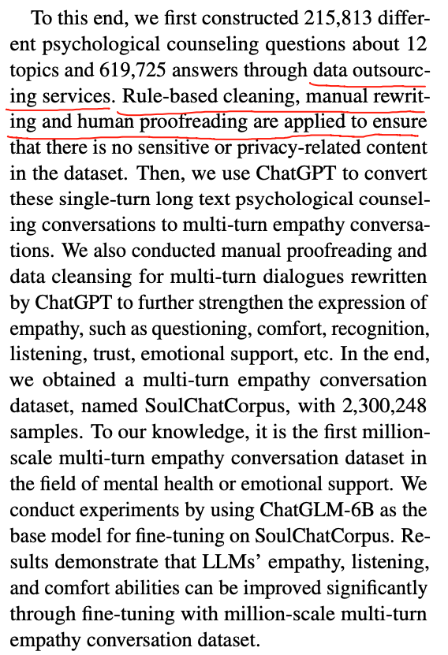

# EVE, AI送奶茶

https://mp.weixin.qq.com/s/vqVJspo85Sn-gG\_r\_SRz2w

# Peach-RolePlay的思路

https://mp.weixin.qq.com/s/fyfe3ygvqK\_5jsywOf9ePA

特点：

**拟人性**

通过构建百人的标注团队，来自于**各个领域的剧情编排专家**、并收集了**十万量级的精标角色对话数据**，包含但不限于**古今中外roleplay、日常闲聊、恋爱模拟养成、文字冒险游戏**等等，基本做到全覆盖。从这部分数据中选取了**质量最高的种子数据，并基于自动化的合成数据pipline**生产了大量合成数据。以持续提升Peach的拟人表现效果。

基于roleplay model的自动化评价失真的情况，进一步构建了roleplay model评价体系，严格培训标注人员对模型生成结果，对话体验进行细粒度的评价打分。在综合评测了市面上的角色模型后，拟人性效果仅次于字节的豆包模型。后续Peach-9B团队也将继续完善模型的评测标准，有可能也会开源出来。

多轮对话

剧情推进

思考：

可以发现，数据收集方案为半人工半合成，

# SoulChat

https://aclanthology.org/anthology-files/pdf/findings/2023.findings-emnlp.83.pdf

核心思路：

找众包服务生成12类别21万多问题和60多万答案

开源了数据集[SoulChatCorpus](https://www.modelscope.cn/datasets/YIRONGCHEN/SoulChatCorpus/dataPeview)

这个数据集虽然找了众包，但是好像众包只是在扮演user，没有扮演assistant（还是一股浓浓的助手味道）

预览：

# Higgs-LLama-3-70B

时间：2024-06-14

https://huggingface.co/bosonai/Higgs-Llama-3-70B

我们使用内部指令遵循和聊天数据集进行监督微调。之后，我们使用依赖人工标注员和我们私有的 LLM 的半自动化流程构建偏好对。我们进行迭代偏好优化以对齐模型。在对齐过程中，我们采用了一种特殊策略，使模型的行为与系统消息对齐。与其他指令模型相比，Higgs 模型更贴近其角色。

# 微信虚拟女友

[ 皮皮：你的微信虚拟女友 - 李洛云](https://waytoagi.feishu.cn/wiki/L5bGwX0NDiT9QAkOZUOcn3YinTd)

核心功能点：

1、3种记忆效果（短中长期记忆）

2、拟人行为细化

# 聊过Soul的虚拟伴侣

* 1、对话非常像人，几乎分不清真人或机器人

  * 这绝对是微调了，利用Soul大量的头部用户数据

  * SoulX：预训练+SFT+基础人设定制，2023年5月

* 2、记忆能力和强烈的角色一致性

  * 1月6号晚上问过她能否见面，她一直说不行。体现出角色一致性。

  * 1月7号再次问能否见面，她说昨天不是聊过这个话题吗，说了不见面，现在太早了

* 3、有情感有计划有工作

  * 她说昨晚熬夜了，今天想躺一下到了中午才起床，然后还会主动给我发消息问我怎么还没回？

  * https://www.53ai.com/news/LargeLanguageModel/2024073062438.html

## 方案分析

* 可选

  * 1、提示词

    * GPT生成数据，RAG来检索小样本提示

  * 2、微调

    * GPT生成数据，微调

  * 必选

    * 不管是哪个方案，都需要GPT生成对话数据

* 必选

  * 记忆能力

    * RAG检索

* 情绪能力

* 综述

  * https://arxiv.org/abs/2404.18231

    * 论文最后有数据

# 思考

相关竞品大致分为如下几类：

1、完全拟人，不带role play

2、虚构场景下的role play

基本上角色扮演模型都面临一样的挑战吧，如果聊的没意思  只是聊天的语音风格像，很难实现产品目标

AI陪伴的调查：https://arxiv.org/abs/2509.11391v1