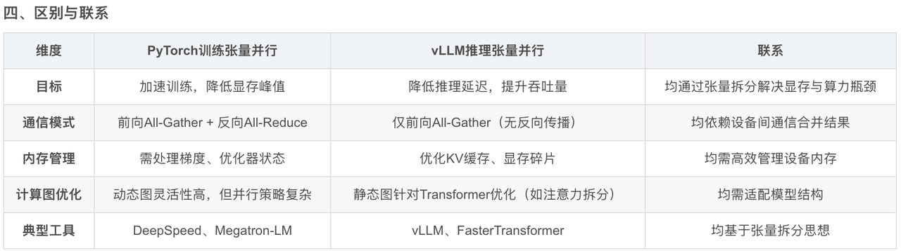

训练机器的要求：

# 1-LoRA训练和推理

1、注册数据

若为ShareGPT数据，如下：

**注意：数据集文本中不能含有tokenizer无法识别的文本，否则报错。**

```json
// /home/yw/LLaMA-Factory/data/dataset_info.json
{
  "role_dialogues": {
    "file_name": "/home/yw/LLaMA-Factory/data/dataset_019.json",
    "formatting": "sharegpt",
    "columns": {
      "messages": "conversations",
      "system": "system",
      "tools": "tools"
    },
    "tags": {
      "role_tag": "role",
      "content_tag": "content",
      "user_tag": "user",
      "assistant_tag": "assistant"
    }
  }
}

// 数据格式见:https://github.com/hiyouga/LLaMA-Factory/blob/main/data/README.md#supervised-fine-tuning-dataset-1
```

若为Alpaca数据，如下：

```json
// /home/yw/LLaMA-Factory/data/dataset_info.json
{
  "role_dialogues": {
    "file_name": "trainset_版本号.json",
    "columns": {
      "prompt": "instruction",
      "query": "input",
      "response": "output"
    }
  }
}
```

2、训练配置

webui为：llamafactory-cli webui

```yaml
# /home/yw/LLaMA-Factory/examples/train_lora/qwen_lora_sft.yaml
### model
model_name_or_path: /disk/yw/models/Qwen/Qwen2___5-7B-Instruct
trust_remote_code: true

### method
stage: sft
do_train: true
finetuning_type: lora
lora_target: all

### dataset
dataset: role_dialogues
template: qwen
cutoff_len: 2048
max_samples: 1000
overwrite_cache: true
preprocessing_num_workers: 16

### output
output_dir: saves/qwen-7b-版本号/lora/sft
logging_steps: 10
save_steps: 500
plot_loss: true
overwrite_output_dir: true

### train
per_device_train_batch_size: 1
gradient_accumulation_steps: 8
learning_rate: 1.0e-4
num_train_epochs: 3.0
lr_scheduler_type: cosine
warmup_ratio: 0.1
bf16: true
ddp_timeout: 180000000

### eval
val_size: 0.1
per_device_eval_batch_size: 1
eval_strategy: steps
eval_steps: 500
```

3、开始训练

训练命令：llamafactory-cli train examples/train\_lora/qwen\_lora\_sft.yaml

4、开始推理

```yaml
# /home/yw/LLaMA-Factory/examples/inference/role_llm.yaml
model_name_or_path: /disk/yw/models/Qwen/Qwen2___5-7B-Instruct
adapter_name_or_path: saves/qwen-7b-版本号/lora/sft
template: qwen
infer_backend: vllm  # choices: [huggingface, vllm]
trust_remote_code: true
finetuning_type: lora
```

推理脚本：API\_PORT=8009 llamafactory-cli api examples/inference/role\_llm.yaml


**训练配置**

全精度SFT32b模型，显存至少200多g，训练就得a100或者h100了，1600条数据我用8张h100也需要几个小时，当然不能用最少的显存，最少显存意味着上下文比较短（对应训练轮数比较少），为了保障不OOM，8张A100或H100比较靠谱。


# 2-全参SFT训练和推理

训练配置文件：examples/train\_full/qwen\_full\_sft.yaml

```yaml
### model
model_name_or_path: /mnt/6d5d6f24-68f7-4fc0-88f7-ab4ad5c540ac/data/yw/models/Qwen/Qwen2___5-0___5B-Instruct
trust_remote_code: true

### method
stage: sft
do_train: true
finetuning_type: full
deepspeed: examples/deepspeed/ds_z3_config.json  # choices: [ds_z0_config.json, ds_z2_config.json, ds_z3_config.json]

### dataset
dataset: role_dialogues
template: qwen
cutoff_len: 2048
max_samples: 1000
overwrite_cache: true
preprocessing_num_workers: 16
dataloader_num_workers: 4

### output
output_dir: saves/qwen2_5_0_5b_017/
logging_steps: 10
save_steps: 500
plot_loss: true
overwrite_output_dir: true
save_only_model: false

### train
per_device_train_batch_size: 1
gradient_accumulation_steps: 2
learning_rate: 1.0e-5
num_train_epochs: 5.0
lr_scheduler_type: cosine
warmup_ratio: 0.1
bf16: true
ddp_timeout: 180000000
resume_from_checkpoint: null

### eval
# eval_dataset: alpaca_en_demo
# val_size: 0.1
# per_device_eval_batch_size: 1
# eval_strategy: steps
# eval_steps: 500
```

训练命令：

```shell
CUDA_VISIBLE_DEVICES=0,1,2,3 FORCE_TORCHRUN=1 llamafactory-cli train examples/train_full/qwen_full_sft.yaml

NCCL_P2P_LEVEL=NVL FORCE_TORCHRUN=1 llamafactory-cli train examples/train_full/qwen_full_sft.yaml
```

部署命令：

```shell
vllm serve xxx
```


使用7B模型：examples/train\_full/qwen\_full\_sft.yaml

```shell
model_name_or_path: /mnt/6d5d6f24-68f7-4fc0-88f7-ab4ad5c540ac/data/yw/models/Qwen/Qwen2___5-7B-Instruct
output_dir: saves/full-sft/qwen2_5_7b
```

# 3-分布式训练

```shell
CUDA_VISIBLE_DEVICES=0,1,2,3,4,5,6,7 accelerate launch
--config_file ../accelerate/single_config.yaml
../../src/train_bash.py
--stage sft
--do_train
--model_name_or_path /data/Meta-llama3-models/Meta-Llama-3-8B-Instruct
--dataset alpaca_gpt4_zh,alpaca_zh
--dataset_dir ../../data
--template llama3
--finetuning_type lora
--lora_target q_proj,v_proj
--output_dir ../../saves/LLaMA3-8B/lora/sft
--overwrite_cache
--overwrite_output_dir
--cutoff_len 8192
--preprocessing_num_workers 16
--per_device_train_batch_size 1
--per_device_eval_batch_size 1
--gradient_accumulation_steps 8
--lr_scheduler_type cosine
--logging_steps 10
--warmup_steps 20
--save_steps 100
--eval_steps 100
--evaluation_strategy steps
--load_best_model_at_end
--learning_rate 5e-5
--num_train_epochs 3.0
--max_samples 1000
--val_size 0.1
--ddp_timeout 180000000
--plot_loss
--pure_bf16
```


# 4-部署

## 部署配置

应该是亚马逊的g6e x12large，A10G（24G显存）\*4

## Ollama

* 特点

  * 模型量化

    * Ollama 默认下载的模型为 int4 量化版本（如 Qwen2.5-14B 模型权重从 9GB 压缩至 4.7GB），显著减少显存需求26。而 vLLM 通常使用原始 FP16/BF16 模型，显存占用更高（例如 Qwen2.5-14B 在 vLLM 中需要 39GB 显存，而 Ollama 仅需 11GB）。

  * 显存优化

    * 基于llama.cpp的底层优化（如分块加载和混合精度计算）

  * 支持CPU

* 缺点

  * 模型精度/能力下降

  * 单次推理速度快，但并发处理能力差

* 结论

  * 适合本机调试，不适合大规模部署


## vLLM

* 特点

  * 高吞吐量，支持动态批处理和千级并发请求

  * 显存占用固定，需预留资源应对峰值负载

  * 不会降低模型精度（可以自定义调整）

  * 支持分布式部署和多卡扩展

* **部署**

  * LLM节点部署

  ```bash
  # 拉取镜像
  docker pull vllm/vllm-openai:v0.7.3
  
  ########################### 第一次运行容器 ###########################
  # 北京4090
  sudo docker run -itd --name vllm_node --runtime nvidia --gpus all -v /disk/yw/models:/root/.cache/modelscope -p 8080:8080 --ipc=host vllm/vllm-openai:v0.7.3 --model /root/.cache/modelscope/Qwen/Qwen2___5-7B-Instruct --port=8080
  # /disk/yw/models是本地模型存储位置
  
  # 武汉4090
  sudo docker run -itd --name vllm_node --runtime nvidia --gpus all -v /mnt/newdisk/yw/models:/root/.cache/modelscope -p 8080:8080 --ipc=host vllm/vllm-openai:v0.7.3 --model /root/.cache/modelscope/Qwen/Qwen2___5-7B-Instruct --port=8080
  # /mnt/newdisk/yw/models时本地模型存储位置
  
  # 华为云的v100(显卡能力较弱)无法部署Qwen7B-fp32，需要指定半精度f16
  sudo docker run -itd --name vllm_node --runtime nvidia --gpus all -v /data/yw/models:/root/.cache/modelscope -p 8080:8080 --ipc=host vllm/vllm-openai:v0.7.3 --model /root/.cache/modelscope/Qwen/Qwen2___5-7B-Instruct --port=8080
  ####################################################################
  
  # 停止容器
  docker stop vllm_node
  
  # 重启容器
  docker restart vllm_node
  ```

  * Nginx配置文件

  ```nginx
  user  nginx;
  worker_processes  auto;
  
  events {
      worker_connections  1024;
  }
  
  http {
      upstream backend_servers {
          server 192.160.11.252:8080;
          server 192.168.110.30:8080;
      }
  
      server {
          listen 80;
          server_name rolellm-unipus.com;
  
          location / {
              proxy_pass http://backend_servers;
              proxy_set_header Host $host;
              proxy_set_header X-Real-IP $remote_addr;
          }
      }
  }
  ```

  * Nginx服务部署

  ```bash
  # 第一次部署
  sudo docker run -itd --name nginx_node \
  -p 9000:80 \
  -v /Users/younger/nginx/www:/usr/share/nginx/html \
  -v /Users/younger/nginx/conf/nginx.conf:/etc/nginx/nginx.conf \
  -v /Users/younger/nginx/logs:/var/log/nginx \
  nginx:latest
  
  # 第二次
  docker restart nginx_node
  ```

  * 配置hosts

  ```bash
  # hosts文件
  sudo vim /etc/hosts
  127.0.0.1       rolellm-unipus.com
  ```

  * **访问nginx服务（注意关闭本机VPN）**

  ```shell
  http://rolellm-unipus.com:9000/
  ```


## SGLang部署

命令如下：

```bash
python3 -m sglang.launch_server --model qwen2.5-32B-instruct-chat789-epoch5 --trust-remote-code --tp 4 --host "0.0.0.0" --port 8000 > sglang_log.log 2>&1 &
```


## 业务代码部署

* 不同环境的重要的参数不同

  * api.config.dev or prod

  * api.funboost\_config

### AWS

* algo\_friendo:v1.0.7,  **amd64架构**，redis，url，都是在亚马逊上（已推送，勿动）

* 打包、打标签和推送镜像

```bash
docker build -f Dockerfile_friendo -t algo_friendo:v1.0.7 .
docker tag algo_friendo:v1.0.7 324037279324.dkr.ecr.us-east-2.amazonaws.com/chev/algo_friendo:v1.0.7
docker push 324037279324.dkr.ecr.us-east-2.amazonaws.com/chev/algo_friendo:v1.0.7
```

* docker容器运行

```bash
# aws挂载
docker run -it --name algo_friendo_node \
-p 7860:7860 \
-v /mnt/algo/algo_friendo:/app/api/logs \
-v /mnt/algo/algo_friendo:/app/tasks/logs \
-e RUNTIME_ENV=dev \
algo_friendo:v1.0.4
```

### 本机

* algo\_friendo:v1.0.6，dev环境，**目前暂不上传到七牛云**

```bash
# 本机无挂载
docker run -it --name algo_friendo_node \
-p 7860:7860 \
-e RUNTIME_ENV=dev \
-v ./api/config/prod.yaml:/app/api/config/prod.yaml \
-v ./api/config/dev.yaml:/app/api/config/dev.yaml \
-v ./tasks/config/prod.yaml:/app/tasks/config/prod.yaml \
-v ./tasks/config/dev.yaml:/app/tasks/config/dev.yaml \
algo_friendo:v1.0.6
```


# 5-成本节省

## Claude的缓存命中

https://docs.anthropic.com/zh-CN/docs/build-with-claude/prompt-caching


## Deepseek上下文硬盘缓存技术

https://api-docs.deepseek.com/zh-cn/news/news0802

在大模型 API 的使用场景中，用户的输入有相当比例是重复的。举例说，用户的 prompt 往往有一些重复引用的部分；再举例说，多轮对话中，每一轮都要将前几轮的内容重复输入。

为此，DeepSeek 启用上下文硬盘缓存技术，把预计未来会重复使用的内容，缓存在分布式的硬盘阵列中。如果输入存在重复，则重复的部分只需要从缓存读取，无需计算。该技术不仅降低服务的延迟，还大幅削减最终的使用成本。


注1. 缓存系统以 64 tokens 为一个存储单元，不足 64 tokens 的内容不会被缓存

注2. 缓存系统是“尽力而为”，不保证 100% 缓存命中

注3. 缓存不再使用后会自动被清空，时间一般为几个小时到几天


# 6-问题

1、成本上，我们部署的模型如何做缓存命中？是否有合适的框架或工具支持？

2、虚拟人每次回复时，需要输入多少条对话历史？所有？还是N条？（N条的话之前聊过的内容怎么办？N怎么取值？）


# 模型部署

## 数据并行


## 张量并行

张量并行（Tensor Parallelism）是一种模型并行技术，其核心思想是将模型的张量操作（如矩阵乘法、注意力计算等）拆分成多个子任务，分配到不同设备（如GPU）上并行执行。



Q：如果只有两个GPU，是否可以理解成张量并行是将模型一半加载到GPU1，另一半加载到GPU2呢？

A：张量并行的核心思想确实是将模型的一部分加载到一个GPU上，另一部分加载到另一个GPU上，从而实现模型的分布式计算。不过，具体的拆分方式并不是简单地将模型“切成两半”，而是根据模型的计算图结构和张量维度进行更精细的划分。

