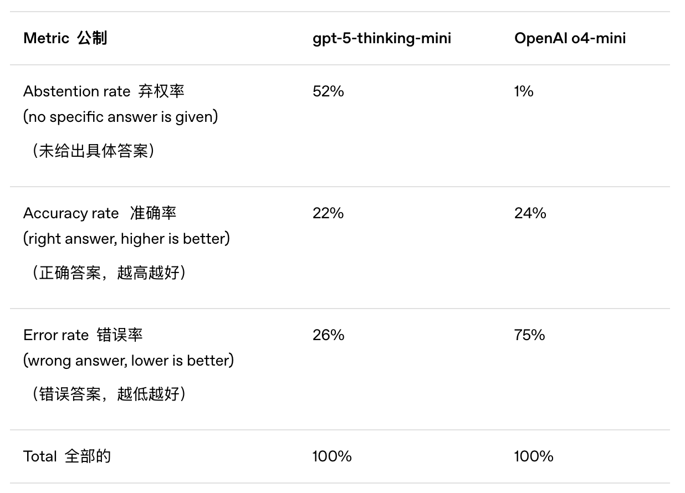

链接：https://openai.com/index/why-language-models-hallucinate/

论文细节更丰富：https://cdn.openai.com/pdf/d04913be-3f6f-4d2b-b283-ff432ef4aaa5/why-language-models-hallucinate.pdf

KIMI：https://www.kimi.com/chat/d30o08v60ra1n6jlet10

机构：OpenAI最新研究（2025-9-4），为什么大模型会有幻觉？

**思想：即使语言模型功能越来越强大，但有一个难题依然难以彻底解决：幻觉。我们指的是模型自信地生成不真实的答案的情况。我们的新研究论文认为，语言模型产生幻觉的原因是，标准的训练和评估程序更倾向于猜测，而不是承认不确定性。**

幻觉举例：

当我们向一个广泛使用的聊天机器人询问 Adam Tauman Kalai（本文作者之一）的博士论文标题时，它自信地给出了三个不同的答案——没有一个是正确的。当我们询问他的生日时，它给出了三个不同的日期，同样全都错了。

幻觉产生原因：

**1、评估方法错误**

当前很多评估方法是答对了给1分，答错了不给分。而当面对像：xxx的生日是哪一天时，模型回答我不知道，模型必定不得分，而随机猜测一天还有1/365的概率会得1分。

所以这种评估，促使模型去猜测，即便它并不知道。而这就是幻觉，即一本正经的胡说八道。

对于只有一个“正确答案”的问题，可以考虑三类答案：准确答案、错误答案和弃权答案（模型不会冒险猜测）

可以发现，即便o4-mini准确率略高gpt5-thinking-mini，但弃权率非常低，说明其幻觉率很高，都是在胡说八道。

**更好的评估方法：**

①对自信回答的错误惩罚力度大于对不确定性错误的惩罚力度

②修复打分器（没说具体怎么修复）

**2、下一个token预测的预训练方式是导致幻觉的本质原因**

思考为什么大模型几乎没有拼写错误和括号不匹配？而却有很多高度具体的事实错误？要弄清楚这个问题，要先想清楚数据中存在哪些模式。

举例：

当数百万猫狗照片被标记为猫狗标签时，算法可以学会对他们进行分类，

结论：

当下的深度学习方法（比如下一token预测），本质上都是一种模式预测（Pattern Prediction）。对于猫狗图片这种类别分类，模型可以从中学到一种模式（统计规律），再如下一token预测，模型可以学到语言模型（文字出现的概率模型），即便少量文本是有错误，数据量上来后照样可以学习到这种内在Pattern。

而知识不存在一种Pattern，比如猫狗图片上标记好生日，再去做分类任务，本质上这个知识对任务没有帮助。

另外，文本中出现大量某些人或事的事实（如某人生日），模型预训练仍然只会学到语言模型，因为生日这种知识没有帮助。所以必然会产生幻觉。

