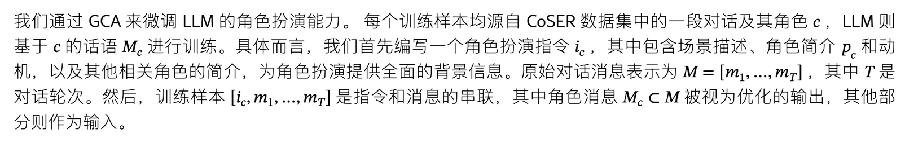
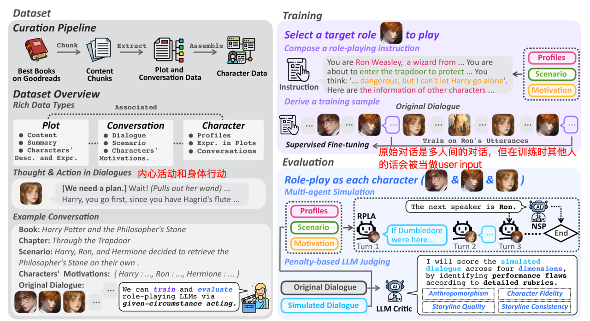

链接：https://arxiv.org/abs/2502.09082

时间：2025-1-13

This paper studies **RPLAs（Role-playing language agents） for established characters，**

本文研究的是已经建立的人物的角色扮演，

CoSER 包含的数据类型全面，如图 [1](https://arxiv.org/html/2502.09082v2#S0.F1) 所示： *i)* 除了人物简介和对话之外，CoSER 还包含情节摘要、人物经历和对话背景，支持提示、检索、模型训练和评估等各种目的。 *ii）* CoSER 中的对话能够捕捉人物的动作和内心想法，超越表面的言语层面，这使得 RPLA 能够模拟人类复杂的认知和行为过程，例如“ *\[我很紧张，但我们必须这样做]（深呼吸）好吧，我们……* ”。

总结：

1、数据更丰富，数据要素更多。包括人物简介、多人对话、情节摘要、人物经历和对话背景，以及**内心想法**和行动

2、训练数据来源于真实书籍，通过大模型提取数据要素并在选定角色上训练对话

# 数据的设计原则

CoSER 与之前的 RPLA 数据集主要不同之处在于： *1）* 丰富的数据类型， *2）* 信息中的**内在思想（internal thoughts）**&#x548C;身体动作， *3）* 环境作为一种角色（**Environment as a Role**）

丰富的数据类型体现在：

1、综合性：涵盖书中人物、情节等广泛的知识；

2、正交：承载不同的、互补的信息，冗余度很小；

3、情境丰富：提供足够的情境，使πc能够忠实地重现 c 在特定场景下的行为和反应。

**具体来说，我们通过三个相互关联的元素——情节、对话和人物——对书籍知识进行层级组织。每个情节包含其原始文本、概要、情节中的对话以及关键人物在该情节中的当前状态和经历。 对话不仅包含对话记录，还包含丰富的背景设定，包括场景描述和人物动机。 人物与他们的对话和情节相关，我们据此制作他们的个人资料。**

**对话中的思想和行动**

以往的 RPLA 研究通常将 RPLA 的输出空间限制在语音（口语表达）层面，这限制了它们完整表征人类交互的能力。本文将 RPLA 和字符数据集的信息空间扩展为三个不同的维度：语音 ( ℒ )、行动 ( 𝒜 ) 和思想 ( 𝒯 )，从而显著丰富了其表达能力。例如，RPLA 可以通过仅生成思想和行动（而非语音）来传达沉默。

speech语音用于角色的口头交流（让人能听到的）

action动作捕捉身体行为、肢体语言、面部表情等。

思想代表着内在的思考过程，这使得 RPLA 能够模拟复杂的人类认知。思想应该对他人不可见，从而形成信息不对称

**环境作为角色**

# 评价

# 实践：

问题：

1、当前content的**背景**在前文content交代，而从本content提取对话时会出现背景缺失的问题。

2、对话并非一对一

3、
