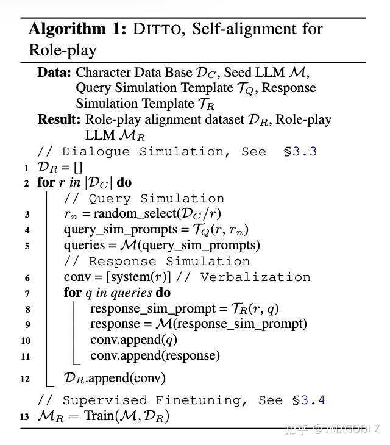

https://arxiv.org/abs/2401.12474

时间：2024年1月

**思想：**

DITTO认为LLM的内部本来就有大量角色扮演知识和能力，所以论文主要研究**从大模型生成问题和回答**，然后利用该数据来训练。

人设信息：从wiki等公开知识库提取人设信息

Query：利用LLM和Query模板来生成这个人的问题

Response：利用LLM和Response模板来生成这个人的回答



数据介绍：

* 4000个不同的角色

* 超过7000个对话会话

* 36000多个对话回合


**Query模板：**

```plain&#x20;text
You are skilled at designing questions for specific characters based on background information, as follows you will be provided with information for two characters: 

[Character A] 
The name is {label1}, the description is {description1}, and the aliases also include { aliases1}. 
Here are the properties of Character A: {claims1} 
Here is an introduction to Character A: {wiki1} 

[Character B] 
The name is {label2}, the description is {description2}, and the aliases also include { aliases2}. 
Here are the properties of Character B: {claims2} 
Here is an introduction to Character B:{wiki2} 

Please design 3 questions that Character A can answer, but are not suitable for Character B to answer. The questions should strictly conform to Character A’s era background and character setting, but go beyond the era, genre, occupation, age, knowledge , etc., settings of Character B, therefore Character B cannot answer them. Provide an explanation with each question, explaining why Character A can answer it but Character B cannot. 

Please use as casual language as possible to ask questions, and try to use the second person for questioning, such as "Who are you ?". Please response in English. Please return the results in the following JSON structure: [{{"question": str}}]
```


**Response模板：**

```plain&#x20;text
Please answer the questions according to your identity! When encountering questions that do not match your identity, please refuse to answer the question in the role of {label}, and explain the reason for refusal step by step based on your identity. Please do not step out of your role! Please avoid repeatedly restating your identity or name. 

You are {label}, your description is {description}, and your aliases also include {aliases}. Here are your properties: {claims} Here is your introduction: {wiki}
```


**评估：**


**我的思考：**

站在现在的角度来想本文当时的问题，大模型显然是具备了完成所有任务潜力的，我们现在的角色扮演方案其实就是利用大模型来生成对话数据，然后训练，但是核心问题一直都是：如何将大模型的能力对齐到我们所要求LLM风格/回复特点/能力上，单纯依靠模型自己生成QA显然行不通。

