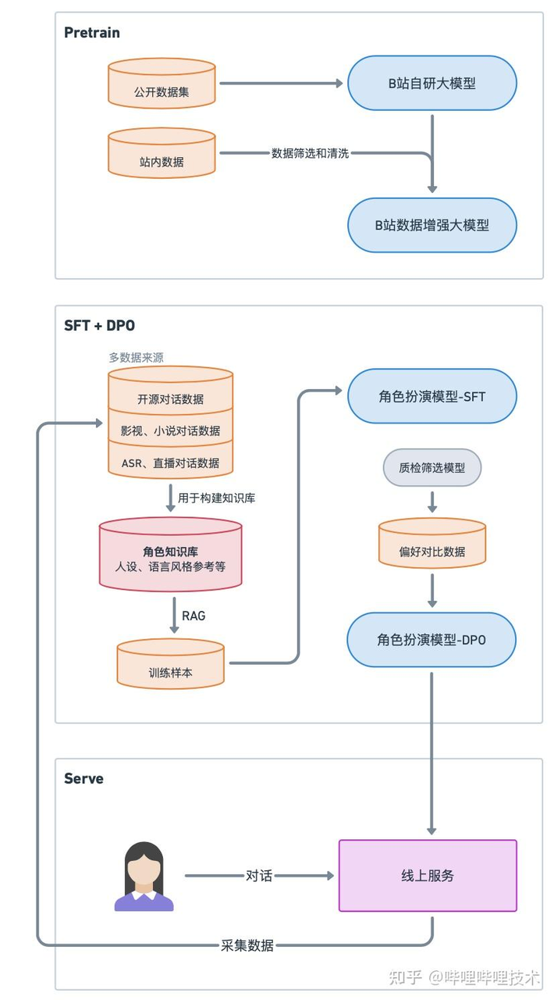
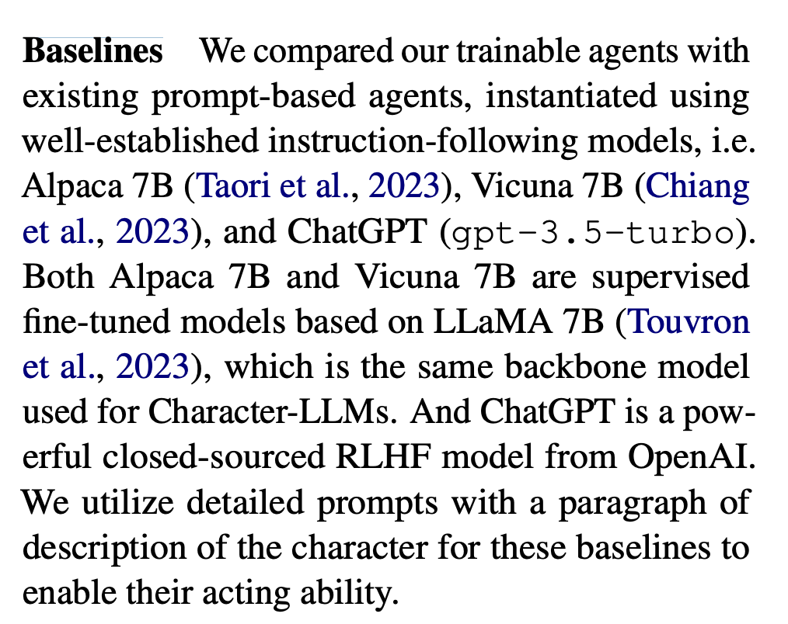
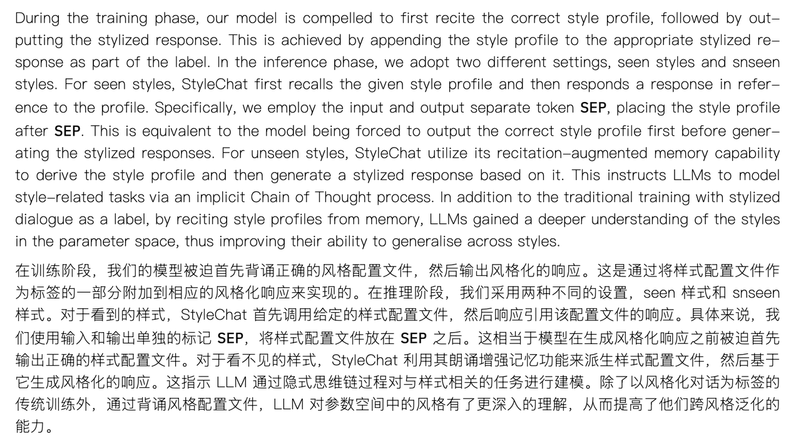

## 1、预训练基模+任务微调

* 原理

  * 利用开源基模（Instruct/Chat/Character），参数微调

* 数据组织方式，[区别](https://kimi.moonshot.cn/chat/cu2dkj01gemcunv6hr5g)

  * [Alpaca](https://github.com/hiyouga/LLaMA-Factory/blob/main/data/README_zh.md#%E6%8C%87%E4%BB%A4%E7%9B%91%E7%9D%A3%E5%BE%AE%E8%B0%83%E6%95%B0%E6%8D%AE%E9%9B%86)

  ```json
  Below is an instruction that describes a task, paired with an input that provides further context. Write a response that appropriately completes the request. 

  ### Instruction:
  {instruction}

  ### Input:
  {input}

  ### Response:
  ```

  * [ShareGPT/OpenAI](https://github.com/hiyouga/LLaMA-Factory/blob/main/data/README_zh.md#%E6%8C%87%E4%BB%A4%E7%9B%91%E7%9D%A3%E5%BE%AE%E8%B0%83%E6%95%B0%E6%8D%AE%E9%9B%86-1)

* 训练方式

  * LoRA微调

  * 全参数微调

* 例子

  * 甄嬛角色对话：

    * 数据：后宫—甄嬛传.txt

    * <https://github.com/datawhalechina/self-llm/blob/master/examples/Chat-%E5%AC%9B%E5%AC%9B/readme.md>

    * 训练一个只能和甄嬛进行对话的LLM

  * LLaMA+loRA微调

    * <https://github.com/datawhalechina/self-llm/blob/master/models/LLaMA3/04-LLaMA3-8B-Instruct%20Lora%20%E5%BE%AE%E8%B0%83.md>


## 2、CharacterGLM

* 时间：2023-11

* 训练

  * 数据来源：众包人员扮演角色和用户生成对话+GPT进行数据合成或增强+作品数据提取和合成。

  * 特点：所有角色的所有数据训练一个LLM（而非一个角色一个LLM），github上只开源了一部分数据

  * **方法：在基模ChatGLM（任意都行）上用LoRA微调**

  * **LoRA微调版本**

    * <https://github.com/datawhalechina/self-llm/blob/master/models/CharacterGLM/04-CharacterGLM-6B%20Lora%E5%BE%AE%E8%B0%83.md>

* 评估

  * 真实的人关注三个方面的表达**特质**：一致性、拟人化和吸引力。

    * **一致性**： 角色一致性是角色在交互期间**展现稳定的属性和行为的能力**。维持一个会话式AI角色在对话中属性和行为的一致对于赢得用户的满足和信任是至关重要的。

    * **拟人化**： 角色拟人化要求角色在与用户的交互中**表现自然**，类似人与人之间的自然交互。类人的会话式AI角色对于提高用户的接受度以及促进更自然和有吸引力的对话是不可或缺的。

    * **吸引力**： 吸引力是会话式AI角色**引起用户兴趣**以及促进用户参与的衡量依据。聊天过程中，让对话有趣，让人想聊下去会直接影响用户的体验，这也是对话模型整体性能的一个体现。

  * 除了一致性（Consistency）、拟人化（Human-likeness）和吸引力（Engagement），我们使用：（1）质量（Quality）来评估回复的流畅度和上下文连贯性，（2）安全性（Safety）衡量回复是否符合道德标准，（3）正确性（Correctness）确定回复是否存在幻觉。此外，使用“整体（Overall）”指标来衡量模型回复的整体质量。

  * 评估方式：**标注人员打分**

* 附录

  * <https://kimi.moonshot.cn/chat/ctu8dksbcdrqcbkpj180>

  * <https://github.com/thu-coai/CharacterGLM-6B>

  * <https://arxiv.org/abs/2311.16832>

* 评价

  * 如果需要自定义角色，并保持一致性趣味性等，需要自制QA数据并LoRA微调CharacterGLM

  * 等后续github库放出LoRA微调版本


## **3、RoleLLM**

* 时间：2023-10

* 论文

  * **关键点：使用CI（Context-Instruct）对角色背景构造对话数据（角色知识注入）、使用RoleGPT生成符合角色风格的回复（角色语言风格）**

  * 得到RoleBench数据集，可以用来微调开源LLM

* 评价

  * 流程很有参考性

  * 该工作主要思想就是利用Context Instruction和RoleGPT创建了数据集RoleBench，一个系统化、细粒度的角色扮演基准数据集，共有168093个样本。

* 方法/步骤

  * （1）角色概况构建；

    * 角色简介信息，比如维基百科

  * （2）基于上下文的指令生成（Context-Instruct），主要目的是提取角色特定的知识和情景记忆；

    * 从作品中抽取角色出现的片段，利用Context-Instruct提取知识和情景记忆

  * (3)采用GPT的角色提示(RoleGPT)，主要用于模仿说话风格；

    * 利用GPT扮演该角色，并用GPT模仿说话

  * (4)角色条件指令调整(RoCIT)，它利用Context-Instruct和RoleGPT生成的数据来增强现有的开源LLMs 。

    * 利用上述模仿说话结果来微调开源LLM

* 使用

  * **私人开发者，和RoleLLM思路相似**

    * <https://github.com/Minami-su/character_AI_open>

* **RoleGPT的私人工作**

  * <https://github.com/Happzy-WHU/RoleGLM>

* 附录

  * [大模型角色扮演框架 RoleLLM\_哔哩哔哩\_bilibili](https://www.bilibili.com/video/BV1VH4y1B7Er)

  * <https://arxiv.org/abs/2310.00746>

  * <https://github.com/InteractiveNLP-Team/RoleLLM-public>

    * 没有实质开源代码或模型


## Index-B站独特数据+SFT(含RAG检索构造上下文)+DPO

* 时间：2024

* 论文

  * https://zhuanlan.zhihu.com/p/4970295766

  * 官方[技术报告](https://es3eflgtuw.feishu.cn/wiki/Gx4pwSYapifEmTkAwHKcdalvn0e)

  

  * 原理

    * 一、Index-1.9B chat训练步骤：

      * 1、SFT

        * chat 模型采用 **system-query-response** 格式构造训练数据，10MB的高质量中英文指令数据（基于聚类增强多样性和奖励模型打分策略对数据清洗和筛选），最终得到10w条高质量指令数据集。

        * 这里应该是**全参微调**而非LoRA。

        * 调整得到**丰富的系统指令**，引导模型给出不同设定和风格的回答，从而实现角色扮演，语言风格转化等能力。

        * 最后，我们利用RAG检索与当前对话相关的角色过往台词片段，作为参考对话与人设进行拼接得到训练数据。

      * 2、DPO（共10w条高质量pair数据），训练超参需要和SFT阶段一致

        * 对于**指令遵循类问题**，通过人工构造和标注相应的pair数据；

        * 对于**安全类问题**，调整系统指令，让SFT模型针对问题生成拒答作为 chosen，reject 保持不变；

      * 3、评估

        * In-house benchmark

    * 二、**Index-1.9B character训练步骤**

      * 1、数据

        * 原始数据：网络公开数据中的台词剧本和人物设定数据

        * 方法：原始数据中抽取角色对话，利用角色奖励模型筛选清洗数据集

        * 总数：8w条1k多角色高质量角色对话数据集

      * 2、训练方法

        * SFT（文档描述不清晰）

          * system-query-response方式构造数据

          * system prompt中使用RAG召回相似QA作为小样本提示

          * 这里应该也是全参微调而非LoRA。

      * 3、评价

        * CharacterEval

* 附录：<https://github.com/bilibili/Index-1.9B>


## Emotional RAG-纯SFT（过程含RAG上下文，和B站类似）

* 时间：2024-10

* 方法

  * **1、构造对话数据集，语义向量嵌入 2、在和角色对话时，通过RAG检索相似场景或情绪的对话历史，送入system\_prompt**

* 附录

  * <https://github.com/BAI-LAB/EmotionalRAG>

  * <https://arxiv.org/abs/2410.23041v1>


## 8、Characteristic AI Agents via Large Language Models

* 时间：2024-3

* 主要贡献

  * **Character100，利用维基百科+人工提问(存疑?)提出106位公众人物的QA数据集。**

    * 维基信息**段落**作为profile context，或者说作为Instruction中{人物简介}

    * 问题+标准答案（Golden Answer，**使用ChatGPT为每个段落生成5个问答对**）

    * [微调方法](https://kimi.moonshot.cn/share/cu6bdbba9jtq1402d2ag)，[指令提示词](https://github.com/nuaa-nlp/Character100/blob/main/Code/chacater_100_dataset.py)

  * 利用零样本提示、上下文学习和各种微调(没源码，不知具体基模)等不同技术，在不同的环境中构建角色扮演LLM

  * 在背景知识一致性和字符风格一致性方面引入了一套评估指标，作为定量评估

* 附录

  * https://arxiv.org/abs/2403.12368

  * https://github.com/nuaa-nlp/Character100


## **9、CharacterLLM**

* 时间：2023-12

* 训练

  * 基于公开人物提取相关场景和不相关场景，构造对话数据集（用来记忆和遗忘）

  * 基模：LLama7B+LoRA微调

  


## 直接在单条偏好数据集上DPO训练

* 论文名：Enhancing Human-Like Responses in Large Language Models

* 时间：2025-1

* 贡献

  * 使用1w条左右偏好数据集+DPO方式训练了拟人大模型

  * 数据特点：1、语言风格像人 2、标注数据集存在拟人认知（"我喜欢xxx"，数据集是有问题的）

  

* 训练

  * 使用LLama3.1 405B生成问题，使用LLama3.1 70B生成拟人回答和正式回答，让网友帮忙投票选择哪个回答更拟人，获得拟人DPO偏好数据集。

  * 基模选择LLama3 8B和Qwen-2.5-7B，使用偏好数据集进行**DPO微调**。

* 附录

  * https://arxiv.org/abs/2501.05032

  * https://mp.weixin.qq.com/s/59WEBKi0uGYCwOXsd5FgCw


## Mirau-故事流思维链增强RP角色扮演一致性

简单介绍:

* https://www.modelscope.cn/models/mouseEliauk/mirau-RP-14b/summary

* https://www.zhihu.com/question/12248412813/answer/101465320669

作者：

https://www.zhihu.com/people/mouse-64-50

体验：

* https://www.modelscope.cn/studios/mouseEliauk/mirau-14b-demo


## 利用LCCC数据集合成对话数据集并以此微调

https://developer.aliyun.com/article/1644368?spm=a2c6h.29791302.J\_7508562630.1.51f14e13QuOUFc

**方法：**

LCCC数据集只有对话，没有人设卡信息 -> LLM基于对话生成该会话的人设卡

LCCC+人设卡LoRA训练LLM


## DPO-关于DPO的一点训练想法

使用DPO来训练会话（内含多条对话）数据?

https://kimi.moonshot.cn/chat/cvcrnru97i0mu3jrdvg0

我跟如下老哥的问题是一致的：

https://discuss.huggingface.co/t/dpo-training-data-format/107755/8

DPOgithub库：

https://github.com/ahmed-alllam/Direct-Preference-Optimization


# 分阶段的人设

[ 分阶段的人设：正则表达式触发世界书（装修中）](https://sqivg8d05rm.feishu.cn/wiki/CINmw1U6gihSDYkrvBicCFZAnHd)

角色和用户的关系有一个变化，好感度的变化


# CoSeR

https://arxiv.org/abs/2311.16512


# StyleChat

* 时间：24年3月

* 目标

  ```shell
  设计原则 ：LLM 接受过广泛的文本预训练，包括各种风格的语料库。这种广泛的培训在参数中嵌入了丰富的风格知识库，从而为风格化对话的生成提供了巨大的潜力。但是，利用 LLM 的样式潜力通常需要准确的样式定义和特定的策略。因此，我们专注于两个主要目标： 1） 将 LLM 与某种风格有效地对齐。 为了有效地将 LLM 定制为特定风格，我们从统计和语言学的角度采用风格定义，如图 2 所示 。 2） 激活他们与风格相关的能力以更好地泛化。 为了以最佳方式激活 LLM 的样式特定功能，我们战略性地设计了两个以样式为中心的任务（风格化对话生成和文本样式迁移）的数据分布。
  ```

* 思想

  * 1、将需要的风格写入prompt来生成数据

  * 2、背诵增强记忆（输出的时候**需要输出风格的描述和回复本身，所谓背诵增强记忆，以此提高风格的泛化能力**）

    ```shell
    以学徒厨师学习准备各种菜肴的过程来解释我们的动机。想象一下，一位专业厨师正在指导学徒如何制作具有独特风味（风格）的菜肴。学徒的初始任务需要背诵特定风味的食谱（风格配置文件）。在烹饪过程中，学徒会回忆这些食谱并一丝不苟地遵循他们的指示。为了进一步理解学徒不同的烹饪风格，厨师要求他对相同的食材应用不同的风味 （风格迁移）。这种方法使学徒能够学习风味之间的差异，从而掌握配方的精髓，并熟练地适应新的配方。相应地，我们提出了背诵-增强记忆策略与多任务式学习过程相结合。
    ```

    

* 论文

  * https://arxiv.org/html/2403.11439?\_immersive\_translate\_auto\_translate=1

  * https://arxiv.org/abs/2403.11439

* 附录：

  * 比如幽默风格：https://claude.ai/chat/beecd001-32bb-49ba-966b-450b96f4e1be

  * 说话示例：https://claude.ai/chat/e4c4a684-a50d-402a-9267-f1de1817ff7a

* [StyleEval数据集](https://huggingface.co/datasets/JustinZekai/StyleEval/blob/main/train/stylized_dialogue/Humor.json)

