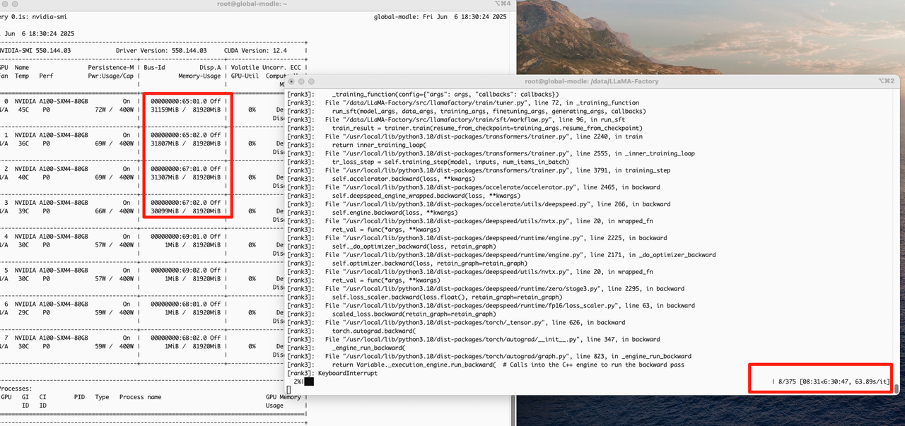
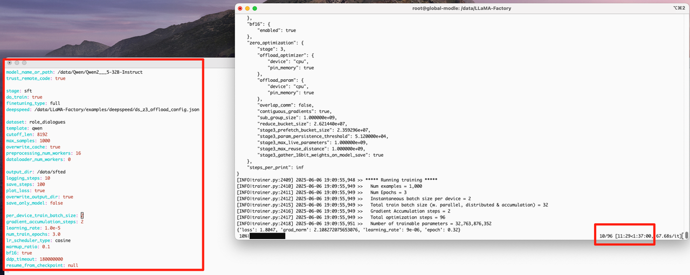
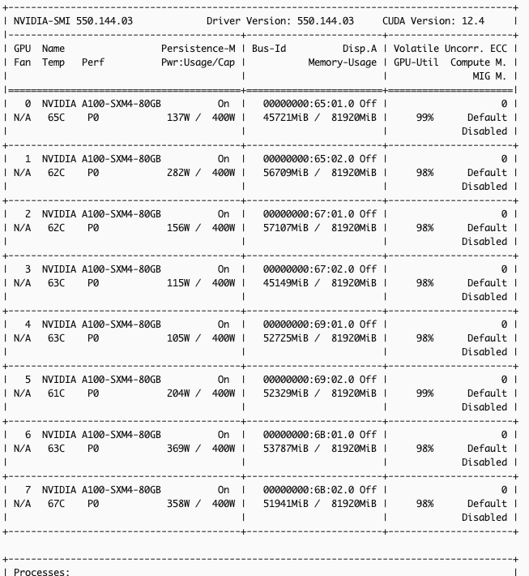
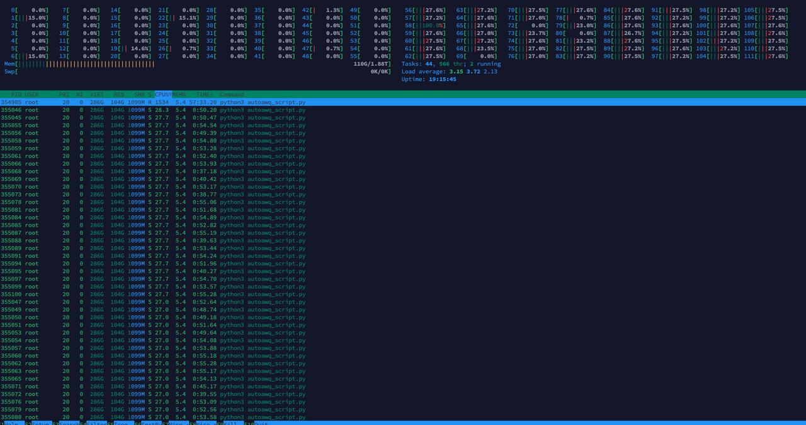
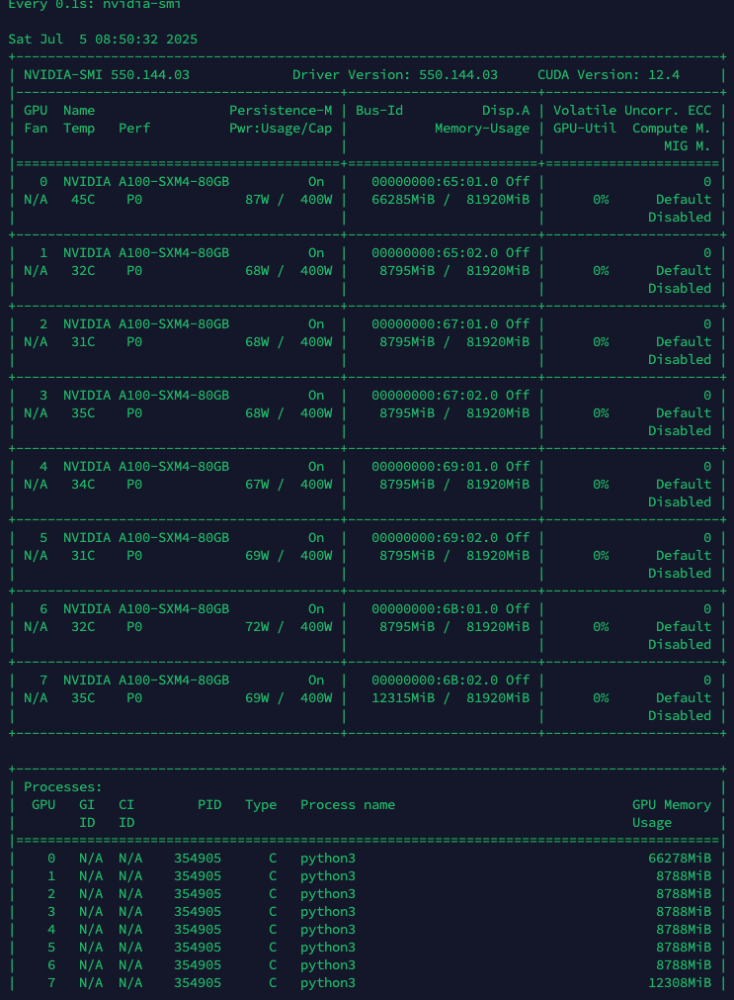

代码、模型位于：/data

# 1、准备模型

```shell
# 模型下载
modelscope download --model Qwen/Qwen2.5-32B-Instruct --cache_dir ./
```


# 2、准备代码

```shell
git clone https://github.com/hiyouga/LLaMA-Factory.git
```


准备环境：

```shell
pip install -e ".[torch,metrics]" --no-build-isolation
```


# 3、配置文件

1、examples/train\_full/qwen\_full\_sft.yaml

```yaml
model_name_or_path: Qwen2___5-32B-Instruct
trust_remote_code: true

stage: sft
do_train: true
finetuning_type: full
deepspeed: LLaMA-Factory/examples/deepspeed/ds_z3_offload_config.json

dataset: role_dialogues
template: qwen
cutoff_len: 8192
max_samples: 1000
overwrite_cache: true
preprocessing_num_workers: 16
dataloader_num_workers: 0

output_dir: /autodl-fs/data/sft
logging_steps: 10
save_steps: 500
plot_loss: true
overwrite_output_dir: true
save_only_model: false

per_device_train_batch_size: 2
gradient_accumulation_steps: 2
learning_rate: 1.0e-5
num_train_epochs: 3.0
lr_scheduler_type: cosine
warmup_ratio: 0.1
bf16: true
ddp_timeout: 180000000
resume_from_checkpoint: null
```

2、dataset.info

准备好dataset\_014.json

```shell
{
  "role_dialogues": {
    "file_name": TODO,
    "formatting": "sharegpt",
    "columns": {
      "messages": "conversations",
      "system": "system",
      "tools": "tools"
    },
    "tags": {
      "role_tag": "role",
      "content_tag": "content",
      "user_tag": "user",
      "assistant_tag": "assistant"
    }
  }
}
```

3、准备好训练数据

```shell
cp /mnt/s3/public/llm/dataset_014.json ./
```


# 4、开始训练

## 前台训练

```shell
CUDA_DEVICE_ORDER="PCI_BUS_ID" PYTORCH_NVML_BASED_CUDA_CHECK=1 CUDA_VISIBLE_DEVICES=0,1,2,3,4,5,6,7 WANDB_DISABLED=True NCCL_P2P_LEVEL=NVL FORCE_TORCHRUN=1 llamafactory-cli train examples/train_full/qwen_full_sft.yaml
```


## 后台训练

```shell
#!/bin/bash

# 设置环境变量
export CUDA_DEVICE_ORDER="PCI_BUS_ID"
export PYTORCH_NVML_BASED_CUDA_CHECK=1
export CUDA_VISIBLE_DEVICES=0,1,2,3,4,5,6,7
export WANDB_DISABLED=True
export NCCL_P2P_LEVEL=NVL
export FORCE_TORCHRUN=1

# 定义变量
CONFIG="examples/train_full/qwen_full_sft.yaml"
LOG_FILE="train.log"
PID_FILE="train.pid"

# 启动训练并记录PID
nohup llamafactory-cli train ${CONFIG} > ${LOG_FILE} 2>&1 &
echo $! > ${PID_FILE}

# 日志轮转设置
echo "开始训练"
```


# 5、训练细节

https://github.com/hiyouga/LLaMA-Factory/issues/4725

尽量用llamafactory的命令来训练


## 参数

**以下是batchsize=1 and accumulate\_step=2：**

1、4卡训练占用和耗时情况



2、8卡也是30GB占用，但总耗时大概2小时20分钟，快很多

**以下是per\_batchsize=2 and accumulate\_step=2 and 卡数=8**






用的都是：

总显卡：A800(80G)\*8=640GB

deepspeed：/root/LLaMA-Factory/examples/deepspeed/ds\_z3\_offload\_config.json

cutoff\_len=8196


以下是autoawq量化使用内存和显卡情况：





## 文件传输速度：

1MB = 8Mbps，所以2000Mbps = 2000 / 8 MB/s = 250 MB/s


## 耗时

9.35开机器

14.48开始训练

17.09训练完毕，开始导出文件


# 6、火山云训练环境配置


## CUDA版本

nvidia-smi上面显示的CUDA version是最高支持的CUDA版本

https://blog.csdn.net/AI\_dataloads/article/details/133043869

**我们实际所安装的CUDA版本小于等于它即可，实际CUDA VERSION需要看nvcc -V**


## 预配置

排查和debug最大帮助是这个[帖子](https://www.leadergpu.com/articles/555-cuda-initialization-unexpected-error-from-cudagetdevicecount#)

内置Ubuntu2204+python3.10，`python3`命令使用

1、机器已安装显卡驱动和CUDA，但好像装的是11.x，可以安装成CUDA12.4

```shell
# 1. 添加NVIDIA仓库
wget https://developer.download.nvidia.com/compute/cuda/repos/ubuntu2204/x86_64/cuda-keyring_1.1-1_all.deb
sudo dpkg -i cuda-keyring_1.1-1_all.deb

# 2. 更新源
sudo apt update

# 3. 安装CUDA Toolkit（最新版）
sudo apt install cuda-toolkit-12-4  # 替换为所需版本

# 4. 添加环境变量
echo 'export PATH=/usr/local/cuda/bin:$PATH' >> ~/.bashrc
echo 'export LD_LIBRARY_PATH=/usr/local/cuda/lib64:$LD_LIBRARY_PATH' >> ~/.bashrc
source ~/.bashrc

# 5. 验证安装
nvcc --version
```


**2、A100/A800，[必须](https://www.volcengine.com/docs/6419/73634)要安装nvidia-fabricmanager（使A100间NVLink通信）**

```shell
wget https://developer.download.nvidia.cn/compute/cuda/repos/ubuntu2204/x86_64/nvidia-fabricmanager-550_550.144.03-1_amd64.deb
dpkg -i nvidia-fabricmanager-550_550.144.03-1_amd64.deb
```


3、安装pytorch

pytorch的[历史版本](https://pytorch.org/get-started/previous-versions/)

```shell
pip install torch==2.6.0 --index-url https://download.pytorch.org/whl/cu124
```

&#x20;4、安装LLama-Factory的环境


## 其他帖子

https://github.com/pytorch/pytorch/issues/35710


DCGM的安装：

https://www.dell.com/support/kbdoc/zh-cn/000219485/poweredge-nvidia-datacenter-gpu-manager-dcgm-%E5%AE%89%E8%A3%85%E4%BB%A5%E5%8F%8A%E5%A6%82%E4%BD%95%E8%BF%90%E8%A1%8C%E8%AF%8A%E6%96%AD%E7%A8%8B%E5%BA%8F


## 文件互传

上传数据服务器：

连接：

```shell
sudo ssh -i /Users/younger/Desktop/global-language-ai.pem root@10.12.9.108
```

上传文件：

```shell
sudo scp -i /Users/younger/Desktop/unipus/chev-jump-key.pem root@10.12.9.108:/mnt/
```


上传到AWS：

```shell
scp -i /mnt/chev-jump-key.pem -r /mnt/checkpoint-189/ ec2-user@3.144.48.202:/mnt/efs/algo/datasets/
```


aws版本大模型转到数据服务器

```shell
scp /home/ec2-user/deployment_share/model-4-18/qwen2.5-32B


scp -i /data/remote/chev-eks-node-key.pem ec2-user@10.2.166.209:/home/ec2-user/deployment_share/model-4-18/qwen2.5-32B
```

scp -i chev-jump-key.pem -r ec2-user@10.12.9.108:/mnt/s3/public/llm/deployment\_share-4-18/qwen2.5-32B-instruct-chat12-epoch5 ./qwen2.5-32B


# 7、硬件配置

https://github.com/hiyouga/LLaMA-Factory?tab=readme-ov-file#hardware-requirement

